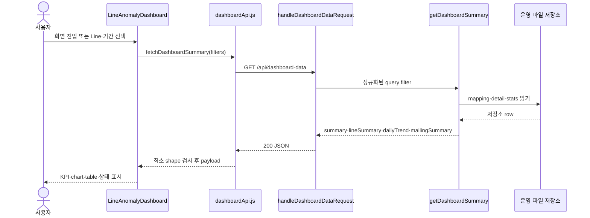

# L0 Spider 대시보드 기능 및 API 계약 기준

> 문서 목적: 대시보드 기능과 API 생산자·소비자 사이의 현재 계약 기준을 정의한다.
> 문서 상태: `Active Baseline`
> 기능 범위: `As-Is`
> 검증 기준 branch: `main`
> 검증 기준 코드 commit: `99c4361164d4109a71f0153a5c963fa4f5d52cb4`
> 최신 하네스 감사: [reports/audit/harness-final-review.md](../../reports/audit/harness-final-review.md)
> 관련 데이터 흐름: `DF-DASH-01`
> 주요 근거: `AGENTS.md`, `reports/audit/system-inventory.md`, `docs/system/overview.md`, `docs/system/architecture.md`, `docs/system/environment-definition.md`, `docs/system/data-flow.md`
> 계약 산출물: `harness/contracts/dashboard-api.schema.json`, success·empty synthetic fixture와 `tests/contract/dashboard-api.contract.test.mjs`가 존재한다.
> 조사 제한: 실제 운영 데이터·`/appdata` 파일·API 실행 결과는 확인하지 않았다.
> 브랜치 경계: `mock-agent`의 mock 응답·fixture·E2E는 이번 문서의 근거와 범위가 아니다.

## 1. 문서 목적과 범위

이 문서는 사용자의 대시보드 진입부터 `GET /api/dashboard-data`의 생산·소비와 현재 success JSON Schema까지의 계약 기준을 제공한다.
현재 `main` 코드의 As-Is를 기준으로 요청 파라미터, 응답 구조, 타입·nullable, 집계, 빈 데이터, 오류와 호환성 규칙을 설명한다.
화면의 상세 사용 순서는 `docs/user-manual/USER_MANUAL.md`, 시스템 전체 흐름은 `docs/system/data-flow.md`가 담당한다.
success JSON Schema, fixture와 contract test는 현재 범위에 포함한다. 오류 응답 Schema, actual root producer 직접 validation, 실제 메일 발송 계약과 mock 응답은 포함하지 않거나 `Partial`·`Blocked`다.
실제 운영 파일의 내용·존재·신선도와 런타임 성공 여부는 정적 코드 조사만으로 확정하지 않는다.

상태는 `Confirmed`, `Documented`, `Inferred`, `Unknown`, `Mismatch`를 사용한다.
계약 준비도는 `Schema Ready`, `Needs Confirmation`, `Blocked`로 별도 표시한다.
`Schema Ready`는 현재 생산자 코드로 타입·필수성·nullable·빈값을 실행 계약에 반영할 근거가 있다는 의미다. 현재 success Schema가 존재하더라도 오류 응답과 producer 직접 대조까지 완료됐다는 의미는 아니다.

## 2. 사용자 목적과 기능 범위

| 사용자 목적 | 제공 정보 또는 기능 | 진입점 | 상태 | 근거 |
|---|---|---|---|---|
| 최신 처리 시각 확인 | 마지막 알고리즘 수행 시각과 Dashboard 최신 데이터 시각 | `/`, `/fdc_trend` | `Confirmed` | `L0SpiderHomePage.jsx:181-209`; `LineAnomalyDashboard.jsx:443-453` |
| 전체 현황 확인 | 모니터링 sensor 총합, 이상 건수, Grade별 건수, 전일 대비 | 대시보드 KPI | `Confirmed` | `LineAnomalyDashboard.jsx:482-496` |
| Line 비교 | Line별 누적 건수 막대와 선택 Line 재조회 | Line별 이상 건수 | `Confirmed` | `LineAnomalyDashboard.jsx:498-535` |
| 기간 추이 확인 | `10`, `30`, `90`, `180`일의 Line별 일자 추이 | 추이 chart | `Confirmed` | `LineAnomalyDashboard.jsx:537-619` |
| Line 상세 확인 | 검색·정렬·페이지와 Self Equipment 상세 이동 | 상세 table | `Confirmed` | `LineAnomalyDashboard.jsx:226-323` |
| 메일 요약 기준 공유 | Dashboard KPI와 Line·SDWT·Grade 집계 제공 | API·메일 template | `Confirmed` / 실제 sender `Unknown` | `dashboardData.mjs:475-526`; `mailing-report.html:48-72` |

대시보드는 데이터 조회 화면이며 이 흐름에서 운영 파일이나 DB를 쓰는 코드는 확인되지 않았다.
Line 표시명은 화면 utility에서 변환될 수 있지만 API의 `lineId` 원문은 변경하지 않는다.

## 3. 화면 진입점

| 진입 경로 | 라우트 | 파라미터 | 페이지 컴포넌트 | 상태 | 근거 |
|---|---|---|---|---|---|
| 기본 진입 | `/` | Dashboard 전용 URL query 없음 | `L0SpiderHomePage` → `LineAnomalyDashboard` | `Confirmed` | `routes.jsx:11-15,58-62`; `L0SpiderHomePage.jsx:275` |
| prefix 진입 | `/fdc_trend` | Dashboard 전용 URL query 없음 | 같은 child route와 컴포넌트 | `Confirmed` | `routes.jsx:58-67` |
| 메일의 메인 버튼 | `/` | 없음 | 메일 밖 브라우저에서 메인 진입 | template `Confirmed`, 발송 경로 `Unknown` | `mailing-report.html:151` |
| 다른 기능에서 메인 복귀 | `/` | 없음 | 메인 화면 | `Documented` | `USER_MANUAL.md:18-32` |

초기 화면 state는 Line 전체를 뜻하는 빈 배열, 기본 추이 `10`일이다.
Dashboard route는 `startDate`, `endDate`, `line`을 브라우저 URL에서 읽지 않는다.
이 값들은 컴포넌트 state와 서버가 반환한 `options`에서 API query로 만들어진다.

## 4. 화면 구성

| 화면 영역 | 사용자에게 표시하는 정보 | 데이터 출처 필드 | 컴포넌트 | 상태 | 근거 |
|---|---|---|---|---|---|
| 마지막 수행 시각 | 메인 상단 최신 시각 | `summary.latestDateTime` | `LatestDataCard` | `Confirmed` | `L0SpiderHomePage.jsx:181-205` |
| 조회 header | Dashboard 제목과 최신 데이터 시각 | `summary.latestDateTime` | `LineAnomalyDashboard` | `Confirmed` | `LineAnomalyDashboard.jsx:443-453` |
| Line filter | 전체 또는 복수 Line, 조회·초기화 | `options.lines`, `filters.lines` | `LineMultiSelect` | `Confirmed` | `LineAnomalyDashboard.jsx:166-213,456-474` |
| 7개 KPI | sensor 총합, 전체·Grade별 건수, 전일 대비 | `summary.*` | `KpiCard`, `ChangeText` | `Confirmed` | `LineAnomalyDashboard.jsx:482-496` |
| Line 막대 | 선택 기간 Line별 누적 이상 건수 | `lineSummary[].lineId`, `totalCount` | `BarChart` | `Confirmed` | `LineAnomalyDashboard.jsx:498-535` |
| 일자 추이 | 기간·Line별 이상 건수 | `dailyTrend[]`, `lineSummary[]` | `LineChart` | `Confirmed` | `LineAnomalyDashboard.jsx:537-619` |
| 상세 table | 건수·전일 대비·최근일·비율·상세 링크 | `lineSummary[]` | `LineSummaryTable` | `Confirmed` | `LineAnomalyDashboard.jsx:226-323` |
| 상태 표시 | 최초 loading, 재조회, 빈 chart, 오류 | query 상태·오류 message | Dashboard 컴포넌트 | `Confirmed` | `LineAnomalyDashboard.jsx:414-433,476-480,624-630` |

`lineDashboard.mailingSummary`와 `lineDashboard.meta`는 브라우저 client가 배열·shape를 확인하지만 현재 Dashboard 화면에 직접 표시하지 않는다.
추이 chart는 응답의 `lineSummary` 정렬 기준 상위 최대 8개 Line만 그린다.
상세 table은 한 페이지에 8개 Line을 표시한다.

## 5. 프론트엔드 구성

| 책임 | 대표 파일 또는 식별자 | 입력 | 출력 | 상태 | 근거 |
|---|---|---|---|---|---|
| route·page 조립 | `routes.jsx`, `L0SpiderHomePage` | 브라우저 경로 | 메인과 Dashboard UI | `Confirmed` | `routes.jsx:11-67`; `L0SpiderHomePage.jsx:211-279` |
| API query 생성 | `fetchDashboardSummary` | `startDate`, `endDate`, `lines`, `signal` | same-origin fetch | `Confirmed` | `dashboardApi.js:3-12` |
| 응답 shape·교차 무결성 검사 | `fetchDashboardSummary`, `assertDashboardIntegrity` | JSON payload·요청 filter | payload 또는 정합성 오류 | `Confirmed` | `dashboardApi.js`; `dashboardIntegrity.mjs` |
| 기본 Dashboard 조회 | `dashboardQuery` | 적용된 Line state | `lineDashboard` | `Confirmed` | `LineAnomalyDashboard.jsx:326-341` |
| 기간 추이 조회 | `trendQuery` | 서버 `maxDate`, 기간, 적용 Line | 별도 `lineDashboard` | `Confirmed` | `LineAnomalyDashboard.jsx:342-365` |
| 표시용 변환 | `useMemo`, formatter | 배열·숫자·날짜 | chart·table model | `Confirmed` | `LineAnomalyDashboard.jsx:367-388` |
| 상세 URL 생성 | `buildSelfEquipmentDetailUrl` | `lineId`, `sdwts`, `sensorGrades` | `/self-equipment?...` | `Confirmed` | `dashboardLinks.mjs:6-13` |

기본 query key는 `["spider-line-dashboard", lines.join("\u0000")]`이고 메인 최신 시각 카드의 전체 조회는 `["spider-line-dashboard", ""]`를 공유한다.
추이 query key는 `"spider-line-dashboard-trend"`, 기간, 시작일, 종료일과 Line 조합으로 구성된다.
API client와 서버 producer는 `assertDashboardIntegrity`로 필수 object·배열, 요청 filter echo, Line 범위와 summary/detail/trend 교차 불변조건을 검사한다.
JSON Schema 전체를 브라우저 runtime에 적재하지 않으므로 이 guard가 검사하지 않는 개별 표시 field의 전체 Schema 검증은 하지 않는다.

## 6. 대시보드 요청 흐름

Flow ID는 시스템 데이터 흐름 문서와 같은 `DF-DASH-01`을 사용한다.



브라우저는 운영 파일에 직접 접근하지 않는다.
다이어그램은 확인된 GET 성공 흐름만 나타내며 외부 메일 sender와 mock 서버는 포함하지 않는다.

## 7. API 엔드포인트 개요

| 메서드 | 경로 | 요청 주체 | 서버 핸들러 | 응답 소비자 | 상태 | 근거 |
|---|---|---|---|---|---|---|
| `GET` | `/api/dashboard-data` | `fetchDashboardSummary` | `handleDashboardDataRequest` | 메인 최신 시각·Dashboard | `Confirmed` | `server.mjs:134-139`; `dashboardApi.js:3-31` |
| `HEAD` | `/api/dashboard-data` | 현재 브라우저 소비 위치 미확인 | 같은 handler | body 없음 | 구현 `Confirmed`, 소비자 `Unknown` | `dashboardData.mjs:794-820` |

통합 `server.mjs`와 Vite middleware 모두 이 경로를 같은 handler에 연결한다.
성공한 GET은 `Content-Type: application/json; charset=utf-8`, `Cache-Control: no-store`를 반환한다.
성공한 HEAD는 status와 `Cache-Control: no-store`만 반환하고 body는 없다.

## 8. 요청 계약

| API | 위치 | 파라미터 | 전달 방식 | 타입 | 필수 여부 | 기본값 | 검증·정규화 | 출처 | 상태 | 근거 |
|---|---|---|---|---|---|---|---|---|---|---|
| Dashboard | query | `startDate` | 단일 값 | `string`, `YYYY-MM-DD` | 선택 | 최신 가용 날짜 | trim, 실제 calendar date 검증 | 추이 state | `Confirmed` | `dashboardApi.js:3-8`; `dashboardData.mjs:158-190,786-791` |
| Dashboard | query | `endDate` | 단일 값 | `string`, `YYYY-MM-DD` | 선택 | 최신 가용 날짜 | trim, 실제 calendar date·순서 검증 | 추이 state | `Confirmed` | 같은 근거 |
| Dashboard | query | `line` | 반복 query | `string[]` | 선택 | 빈 배열은 전체 Line | trim, 빈값 제거, 중복 제거, mapping 존재 검증 | 사용자 선택 | `Confirmed` | `dashboardData.mjs:245-262,786-791` |
| Dashboard | header | `Accept` | `application/json` | `string` | server 기준 선택 | 없음 | 별도 검증 없음 | API client | `Confirmed` | `dashboardApi.js:9-12` |
| Dashboard | body | 해당 없음 | 없음 | 해당 없음 | 해당 없음 | 해당 없음 | handler가 body를 소비하지 않음 | 해당 없음 | `Confirmed` | `handleDashboardDataRequest` |

`startDate`가 `endDate`보다 늦으면 `400`이다.
요청 날짜가 가용 최소·최대 범위 밖인지 자체를 거부하는 검증은 없으며, 유효한 날짜지만 선택 파일이 없으면 0·빈 배열 중심의 `200` payload가 생성될 수 있다.
요청 Line이 mapping 기준정보에 없으면 `400`이고, Line 순서는 응답에서 건수와 내부 정렬 규칙에 따라 다시 정렬된다.
query 길이, Line 최대 개수, rate limit과 인증 요구는 현재 자료로 `Unknown`이다.

## 9. 응답 계약 개요

성공한 GET의 축약 구조는 다음과 같다.

```text
response
├─ ok
├─ latestDate
├─ metrics
├─ detailCounts
├─ sourcePaths
├─ columns
└─ lineDashboard
   ├─ filters
   ├─ options
   ├─ summary
   │  ├─ monitoringSensorTotal
   │  ├─ changeFromPreviousDay
   │  └─ previousDateTime
   ├─ lineSummary
   ├─ dailyTrend
   ├─ mailingSummary
   └─ meta
```

`lineDashboard.mailingSummary`는 `lineDashboard.summary`의 형제가 맞다.
후보 `lineDashboard.summary.mailingSummary`는 현재 응답에 존재하지 않는다.
상위 `metrics`는 최신 선택 파일 요약이고, 화면이 사용하는 기간·Line 기준 KPI는 `lineDashboard.summary`이므로 두 객체를 같은 의미로 취급하지 않는다.

## 10. 성공 응답 상위 계약

| 필드 | 타입 | 필수 | nullable·빈값 | 의미 | 준비도 | 근거 |
|---|---|---|---|---|---|---|
| `ok` | `boolean` | 예 | `false` 아님 | 성공 여부, 성공 시 `true` | `Schema Ready` | `dashboardData.mjs:812` |
| `latestDate` | `string` | 예 | 선택 파일 없으면 `""` | 최신 선택 detail의 date-time filename | `Schema Ready` | `dashboardData.mjs:289-306,755-766` |
| `metrics` | `object` | 예 | object 유지, 값은 숫자 0 가능 | 최신 detail·stats 기반 요약 | `Schema Ready` | `dashboardData.mjs:264-306` |
| `detailCounts` | `object` | 예 | object 유지, 값은 정수 0 가능 | 최신 detail row·고유값 수 | `Schema Ready` | `dashboardData.mjs:279-305` |
| `sourcePaths` | `object` | 예 | 값은 빈 문자열 가능 | 사용한 stats·detail·root·mapping 경로 | `Schema Ready` / 노출 `Risk` | `dashboardData.mjs:298-301,778-782` |
| `columns` | `object` | 예 | 고정 문자열 배열 | 읽기에 사용한 stats·detail 컬럼 | `Schema Ready` | `spiderDataPaths.mjs:20-23`; `dashboardData.mjs:302-305` |
| `lineDashboard` | `object` | 예 | object 유지 | 화면·메일용 기간·Line 집계 | `Schema Ready` | `dashboardData.mjs:388-532,765-783` |

`metrics`의 필드는 `monitoringSensorTotal`, `detectedPpidCount`, `totalAnomalyCount`, `abGradeCount`, `dGradeCount`, `nGradeCount`, `mGradeCount`이며 모두 `number`이고 non-null이다.
`detailCounts`의 `rows`, `sdwt`, `steps`, `recipeIds`, `sensors`는 non-null 정수다.
현재 browser Dashboard는 상위 `metrics`, `detailCounts`, `sourcePaths`, `columns`를 직접 소비하지 않는다.

## 11. `lineDashboard` 응답 계약

### 11.1 필터와 선택지

| 필드 | 타입 | 필수 | nullable·빈값 | 의미 | 준비도 | 근거 |
|---|---|---|---|---|---|---|
| `filters.startDate` | `string` | 예 | non-null | 적용 시작일 | `Schema Ready` | `dashboardData.mjs:494-499` |
| `filters.endDate` | `string` | 예 | non-null | 적용 종료일 | `Schema Ready` | 같은 근거 |
| `filters.lines` | `string[]` | 예 | 빈 배열은 전체 선택 | 명시 요청된 Line | `Schema Ready` | 같은 근거 |
| `options.lines` | `string[]` | 예 | 빈 배열 가능 | 응답 집계에서 확인된 Line 선택지 | `Schema Ready` | `dashboardData.mjs:409-410,500-506` |
| `options.minDate` | `string` | 예 | non-null | 전체 가용 filename의 최소 날짜 | `Schema Ready` | `dashboardData.mjs:158-190` |
| `options.maxDate` | `string` | 예 | non-null | 전체 가용 filename의 최대 날짜 | `Schema Ready` | 같은 근거 |
| `options.defaultStartDate` | `string` | 예 | non-null | 기본 조회 시작일, 현재 최신일 | `Schema Ready` | 같은 근거 |
| `options.defaultEndDate` | `string` | 예 | non-null | 기본 조회 종료일, 현재 최신일 | `Schema Ready` | 같은 근거 |

### 11.2 요약

| 필드 | 타입 | 필수 | nullable·빈값 | 의미·계산 | 준비도 |
|---|---|---|---|---|---|
| `summary.totalAbnormalCount` | `integer` | 예 | 0 가능 | 선택 날짜·Line의 일별 고유건수 합 | `Schema Ready` |
| `summary.abnormalLineCount` | `integer` | 예 | 0 가능 | `totalCount > 0`인 Line 수 | `Schema Ready` |
| `summary.latestDate` | `string \| null` | 예 | 선택 파일 없으면 `null` | 응답 범위 내 최신 날짜 | `Schema Ready` |
| `summary.latestDateTime` | `string \| null` | 예 | 선택 파일 없으면 `null` | 응답 범위 내 최신 filename 시각 | `Schema Ready` |
| `summary.latestDateCount` | `integer` | 예 | 0 가능 | 최신 선택일의 고유건수 합 | `Schema Ready` |
| `summary.topLine` | `string \| null` | 예 | 이상건 없으면 `null` | 기간 누적 건수 최상위 Line | `Schema Ready` |
| `summary.topLineCount` | `integer` | 예 | 0 가능 | `topLine`의 기간 누적 건수 | `Schema Ready` |
| `summary.previousDate` | `string \| null` | 예 | 비교 파일 없으면 `null` | D-1 동일 `hh:mm` 비교 날짜 | `Schema Ready` |
| `summary.previousDateTime` | `string \| null` | 예 | 비교 파일 없으면 `null` | 실제 선택된 비교 filename 시각 | `Schema Ready` |
| `summary.changeFromPreviousDay` | `integer \| null` | 예 | 비교 파일 없으면 `null` | 최신일 건수 - 비교 파일 건수 | `Schema Ready` |
| `summary.monitoringSensorTotal` | `number` | 예 | 0 가능 | 최신 선택 시각 stats의 `TL total` 합 | `Schema Ready` |
| `summary.abGradeCount` | `integer` | 예 | 0 가능 | 기간의 A·B 고유건수 합 | `Schema Ready` |
| `summary.dGradeCount` | `integer` | 예 | 0 가능 | 기간의 D 고유건수 합 | `Schema Ready` |
| `summary.nGradeCount` | `integer` | 예 | 0 가능 | 기간의 N 고유건수 합 | `Schema Ready` |
| `summary.mGradeCount` | `integer` | 예 | 0 가능 | 기간의 M 고유건수 합 | `Schema Ready` |

요약 생산 근거는 `dashboardData.mjs:451-523`이다.
`monitoringSensorTotal`은 Line filter로 재집계하지 않으며 선택 범위의 최신 detail과 짝지은 stats 파일 전체 `TL total` 합이다.
비교 파일은 최신 선택 파일의 D-1에서 동일한 `hh:mm`인 후보 중 초가 가장 최신인 파일이다.

### 11.3 Line·추이·메일·meta 배열

| 필드 또는 item | 타입 | 필수 | nullable·빈값 | 의미 | 준비도 | 근거 |
|---|---|---|---|---|---|---|
| `lineSummary` | `object[]` | 예 | 빈 배열 가능 | 선택 Line별 기간 요약 | `Schema Ready` | `dashboardData.mjs:427-455` |
| `lineSummary[].lineId` | `string` | 예 | non-null | 내부 Line 식별자 | `Schema Ready` | 같은 근거 |
| `lineSummary[].totalCount` | `integer` | 예 | 0 가능 | 기간 누적 고유건수 | `Schema Ready` | 같은 근거 |
| `lineSummary[].abGradeCount` | `integer` | 예 | 0 가능 | 기간 A·B 고유건수 | `Schema Ready` | 같은 근거 |
| `lineSummary[].latestDateCount` | `integer` | 예 | 0 가능 | 최신 선택일 건수 | `Schema Ready` | 같은 근거 |
| `lineSummary[].previousDateCount` | `integer \| null` | 예 | 비교 없음 `null` | 해당 Line의 비교 파일 건수 | `Schema Ready` | 같은 근거 |
| `lineSummary[].changeCount` | `integer \| null` | 예 | 비교 없음 `null` | 최신일 - 비교 건수 | `Schema Ready` | 같은 근거 |
| `lineSummary[].lastAbnormalDate` | `string \| null` | 예 | 기간 내 없음 `null` | 마지막 1건 이상 날짜 | `Schema Ready` | 같은 근거 |
| `lineSummary[].ratio` | `number` | 예 | 전체 0이면 0 | 전체 대비 백분율, 소수 2자리 | `Schema Ready` | `dashboardData.mjs:451-454` |
| `lineSummary[].sdwts` | `string[]` | 예 | 빈 배열 가능 | 상세 link에 전달할 SDWT | `Schema Ready` | `dashboardData.mjs:423-448` |
| `lineSummary[].sensorGrades` | `string[]` | 예 | 빈 배열 가능 | 상세 link에 전달할 표시 Grade | `Schema Ready` | 같은 근거 |
| `dailyTrend` | `object[]` | 예 | 빈 배열 가능 | 날짜×Line 추이 row | `Schema Ready` | `dashboardData.mjs:467-473` |
| `dailyTrend[]` | `{date:string,lineId:string,abnormalCount:integer}` | 예 | item non-null | 파일 없는 날짜도 0으로 채움 | `Schema Ready` | 같은 근거 |
| `mailingSummary` | `object[]` | 예 | 빈 배열 가능 | Line·SDWT·원본 Grade별 기간 집계 | `Schema Ready` | `dashboardData.mjs:475-492` |
| `mailingSummary[]` | `{lineId:string,sdwt:string,sensorGrade:string,abnormalCount:integer}` | 예 | item non-null | mail 전체설비 row 생산 후보 | `Schema Ready` | 같은 근거 |
| `meta.filesRead` | `integer` | 예 | 0 가능 | 선택 기간에서 읽은 일별 집계 수 | `Schema Ready` | `dashboardData.mjs:527-531` |
| `meta.comparisonFileRead` | `boolean` | 예 | non-null | 비교 filename 존재 여부 | `Schema Ready` | 같은 근거 |
| `meta.unmappedRows` | `integer` | 예 | 0 가능 | mapping에서 Line을 찾지 못해 제외된 row 수 | `Schema Ready` | 같은 근거 |

`lineSummary`는 `totalCount` 내림차순, 동률은 Line 순으로 정렬된다.
`mailingSummary.sensorGrade`는 `A`, `B`, `D`, `M`, `N`만 남기며 A·B를 `A/B`로 합치지 않는다.
`lineSummary.sensorGrades`는 상세 화면 filter에 맞게 A·B를 `A/B`로 정규화한다.

### 11.4 실행 가능한 교차 불변조건

서버는 `lineDashboard` 조립 직후, 브라우저는 success payload 소비 직전에 같은 pure guard를 실행한다.

- `filters.lines`는 정규화·중복 제거한 요청 Line 집합과 일치한다. `options.lines`는 전체 선택지이므로 요청 범위 판정 대상이 아니다.
- `lineSummary`, `dailyTrend`, `mailingSummary`와 nullable `summary.topLine`의 Line은 `lineSummary` 범위 안에 있고, 명시적 Line 요청이 있으면 그 요청 집합의 부분집합이어야 한다.
- `summary.totalAbnormalCount`, `latestDateCount`, `abnormalLineCount`, `abGradeCount`, `topLine`, `topLineCount`는 `lineSummary` 계산 결과와 일치한다.
- Line별 `dailyTrend.abnormalCount` 합은 각 `lineSummary.totalCount`와 일치하고 날짜·Line 중복 row는 허용하지 않는다.
- `mailingSummary.abnormalCount`는 Line·SDWT·Grade별 메일 집계이므로 전체 Dashboard 합계와 같아야 하는 불변조건으로 취급하지 않는다.

위반 시 부분 payload를 표시하지 않는다. 서버는 `500`과 안정적 code `DASHBOARD_RESPONSE_INTEGRITY_ERROR`로 fail-closed하고 브라우저는 정합성 오류와 **다시 조회** 동작을 제공한다. JSON Schema로 표현하기 어려운 합계 규칙은 `tests/contract/dashboard-api.contract.test.mjs`가 실행 가능한 기준이다.

## 12. 데이터 원천과 집계 규칙

| 단계 | 원천·처리 | 계약상 결과 | 상태 | 근거 |
|---|---|---|---|---|
| 날짜 file 검색 | Dashboard detail root의 `YYYY-MM-DD hh:mm:ss` file | 가용 날짜와 선택 file | `Confirmed` | `dashboardData.mjs:95-102,664-690` |
| 기간 선택 | 날짜별 가장 최신 `hh:mm:ss` file | 일자당 최대 1개 detail | `Confirmed` | `selectLatestDashboardFilePerDate` |
| stats 선택 | 최신 선택 detail 시각으로 stats 경로 조립 | `monitoringSensorTotal` | `Confirmed` | `spiderDataPaths.mjs:5-8,50-52`; `dashboardData.mjs:731-735` |
| Line mapping | mapping JSON의 `line_mapping`, `sdwt_mapping` | Line·표시 SDWT | `Confirmed` | `mappingConfig.mjs:26-39`; `dashboardData.mjs:193-223` |
| 고유건 정의 | `desc`, `recipe_id`, `priority`, `sensor`, `eqp` 조합 | Line·Grade·메일 count | `Confirmed` | `dashboardData.mjs:18,317-380` |
| 전일 비교 | 최신 선택 detail의 D-1 동일 `hh:mm` file | nullable 비교 field | `Confirmed` | `dashboardData.mjs:122-141,724-726` |
| 파일 없는 날짜 | 요청 날짜를 열거하고 count 0 적용 | 연속 `dailyTrend` | `Confirmed` | `dashboardData.mjs:143-152,411-473` |

경로는 일반화하면 detail `.../path/{latest_date}`, stats `.../stats/{latest_date}_spider_step_stats.parquets`이다.
Dashboard detail root는 `SPIDER_DASHBOARD_PATH_ROOT`로 override할 수 있고 mapping은 `MAPPING_CONFIG_PATH`를 사용할 수 있다.
실제 root 값, 실제 row와 운영 데이터 생성 주체·주기·완료 신호는 확인하지 않았다.
mapping되지 않은 detail row는 집계에서 제외되며 화면은 `meta.unmappedRows`를 표시하지 않는다.

## 13. 프론트엔드 소비와 표시 규칙

| 응답 영역 | 소비 위치 | 표시·변환 | 상태 |
|---|---|---|---|
| `summary.latestDateTime` | `LatestDataCard`, Dashboard badge | `YYYY.MM.DD hh:mm:ss` 형태 | `Confirmed` |
| `summary.monitoringSensorTotal` | 첫 KPI | locale 숫자와 `개` | `Confirmed` |
| 전체·Grade count | 나머지 count KPI | locale 숫자와 `건` | `Confirmed` |
| `changeFromPreviousDay` | 전일 대비 KPI | 증가 ▲, 감소 ▼, 0 변동 없음, null 비교 없음 | `Confirmed` |
| `lineSummary` | 막대·상세 table | chart, 정렬·검색·8개 pagination | `Confirmed` |
| `dailyTrend` | 기간 추이 | 응답 상위 Line 최대 8개 | `Confirmed` |
| `sdwts`, `sensorGrades` | 상세 link | 반복 `sdwt`, 반복 `grade` query | `Confirmed` |
| `mailingSummary`, `meta` | API client | shape 확인만 하고 UI 미표시 | `Confirmed` |

숫자 formatter는 유효한 숫자로 변환되지 않으면 `—`를 표시하지만 API client가 세부 타입 오류를 먼저 차단하지는 않는다.
`ratio`는 숫자 메서드를 직접 호출하므로 타입 호환이 깨지면 화면 오류가 발생할 수 있다.
`TL.total`은 D-04 승인에 따라 null·빈 문자열·숫자 변환 실패를 기존과 같이 `0`으로 보정하며 `monitoringSensorTotal`의 non-null number 계약을 유지한다. 이 예외는 다른 숫자 field에 자동 적용하지 않는다.

## 14. 로딩, 빈 데이터, 부분 데이터와 오류

| 상황 | 현재 동작 | 상태 | 근거 |
|---|---|---|---|
| 최초 요청 중 | Dashboard 전체 loading 안내 | `Confirmed` | `LineAnomalyDashboard.jsx:414-422` |
| 같은 query key 수동 재조회 | 현재 payload를 유지하고 overlay 표시 | `Confirmed` | `dashboardQuery.refetch`, `trendQuery.refetch` |
| Line filter 변경 | 이전 payload를 제거하고 새 조건 loading 표시 | `Confirmed` | `dashboardQueryOptions.mjs`; Dashboard query 상태 분기 |
| 추이 기간 변경 | 이전 추이 payload를 제거하고 chart loading 표시 | `Confirmed` | `dashboardQueryOptions.mjs`; trend query 상태 분기 |
| 최초·새 조건 요청 실패 | Dashboard 제목, 오류 panel과 다시 조회 동작 | `Confirmed` | `LineAnomalyDashboard.jsx` 오류 분기 |
| 같은 조건 재조회 실패 | 기존 화면과 inline 오류·다시 조회 동작을 함께 표시 | `Confirmed` | `LineAnomalyDashboard.jsx` inline 오류 분기 |
| Line row 없음 | chart 빈 상태, table 빈 안내 | `Confirmed` | `LineAnomalyDashboard.jsx:158-164,304-309,533` |
| 추이 요청 중·실패 | 별도 loading 또는 빈 chart에 오류 표시 | `Confirmed` | `LineAnomalyDashboard.jsx:568-617` |
| D-1 file 없음 | 비교 field `null`, “동일 시각 비교 데이터 없음” | `Confirmed` | `dashboardData.mjs:515-517`; Dashboard KPI |
| 요청 기간 일부 날짜 file 없음 | 해당 날짜·Line을 0건으로 생성 | `Confirmed` | `dashboardData.test.mjs:186-200` |
| unmapped row 존재 | 집계 제외, `meta.unmappedRows` 증가 | `Confirmed` | `dashboardData.mjs:327-385,527-531` |

기본·추이 query는 `placeholderData`를 사용하지 않는다. 따라서 Line 또는 기간 query key가 바뀌면 이전 조건의 payload를 새 조건 아래 표시하지 않는다.
같은 key의 명시적 `refetch()`는 React Query의 현재 payload를 유지하며 화면에 재조회 중임을 표시한다.

## 15. 캐시, 재조회와 최신 판단

기본 Dashboard query는 `staleTime` 60초, 추이 query는 5분이며 둘 다 `retry: false`다.
공통 QueryClient는 window focus refetch를 끄며 polling 또는 사용자용 전역 새로고침 주기는 확인되지 않았다.
같은 Line·추이 조건으로 조회하면 `refetch()`, 다른 조건이면 query key 변경으로 조회한다.
서버 file list cache는 root `mtimeMs`, Parquet·집계 cache는 file `mtimeMs`와 size를 기준으로 갱신하며 응답은 `Cache-Control: no-store`다.
“최신”은 선택 기간 안에서 filename 규칙에 맞는 가장 최신 file이며 upstream 생성 완료 여부를 검사한다는 근거는 없다.

근거: `LineAnomalyDashboard.jsx:331-365,390-405,546-558`, `queryClient.js:8-17`, `dashboardData.mjs:568-699`.

## 16. 상세 화면과 연계 기능

Dashboard 상세 link는 `lineSummary` row의 `lineId`, 중복 제거한 `sdwts`, `sensorGrades`를 사용한다.
생성 형식은 `/self-equipment?line=...&sdwt=...&grade=...`이며 SDWT·Grade는 여러 번 나타날 수 있다.
Dashboard 상세 link는 `step`, `eqpCh` 또는 HMAC token을 생성하지 않는다.
Self Equipment URL 소비·초기 filter 계약은 후속 `docs/features/self-equipment.md`와 `docs/features/step-deeplink.md`가 담당한다.
route·query 이름 변경 시 Dashboard table, URL utility, Self Equipment 소비자와 사용자 메뉴얼을 함께 검토한다.

## 17. 메일 요약과의 관계

`lineDashboard.mailingSummary`는 Dashboard와 같은 5개 식별자 고유조합을 날짜·Line·SDWT·원본 Grade별로 합산한다. 단, 기본 `config/sensor-exclusions.json` 또는 경로 override 설정의 `apps.mailing.contains`에 일치하는 sensor는 이 배열에서만 제외한다. `summary`, `lineSummary`, `dailyTrend`와 화면 KPI에는 이 규칙을 적용하지 않는다. Template은 `abnormalCount`를 전체설비 report count의 원천으로 요구한다.
`dashboard_monitoring_sensor_total`, `dashboard_change_from_previous_day`, `dashboard_previous_date_time`은 같은 무필터 Dashboard 응답에서 가져오고, `dashboard_change_color`는 numeric change 값만으로 결정하도록 문서화돼 있다.
My EQP 메일 count는 sender가 같은 고유건 규칙으로 별도 계산하며 `lineDashboard` 변경 대상이 아니다.
등록 조건 결합, 실제 renderer·scheduler·sender, 수신자 결정과 발송 결과는 `Unknown`이다.

근거: `public/mailing-report.html:20-80`; `server/dashboardData.mjs:475-526`.

## 18. 오류 응답 계약

| 조건 | HTTP status | GET body | HEAD body | 상태 |
|---|---:|---|---|---|
| 성공 | `200` | `{ok:true,...payload}` | 없음 | `Confirmed` |
| 날짜·Line filter 오류 | `400` | `{ok:false,code,error,requestId}` | 없음 | `Confirmed` |
| 유효한 Dashboard filename 없음 | `404` | `{ok:false,code,error,requestId}` | 없음 | `Confirmed` |
| 허용하지 않은 method | `405` | `{ok:false,error:"Method not allowed"}`, `Allow: GET, HEAD` | 해당 없음 | `Confirmed` |
| success 응답 교차 불변조건 위반 | `500` | `{ok:false,code:"DASHBOARD_RESPONSE_INTEGRITY_ERROR",error,requestId}` | 없음 | `Confirmed` |
| 파일·mapping·schema 등 기타 예외 | `500` | `{ok:false,code:"DASHBOARD_DATA_LOAD_FAILED",error,requestId}` | 없음 | `Confirmed` |

브라우저 API client는 non-2xx의 `error`를 sanitize하고 안전한 `requestId`가 있으면 문의 코드로 함께 표시한다. JSON이 아니면 일반 fallback message를 사용한다.
보호 대상 오류는 `harness/contracts/safe-api-error.schema.json`의 `ok:false`, 안정적 `code`, 고정 사용자 `error`, UUID `requestId` 계약을 사용한다. 원문 exception과 내부 경로는 응답 또는 오류 로그에 결합하지 않는다.
오류 `error` 문자열의 정확한 문구를 하위 호환 계약으로 고정할 근거는 부족하므로 `Needs Confirmation`이다.

## 19. 호환성 및 변경 영향 기준

- `/`, `/fdc_trend`, `/api/dashboard-data`, `startDate`, `endDate`, 반복 `line` 이름을 변경하면 route·client·문서 영향을 함께 검토한다.
- 성공 응답의 `lineDashboard`, `summary`, 세 배열과 `options.lines`는 현재 client의 최소 필수 shape다.
- 숫자 field를 문자열로 바꾸거나 nullable을 확대하면 formatter, 비교, 정렬, chart와 table을 함께 수정해야 한다.
- `null` 비교 field를 0으로 바꾸면 “비교 데이터 없음”과 “변동 없음”의 의미가 합쳐지므로 호환 변경으로 취급하지 않는다.
- 고유건 5개 컬럼, 날짜별 최신 file, D-1 동일 시각 규칙 변경은 KPI·Line chart·메일 count를 동시에 바꾼다.
- `mailingSummary`를 `summary` 아래로 이동하거나 별칭 없이 이름을 바꾸지 않는다.
- `lineSummary.sdwt`·Grade 정규화 변경은 Self Equipment 상세 link 계약에 영향을 준다.
- 새 field 추가 허용, `additionalProperties` 정책과 API versioning·deprecation 정책은 `Unknown`이므로 후속 Schema 단계에서 결정한다.
- API 변경 시 이 문서, JSON Schema, 최소 synthetic 샘플, contract test와 `mock-agent` 소비 계약을 함께 검토한다.

## 20. 계약 준비도

| 계약 영역 | 증거 상태 | 준비도 | 판단 |
|---|---|---|---|
| endpoint·method·query | `Confirmed` | `Schema Ready` | handler와 client에서 method·형식·기본값 확인 |
| 성공 상위 구조 | `Confirmed` | `Schema Ready` | 생산자가 모든 field를 조립 |
| `lineDashboard.summary` | `Confirmed` | `Schema Ready` | 타입·nullable·0 처리 확인 |
| `lineSummary`, `dailyTrend`, `mailingSummary`, `meta` | `Confirmed` | `Schema Ready` | item 구조·빈 배열·정렬 근거 확인 |
| 합계·Line 범위 교차 불변조건 | `Confirmed` | `Contract Ready` | 서버·브라우저 pure guard와 negative contract test 존재 |
| 오류 기본 구조 | `Confirmed` | `Contract Ready` | 보호 대상 오류는 `{ok:false,code,error,requestId}` 사용 |
| 정합성 오류 code | `Confirmed` | `Contract Ready` | `DASHBOARD_RESPONSE_INTEGRITY_ERROR`로 고정 |
| 그 밖의 보호 대상 오류 code | `Confirmed` | `Contract Ready` | filter·latest date·일반 load 오류 code 고정 |
| 날짜·문자열 정규식 제약 | 생산 형식 `Confirmed` | `Needs Confirmation` | API version과 future format 정책 없음 |
| `additionalProperties`·버전 정책 | `Unknown` | `Needs Confirmation` | producer·consumer 합의 없음 |
| 실제 mail sender 소비 | `Unknown` | `Blocked` | 저장소에서 결합·발송 구현 미확인 |
| mock 응답 일치 | `Out of Scope` | `Blocked` | `mock-agent` 미조사 |

Dashboard success Schema와 별도로 CORE-03A 보호 대상 오류 공통 Schema가 존재한다. `405` 같은 단순 method 오류는 공통 보호 대상 오류 Schema 범위가 아니다.
Schema 작성 시 실제 운영 값이 아닌 최소 synthetic sample만 사용한다.

## 21. Mismatch

| ID | 후보·문서 | 현재 코드 | 영향 | 기준 |
|---|---|---|---|---|
| `DASH-M01` | `lineDashboard.summary.mailingSummary` | `lineDashboard.mailingSummary` | Schema·sender가 잘못된 위치를 소비할 수 있음 | 실제 sibling 위치를 계약으로 유지 |

이 Mismatch는 `AGENTS.md`와 `DF-DASH-01`의 기존 판정을 유지한 것이다.
사용자 메뉴얼의 7개 KPI, 추이 기간, 상세 이동과 현재 코드 사이에는 이번 정적 조사에서 명확한 추가 Mismatch를 확인하지 못했다.

## 22. Unknown 및 Risk

### Unknown

실제 운영 데이터에서의 성공 구조·payload 상한, 데이터 생산 주체·주기·완료 신호·신선도 SLA, 실제 timezone 의미는 `Unknown`이다.
인증·인가, rate limit, query·Line 한계, API versioning·field 추가·deprecation 정책도 확인되지 않았다.
외부 메일 sender의 실제 호환, 운영 실행 mode·관찰성·request ID·log 보존, 현재 화면과 메뉴얼 이미지의 시각적 일치 여부도 `Unknown`이다.

### Risk

성공 payload의 `sourcePaths`는 내부 운영 경로를 노출할 수 있으며 `CORE-03B` 호환 전환 전까지 남는 `Risk`다. 보호 대상 실패 응답의 원문 message·경로 노출은 CORE-03A에서 제거했다.
교차 무결성 guard가 검사하지 않는 상세 표시 field의 malformed 200 응답은 여전히 UI 깊은 위치에서 실패할 수 있다.
mapping 제외 row는 화면이 아니라 `meta`에만 남는다.

## 23. Core Harness와 `mock-agent` 경계

이 문서와 현재 Dashboard JSON Schema·운영 자원 비의존 contract test는 `main`의 Core Harness 기준이다.
`mock-agent`는 이 API 경로, field 위치, 타입·nullable·빈값과 오류 계약을 따라야 한다.
mock 서버·대규모 fixture·mock 의존 integration·E2E와 Browser QA는 `mock-agent` 전용이며 이번 단계에서 조사하지 않았다; 현재 `main`에 mock 응답이 없는 것은 결함이 아니다.
기본 동기화 방향은 `main → mock-agent`이고 mock 구현 자체는 `main` 병합 대상이 아니다.

## 24. 계약 산출물과 갱신 조건

현재 `harness/contracts/dashboard-api.schema.json`, `harness/fixtures/dashboard/dashboard-{success,empty}.json`과 `tests/contract/dashboard-api.contract.test.mjs`가 존재한다.
contract test는 Schema compile·fixture와 partial·합계 불일치·범위 밖 Line·filter echo mismatch를 검증한다. 실제 운영 route와 운영 데이터는 사용하지 않았으므로 그 범위는 `Not Run`이다.
메일 결합·발송 경계와 상세 link 소비는 각각 `docs/features/mailing.md`, `docs/features/self-equipment.md`가 담당한다.

producer·consumer·집계·오류가 바뀌면 같은 변경에서 본 문서의 상태와 준비도를 재검토한다.
실행 검증 근거가 추가되면 정적 `Confirmed`와 재현 가능한 실행 결과를 구분해 갱신한다.

## 25. 근거 자료

최우선 코드 근거는 생산자인 `server/dashboardData.mjs`와 소비자인 `dashboardApi.js`, `LineAnomalyDashboard.jsx`, `L0SpiderHomePage.jsx`다.
정책·추적 근거는 `AGENTS.md`, `docs/system/data-flow.md`, `reports/audit/system-inventory.md`와 세 시스템 기준 문서다.
사용자·연계 근거는 `docs/user-manual/USER_MANUAL.md`, `public/mailing-report.html`, 정적 테스트 사례는 `server/dashboardData.test.mjs`다.

이 문서는 검증 기준 코드 commit `99c4361`의 정적 As-Is 계약 기준이다.
최신 하네스 감사에서 contract test와 안전 검증 script 실행은 확인됐지만 애플리케이션·실제 API와 운영 데이터는 사용하지 않았다.
