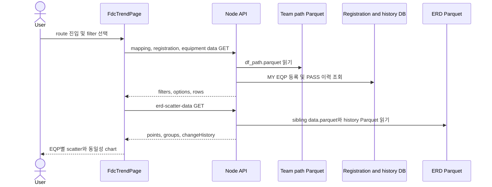

# L0 Spider Self Equipment 기능 기준

| 항목 | 내용 |
|---|---|
| 문서 목적 | Self Equipment의 사용자 진입부터 화면 출력까지 현재 구현 기준을 정의한다. |
| 문서 상태 | `Active Baseline` |
| 기능 범위 | `As-Is` |
| 검증 기준 branch | `main` |
| 검증 기준 코드 commit | `99c4361164d4109a71f0153a5c963fa4f5d52cb4` |
| 최신 하네스 감사 | [reports/audit/harness-final-review.md](../../reports/audit/harness-final-review.md) |
| 관련 Flow ID | `DF-SELF-01`, `DF-SELF-02`, `DF-SELF-03`, `DF-STEP-01` |
| 주요 근거 | `AGENTS.md`, 시스템 문서, 인벤토리, 사용자 메뉴얼, 현재 소스코드 |
| 조사 제한 | 실제 운영 DB, `/appdata`, Parquet·이미지 내용은 조사하지 않았다. |
| 연계 범위 | STEP/HMAC 보안 상세는 [step-deeplink.md](step-deeplink.md), [security.md](../system/security.md), [ADR-003-step-hmac-token.md](../decisions/ADR-003-step-hmac-token.md)에 존재하며 실제 HMAC은 `Blocked`다. |
| 제외 범위 | `mock-agent`의 mock API·데이터·브라우저 검증은 조사하지 않았다. |
## 1. 문서 목적과 범위

이 문서는 Self Equipment 화면, URL query, 프론트엔드 상태, API, 서버 처리와 데이터 원천의 연결을 현재 코드 기준으로 정의한다. 사용자 조작의 상세 절차는 `docs/user-manual/USER_MANUAL.md`를 기준으로 하며 여기서는 기능 계약과 추적성에 집중한다.
실제 운영 데이터 내용·실행 결과·생산 작업은 확인하지 않았고, HMAC 상세와 `mock-agent` 전용 흐름도 현재 기능 근거에서 제외한다.
## 2. 사용자 목적과 주요 사용 시나리오

Self Equipment는 Line·SDWT·Grade와 종속 조건을 좁혀 ERD 이상감지 데이터를 EQP별 산점도와 동일성 차트로 확인하는 기능이다.

| 사용자 목적 | 대표 시나리오 | 진입점 | 최종 결과 | 상태 | 근거 |
|---|---|---|---|---|---|
| 일반 이상 확인 | 메뉴에서 Line부터 `ch_step`까지 선택 | 메인 카드 | EQP별 scatter chart | `Confirmed` | `L0SpiderHomePage.jsx:11-19`; `FdcTrendPage.jsx:1932-2234` |
| Dashboard 상세 확인 | Line 상세 행의 조건으로 진입 | Dashboard `상세` | Line·SDWT·Grade 초기 선택 | `Confirmed` | `LineAnomalyDashboard.jsx:287-301`; `dashboardLinks.mjs:6-13` |
| MY EQP 확인 | 등록된 설비만 모아 조회 | SDWT `MY EQP` | 등록 EQP의 종속 필터와 chart | `Confirmed` | `FdcTrendPage.jsx:1491-1558`; `selfEquipmentData.mjs:356-446` |
| 전체 STEP의 MY EQP 확인 | `step=ALL` 링크로 진입 | 메일 template 또는 URL | 모든 STEP의 EQP 선택지 | `Confirmed` | `mailing-report.html:229-241`; `selfEquipmentData.mjs:420-428` |
| 동일성 비교 | 모아보기 또는 카드 버튼 사용 | chart 영역 | 최근 72시간 또는 전체 동일성 chart | `Confirmed` | `FdcTrendPage.jsx:1901-1928,2210-2224`; `selfEquipmentData.mjs:654-725` |
| SKIP·이력 작업 | chart 카드에서 작업 실행 | chart action | DB history 반영 및 화면 재조회 | `Confirmed` | `FdcTrendPage.jsx:869-872,1055-1077`; `passHistoryApi.js:40-64` |
## 3. 화면 진입 경로

| 출발 위치 | 진입 방식 | 대상 라우트 | 전달 파라미터 | 상태 | 근거 |
|---|---|---|---|---|---|
| 브라우저 | 직접 URL·공유 URL | `/self-equipment` | 선택적으로 `line`, `sdwt`, `grade`, `step`, `eqpCh` | `Confirmed` | `routes.jsx:11-19`; `selfEquipmentUrlFilters.mjs:23-32` |
| SPIDER 메인 | `자설비 이상감지` 카드 | `/self-equipment` | 없음 | `Confirmed` | `L0SpiderHomePage.jsx:11-19` |
| Dashboard | Line 상세 링크 | `/self-equipment?...` | `line`, 반복 `sdwt`, 반복 `grade` | `Confirmed` | `LineAnomalyDashboard.jsx:287-301`; `dashboardLinks.mjs:6-13` |
| Mailing template | 전체 이상현황 `LINK` | `/self-equipment?...` | `line`, `sdwt`, `grade` | template `Confirmed` | `public/mailing-report.html:180-190` |
| Mailing template | My EQP `LINK` | `/self-equipment?...` | `line`, `sdwt=MY_EQP`, `grade`, `step=ALL`, `eqpCh` | template `Confirmed` | `public/mailing-report.html:229-241` |
| production SPA refresh | 서버 static fallback | 같은 URL | 기존 query 유지 | 코드 `Confirmed` | `server.mjs:89-128` |
| `/fdc_trend` alias | 중첩 alias route | `/fdc_trend/self-equipment` | 같은 query 형식 | `Confirmed` | `routes.jsx:58-67` |

메일 template을 실제로 렌더링·발송하는 실행 주체는 `Unknown`이다.
## 4. 브라우저 라우트

| 항목 | 확인 결과 | 상태 | 근거 |
|---|---|---|---|
| 기본 path | root children의 `self-equipment` | `Confirmed` | `src/features/fdc-trend/routes.jsx:11-19` |
| alias path | `fdc_trend` children에도 같은 route 등록 | `Confirmed` | `src/features/fdc-trend/routes.jsx:58-67` |
| 페이지 | `FdcTrendPage` | `Confirmed` | `src/features/fdc-trend/routes.jsx:5,17-18` |
| route guard | route 정의에서 별도 인증·guard 없음 | `Confirmed` | `src/features/fdc-trend/routes.jsx:11-68` |
| 사용자 식별 | 화면과 일부 DB 작업은 `/api/current-user` 또는 요청 IP를 별도 사용 | `Confirmed` | `FdcTrendPage.jsx:1445-1449`; `selfEquipmentData.mjs:368-377` |
| 새로고침 | unified server는 미존재 static path에 `dist/index.html` 반환 | 코드 `Confirmed` | `server.mjs:89-128` |
| 잘못된 client route | 명시적 wildcard 처리 결과 미확인 | `Unknown` | 제한적 route 조사 |
## 5. URL query parameter 계약

브라우저 route 자체는 query를 요구하지 않는다. 모든 wire 값은 URL-decoded 문자열이며 parser는 NFKC 정규화와 trim을 수행한다.

| 파라미터 | 의미 | 반복 | 필수 | 기본·누락 처리 | 소비 위치 | 상태 | 근거 |
|---|---|---:|---|---|---|---|---|
| `line` | Line 초기 선택값 | 첫 값 | 선택 | 유효하지 않거나 없으면 mapping의 첫 Line | page 초기 state | `Confirmed` | `selfEquipmentUrlFilters.mjs:23-32`; `FdcTrendPage.jsx:1451,1490` |
| `sdwt` | 일반 SDWT 또는 `MY_EQP` | parser는 복수·dedupe | 선택 | 화면은 첫 값만 초기 선택; 유효하지 않으면 첫 option | team state | `Confirmed` | `selfEquipmentUrlFilters.mjs:24-25`; `FdcTrendPage.jsx:1452,1510-1514` |
| `grade` | Sensor Grade | 복수·dedupe | 선택 | 유효한 값이 없으면 `A/B`; A·B·A/B는 `A/B`로 정규화 | Grade state→`priority` | `Confirmed` | `selfEquipmentUrlFilters.mjs:29,51-60`; `FdcTrendPage.jsx:1453-1457,1517` |
| `step` | STEP 후보 값 또는 MY EQP의 `ALL` | 첫 값 | 선택 | `sdwt=MY_EQP`이면 입력과 무관하게 `ALL`; 그 외에는 `ALL`만 초기 state에 반영 | `selectedDesc` 초기화 | `Confirmed`/`Mismatch` | `selfEquipmentUrlFilters.mjs:30`; `FdcTrendPage.jsx:1458-1460` |
| `eqpCh` | 서버 row의 `eqp`와 매칭할 초기 선택값 | 첫 값 | 선택 | 없으면 빈 값; legacy alias `eqp_ch` 허용 | `selectedEqpCh`→API | `Confirmed` | `selfEquipmentUrlFilters.mjs:31`; `FdcTrendPage.jsx:1461,1545-1556` |

파라미터 순서는 의미가 없다. 중복 `line`, `step`, `eqpCh`는 첫 값을 소비하고 `sdwt`, `grade`는 전체 값을 공백 제거·dedupe하며, `eqpCh`에만 `eqp_ch` fallback이 있다.
## 6. 초기 상태 결정

| 상태 항목 | 초기값 출처 | 보정 규칙 | 사용자 선택 시 URL 반영 | 상태 | 근거 |
|---|---|---|---|---|---|
| Line | URL `line` | mapping에 없으면 첫 Line | 없음 | `Confirmed` | `FdcTrendPage.jsx:1451,1480-1490` |
| SDWT | URL `sdwt` 첫 값 | option에 없으면 첫 SDWT; active 등록 시 MY EQP 추가 | 없음 | `Confirmed` | `FdcTrendPage.jsx:1452,1491-1516` |
| Grade | URL 반복 `grade` | 유효값 없으면 `A/B`; MY EQP 전환 시 전체 Grade | 없음 | `Confirmed` | `FdcTrendPage.jsx:1453-1457,1517` |
| STEP | URL `step` | 정확히 `ALL`일 때만 초기 반영 | 없음 | `Confirmed` | `FdcTrendPage.jsx:1458-1460` |
| `eqp_ch` | URL `eqpCh`/`eqp_ch` | 서버 option과 불일치하면 응답 `filters.eqpCh`가 빈 값 | 없음 | `Confirmed` | `FdcTrendPage.jsx:1461,1575-1578`; `selfEquipmentData.mjs:218-239` |
| sensor·`ch_step` | 코드 빈 문자열 | 상위 필터 선택 후 API option에서 선택 | 없음 | `Confirmed` | `FdcTrendPage.jsx:1462-1463` |
| 3일 동일성 | 코드 `true` | 사용자 toggle | query 대상 아님 | `Confirmed` | `FdcTrendPage.jsx:1465,1901-1928` |

`useSearchParams` 값은 state initializer에 사용되지만 선택 handler는 URL을 갱신하지 않으며, 마운트 후 browser history에 state를 재동기화하는 별도 effect도 확인되지 않았다.
## 7. 프론트엔드 구성

| 책임 | 파일 또는 식별자 | 입력 | 출력 | 상태 |
|---|---|---|---|---|
| route·page | `routes.jsx`, `FdcTrendPage` | route, query | 전체 화면 | `Confirmed` |
| URL parser | `readSelfEquipmentUrlFilters` | `URLSearchParams` | requested filters | `Confirmed` |
| mapping·등록 | `fetchLineMapping`, `fetchMyEqpRegistrations` | Line·현재 사용자 범위 | Line·SDWT option | `Confirmed` |
| 일반·MY EQP 조회 | `fetchSelfEquipmentData`, `fetchMyEqpEquipmentData` | filter state | option·row payload | `Confirmed` |
| 종속 filter | `FdcTrendPage` FilterCard 묶음 | server option arrays | 다음 filter state | `Confirmed` |
| chart query | `ErdScatterCard`, `ThreeDayIdentityChartCard` | `row.file_path`, EQP, axis | point chart·history | `Confirmed` |
| pagination | `paginateChartGroups` | EQP groups, page | 최대 20 실제 chart/page | `Confirmed` |
| SKIP·이력 | pass/hit/click history API clients | chart·선택 context | DB 반영·query invalidation | `Confirmed` |

현재 페이지는 chart를 직접 렌더링한다. `buildErdFileUrl`과 `GET /api/erd-file`은 등록되어 있지만 현재 소비 위치는 확인되지 않았다.
## 8. 화면 상태와 사용자 상호작용

| 사용자 동작 | 변경 상태 | URL 변경 | API 재요청 | 화면 영향 | 상태 |
|---|---|---|---|---|---|
| Line 변경 | Line과 하위 선택 초기화 | 없음 | mapping 기반 query key 변경 | SDWT부터 재구성 | `Confirmed` |
| SDWT 변경 | team과 하위 선택 초기화 | 없음 | 일반·MY EQP·SKIP 분기 변경 | Grade·STEP 재구성 | `Confirmed` |
| Grade 변경 | 복수 Grade와 하위 선택 초기화 | 없음 | `priority` 반복 query 변경 | STEP option 변경 | `Confirmed` |
| STEP 변경 | `selectedDesc`, 이하 초기화 | 없음 | data query 변경 | `eqp_ch` option 변경 | `Confirmed` |
| `eqp_ch` 변경 | `selectedEqpCh`, sensor·ch_step 초기화 | 없음 | data query 변경 | sensor option 변경 | `Confirmed` |
| sensor 변경 | sensor, ch_step 초기화 | 없음 | data query 변경 | ch_step option 변경 | `Confirmed` |
| `ch_step` 변경 | chStep 선택·해제 | 없음 | data fetch 후 chart query | chart 표시·클릭 이력 | `Confirmed` |
| sensor `ALL` | sensor=`ALL`, ch_step 초기화 | 없음 | server도 종속 규칙 적용 | ch_step에는 `ALL`만 표시 | `Confirmed` |
| ch_step 모아보기 | 선택 범위의 chart row | 없음 | sensor·PPID별 최저 ch_step 유지 | sensor `ALL`에서도 sensor별 대표 chart 유지 | `Confirmed` |
| 모아보기 전환 | EQP별 expanded set | 없음 | 보이는 chart query만 구성 | 대표/전체 ch_step 전환 | `Confirmed` |
| page 변경 | chart page | 없음 | 새 page의 lazy chart query | 이전 page chart unmount | `Confirmed` |
| `EQP ALL SKIP` | 현재 chart의 EQP·sensor | 없음 | 해당 sensor와 `chStep=ALL`로 대상 재조회 | 다른 sensor는 제외하고 모든 ch_step을 SKIP | `Confirmed` |

근거: `FdcTrendPage.jsx:1518-1569,1692-1858,1932-2234`, `selfEquipmentData.mjs:196-293`.
## 9. Self Equipment 요청 흐름

`DF-SELF-01~03`의 현재 연결은 다음과 같다.

브라우저는 DB나 `/appdata`에 직접 접근하지 않는다. 일반 조회·chart·MY EQP는 각각 `DF-SELF-01~03`, 딥링크 초기화는 HMAC 경계가 남은 `DF-STEP-01`이다.
## 10. API 엔드포인트 인벤토리

| 기능 | 메서드 | 경로 | 서버 핸들러 | 응답 소비 위치 | 상태 |
|---|---|---|---|---|---|
| 기준 mapping | `GET` | `/api/mapping-config` | `handleMappingConfigRequest` | Line·SDWT option | `Confirmed` |
| 현재 사용자 | `GET` | `/api/current-user` | `handleCurrentUserRequest` | 인사말·이력 주체 | `Confirmed` |
| MY EQP 등록 조회 | `GET` | `/api/my-eqp-registration` | `handleMyEqpRegistrationRequest` | MY EQP option 활성화 | `Confirmed` |
| 일반 Self Equipment | `GET` | `/api/self-equipment-data` | `handleSelfEquipmentDataRequest` | 종속 option·chart row | `Confirmed` |
| MY EQP | `GET` | `/api/my-eqp-equipment-data` | `handleMyEqpEquipmentDataRequest` | 등록 EQP option·row | `Confirmed` |
| SKIP 목록·작업 | `GET/POST/DELETE` | `/api/pass-history` | `handlePassHistoryRequest` | SKIP LIST·chart action | `Confirmed` |
| scatter·identity | `GET` | `/api/erd-scatter-data` | `handleErdScatterDataRequest` | chart card·modal | `Confirmed` |
| ERD image stream | `GET/HEAD` | `/api/erd-file` | `handleErdFileRequest` | 현재 화면 소비 미확인 | endpoint `Confirmed` |
| 선택 이력 | `POST` | `/api/clicked-category-history` | `handleClickedCategoryHistoryRequest` | 마지막 filter·MY EQP 진입 | `Confirmed` |
| 결과 이력 | `POST` | `/api/hit-history` | `handleHitHistoryRequest` | `이력저장` action | `Confirmed` |

통합 진입점 근거는 `server.mjs:141-260`이며 STEP token 전용 mapping·검증 API는 확인되지 않았다.
## 11. API 요청 계약

| API | 파라미터 | 위치 | wire 타입 | 필수 여부 | 기본·정규화 | 출처 | 상태 |
|---|---|---|---|---|---|---|---|
| `/api/self-equipment-data` | `line`, `pathSdwt`, `sdwt` | query | string | 필수 | trim, path segment 검증 | active Line/team | `Confirmed` |
| 같은 API | 반복 `priority` | query | string[] | payload 선택에 필요 | A/B는 A·B로 확장 | Grade state | `Confirmed` |
| 같은 API | `desc`, `eqpCh`, `sensor`, `chStep` | query | string | 선택 | option 불일치 시 빈 선택 | 종속 state | `Confirmed` |
| `/api/my-eqp-equipment-data` | `line` | query | string | 필수 | trim | active Line | `Confirmed` |
| 같은 API | `priority`, `desc`, `eqpCh`, `sensor`, `chStep` | query | string/string[] | 선택 | EQP 표기 정규화 매칭 | filter state | `Confirmed` |
| `/api/erd-scatter-data` | `path`, `eqp` | query | string | 필수 | 허용 root·segment 검증 | chart row | `Confirmed` |
| 같은 API | `sensor`, `chStep` | query | string | 선택 | 없으면 path segment 사용 | chart row | `Confirmed` |
| 같은 API | `mode=identity`, `days` | query | string, integer string | 선택 | days는 0~30 정수 | chart mode | `Confirmed` |
| `/api/my-eqp-registration` | `line`, `activeOnly=true` | query | string | Line 필요 | active 조건 | page | `Confirmed` |

일반 API의 필수값 누락은 `400`, 비-GET은 `405`, 조회 예외는 `500`이다.
클라이언트는 JSON parse 실패를 빈 객체로 바꾼 뒤 비정상 HTTP이면 사용자용 error를 throw한다.
## 12. API 응답과 화면 소비

| API | 대표 응답 필드 | 생산 위치 | 화면 표현 | 빈값 처리 | 상태 |
|---|---|---|---|---|---|
| equipment API | `filters` | `buildSelfEquipmentPayload` | 서버가 인정한 active filter | 불일치 값은 `""` | `Confirmed` |
| equipment API | `steps`, `eqpChannels`, `sensors`, `chSteps` | 같은 builder | 4개 종속 option 목록 | 빈 목록 placeholder | `Confirmed` |
| equipment API | `rows`, `counts` | 같은 builder | EQP group과 chart 대상 | rows가 없으면 빈 chart 안내 | `Confirmed` |
| MY EQP API | `availablePriorities`, registration counts | MY EQP handler | Grade option·매칭 없음 경고 | 등록/매칭 count로 구분 | `Confirmed` |
| 일반·MY EQP API | `counts.excludedSensorRows` | sensor 제외 설정 | SKIP 제외 후 sensor 제외 건수; 화면 직접 표시는 없음 | 기본 파일 최초 읽기 실패는 0, 재로딩 실패는 마지막 정상 규칙 적용 | `Confirmed` |
| scatter API | `points`, `axisColumn`, timing fields | scatter builder | 산점도·최근 point 구분 | point 없음은 card 빈 상태 | `Confirmed` |
| scatter API | `changeHistory`, `historyError` | scatter builder | 변경점 이력 dialog | history만 실패해도 HTTP 200 | `Confirmed` |
| identity API | `groups`, `windowDays`, point counts | identity builder | 동일성 chart | group 없음 안내 | `Confirmed` |

전체 JSON Schema는 이번 단계에서 만들지 않았다.
## 13. 데이터 원천

| Data Source ID | 유형 | 경로·테이블·자원 | 접근 코드 | 사용 목적 | 읽기·쓰기 | 생성 책임 | 상태 |
|---|---|---|---|---|---|---|---|
| `DS-SELF-01` | Parquet | `path/{line}/{sdwt}/df_path.parquet` | `readTeamErdRows` | filter option·`file_path` index | Self 흐름 읽기 | `Unknown` | `Confirmed` |
| `DS-SELF-02` | Parquet | ERD image sibling `data.parquet` | `readErdScatterRows` | scatter·identity point | Self 흐름 읽기 | `Unknown` | `Confirmed` |
| `DS-SELF-02-H` | Parquet | sibling `{eqp}.parquet` | `readErdHistoryRows` | 변경점 이력 | Self 흐름 읽기 | `Unknown` | `Confirmed` |
| `DS-SELF-IMG` | image | 허용 ERD root의 image | `handleErdFileRequest` | stream endpoint | 읽기 | `Unknown` | endpoint `Confirmed` |
| `DS-MAP` | JSON | mapping config | `readLineMapping` | Line·SDWT·MY EQP path 매핑 | 읽기 | `Unknown` | `Confirmed` |
| `DS-SENSOR-EXCLUSION` | JSON | 기본 `config/sensor-exclusions.json`, 선택적 `SENSOR_EXCLUSION_CONFIG_PATH` override | `readSensorExclusionConfig` | 일반·MY EQP sensor 포함문자 제외 | 읽기 | 개발자·배포 담당자 | `Confirmed` |
| `DS-DB-REG` | DB | `myeqp_regist` | registration helper | 사용자별 active MY EQP | 읽기·등록 기능 쓰기 | L0 Spider 일부 쓰기 | `Confirmed` |
| `DS-DB-HIST` | DB | `pass_history`, `hit_history`, `clicked_category_history` | history helper | SKIP·결과·선택 이력 | 읽기·쓰기 | L0 Spider 쓰기 | `Confirmed` |

통계 파일과 공통성 이미지 경로는 저장소에 존재하지만 현재 Self Equipment 요청 흐름의 직접 원천으로 확인되지 않았다.
## 14. 데이터 경로 패턴

| 경로 또는 자원 ID | 코드의 경로 패턴 | 용도 | 경로 변수 | 누락 처리 | 상태 |
|---|---|---|---|---|---|
| team index | `/appdata/abnormal_trend/pic/path/{line}/{sdwt}/df_path.parquet` | 일반·MY EQP 대상 row | URL/mapping의 Line·path SDWT | `statSync` 예외→API `500` | `Confirmed` |
| ERD data | row `file_path`의 sibling `data.parquet` | scatter·identity | index row, sensor, chStep | 예외→chart API `500` | `Confirmed` |
| ERD history | 같은 directory의 `{eqp}.parquet` | 변경점 이력 | 선택 EQP | 실패를 `historyError`로 분리 | `Confirmed` |
| ERD image | `/appdata/abnormal_trend/pic/erd/...` | image stream endpoint | 요청 `path` | 금지 `403`, 없음 `404` | endpoint `Confirmed` |
| backup | `/appdata/abnormal_trend/pic/backup/...` | data path 복원 | index row `file_path` | root 외 경로 거부 | `Confirmed` |

경로 template 근거는 `src/config/spiderDataPaths.mjs:1-17,70-72`, 접근 근거는 `server/selfEquipmentData.mjs:137-163,449-468`이다.
Self Equipment는 별도 최신 directory를 탐색하지 않고 index row의 `file_path`를 기준으로 `latestDate`를 추출한다.
## 15. 조회 파라미터 전파

| 파라미터 | URL·UI 입력 | API 전달 | 서버·데이터 반영 | 화면 영향 | 상태 |
|---|---|---|---|---|---|
| `line` | URL 또는 Line 선택 | `line` | row `line_rev`, path root; MY EQP 등록 query | SDWT 범위 | `Confirmed` |
| `sdwt` | URL 또는 SDWT 선택 | `pathSdwt`와 display `sdwt` | team path, row `sdwt`, PASS history | STEP 범위 | `Confirmed` |
| `grade` | URL 또는 복수 선택 | 반복 `priority` | row `priority` | 모든 하위 option | `Confirmed` |
| `step` | URL 초기값 또는 STEP 선택 | 선택 후 `desc` | row `desc`; MY EQP `ALL`은 전체 baseRows | EQP option | `Confirmed`/`Mismatch` |
| `eqpCh` | URL 또는 eqp_ch 선택 | `eqpCh` | row `eqp` 매칭 | sensor option | `Confirmed` |
| `sensor` | UI 선택 | `sensor` | row `sensor`; chart axis prefix | ch_step·chart | `Confirmed` |
| `ch_step` | UI 선택 | `chStep` | row `step`; chart axis suffix | rows·chart | `Confirmed` |
| `file_path` | index row | chart API `path` | sibling data/history path | chart source | `Confirmed` |
| `latest_date` | `file_path` segment | 직접 전달 안 함 | server가 path에서 추출 | chart 기준 시각 | `Confirmed` |
| `ver`, `recipe_id` | index row | row payload | 표시·이력 식별 context | card metadata·SKIP key | `Confirmed` |

`step_seq`와 `ppid`를 URL 또는 equipment API filter로 전달하는 흐름은 확인되지 않았다.
`ppid`는 `file_path`/row context와 chart 모아보기 식별에 간접 사용된다.
## 16. STEP 선택 처리 개요

| 입력 형태 | 처리 위치 | 변환·검증 | 조회 조건 | 화면 결과 | 상태 |
|---|---|---|---|---|---|
| UI STEP label | `FdcTrendPage` | server `steps[].desc` 중 선택 | API `desc` | 다음 eqp_ch option | `Confirmed` |
| URL `step=ALL`, MY EQP | parser·page | MY EQP이면 강제 `ALL` | `allowAllSteps`로 모든 `desc` row | 전체 STEP EQP | `Confirmed` |
| URL `step=ALL`, 일반 SDWT | page·server | page state에는 ALL이나 일반 handler는 ALL 불허 | server `filters.desc=""` | STEP 재선택 필요 | `Confirmed` |
| URL 비-ALL STEP 문자열 | parser·page | `stepToken`으로 읽지만 state에 반영 안 함 | API로 전달 안 함 | STEP 미선택 | `Mismatch` |
| 잘못된 token | 확인된 검증 없음 | 오류·매핑 없음 | 조회 조건 없음 | STEP 미선택과 동일 | `Unknown` |
| STEP 없음 | page | 빈 state | `desc` 생략 | STEP option 표시 | `Confirmed` |

현재 코드에는 HMAC 생성, 검증, timing-safe 비교 또는 STEP 매핑 호출이 확인되지 않았다.
## 17. `eqpCh` 처리

| 단계 | 값 또는 표현 | 처리 주체 | 사용 목적 | 상태 | 근거 |
|---|---|---|---|---|---|
| URL | `eqpCh`, fallback `eqp_ch` 단일 문자열 | URL parser | 초기 선택 | `Confirmed` | `selfEquipmentUrlFilters.mjs:31` |
| state | `selectedEqpCh` | page | query key·하위 초기화 | `Confirmed` | `FdcTrendPage.jsx:1461,1525,2043-2049` |
| API | query `eqpCh` | API client | server filter 전달 | `Confirmed` | `selfEquipmentApi.js:15-18,42-45` |
| 일반 server | row `eqp` exact match 또는 `ALL` | payload builder | sensor 대상 row 구성 | `Confirmed` | `selfEquipmentData.mjs:218-239` |
| MY EQP server | 구두점 제거·대문자화·`.png` 제거 비교 | payload builder | registration과 index 표기 차이 흡수 | `Confirmed` | `selfEquipmentData.mjs:77-90,222-238` |
| sensor 제외 | trim·대문자화 후 포함문자 비교 | 일반·MY EQP handler | 같은 `selfEquipment` 규칙으로 option·row 생성 전 제외 | `Confirmed` | `sensorExclusionConfig.mjs`; `selfEquipmentData.mjs` |
| chart | 선택 row의 EQP | page·chart API | EQP group·point filter | `Confirmed` | `FdcTrendPage.jsx:1622-1630`; `selfEquipmentData.mjs:588-651` |

코드는 `eqpCh`를 row의 `eqp`에 대응시키지만, 이름이 의미하는 정확한 장비·chamber 도메인 정의는 `Unknown`이다.
복수 `eqpCh` 선택은 지원하지 않는다.
## 18. 화면 구성과 데이터 매핑

| 화면 영역 | 표시 정보 | 데이터 API·필드 | 컴포넌트·상호작용 | 상태 |
|---|---|---|---|---|
| 상단 | 제목, 사용자 인사, 메인 링크 | current-user | `FdcTrendPage` | `Confirmed` |
| toggle | 최근 72시간 동일성 동시 표시 | local boolean | switch, 기본 ON | `Confirmed` |
| filter area | Line→SDWT→Grade→STEP→eqp_ch→sensor→ch_step | mapping, registration, equipment options | `FilterCard` | `Confirmed` |
| 상태 안내 | API·등록·PASS 오류, MY EQP 매칭 없음 | query state, counts | alert | `Confirmed` |
| chart summary | EQP category·chart count·page | equipment `rows` | group·pagination | `Confirmed` |
| scatter card | `act_time`, axis value, EQP·lot·wafer 등 | scatter `points` | lazy query·zoom·dialog | `Confirmed` |
| identity card | EQP별 point groups | identity `groups` | 3일 동시 chart 또는 modal | `Confirmed` |
| history·actions | 변경점 이력, SKIP, 이력저장 | history APIs | button·dialog·mutation | `Confirmed` |
| image | image endpoint 존재 | `/api/erd-file` | 현재 page 소비 없음 | `Unknown` |

사용자 메뉴얼의 차트 조작 설명은 `USER_MANUAL.md:71-120`과 일치하며 상세 사용법은 그 문서를 따른다.
## 19. 로딩, 빈 데이터와 오류 처리

| 상황 | 서버·API 결과 | 프론트엔드 동작 | 사용자 표시 | 상태 |
|---|---|---|---|---|
| mapping 로딩·오류 | query pending/error 또는 빈·잘못된 payload | production fallback 없이 모든 종속 조회 비활성 | 기준정보 오류·다시 조회 | `Confirmed` / CORE-04 |
| MY EQP 등록 오류 | non-2xx throw | option 계산과 별도 error | 등록 조건 오류 문구 | `Confirmed` |
| 필수 API query 누락 | `400` JSON | client throw | dataQuery error alert | `Confirmed` |
| 일반/MY EQP 조회 예외 | `500` JSON | client throw | 조회 실패 alert | `Confirmed` |
| filter option 없음 | 성공+빈 array | 다음 FilterCard disabled/placeholder | 조건별 안내 | `Confirmed` |
| ch_step 미선택 | 성공 가능, rows 미표시 | chart query 비활성 | 선택 안내 | `Confirmed` |
| chart row 없음 | 성공+빈 rows | group 없음 | `표시할 file_path 데이터가 없습니다.` | `Confirmed` |
| MY EQP 등록은 있으나 매칭 없음 | 성공+counts | amber alert | 등록 SDWT·EQP 매칭 없음 | `Confirmed` |
| ERD data 없음·오류 | chart API `500` | card query error | chart 오류 문구 | `Confirmed` |
| history Parquet만 실패 | scatter API `200`+`historyError` | chart 유지 | 변경점 이력 오류 | `Confirmed` |
| image 없음 | `/api/erd-file` `404` | 현재 화면 소비 미확인 | `Unknown` | endpoint `Confirmed` |
| 잘못된 HMAC token | 전용 오류 응답 없음 | 일반 STEP 미선택과 구분 안 됨 | 별도 안내 없음 | `Mismatch` |

근거: `FdcTrendPage.jsx:2100-2234`, `selfEquipmentData.mjs:321-446,728-833`.

보호 대상 `500`·일부 `404`는 고정 사용자 메시지, 안정적 `code`, `requestId`만 반환한다. history 부분 실패의 `historyError`도 원문 exception 없이 고정 메시지만 반환하며, 브라우저는 안전한 request ID를 문의 코드로 표시한다.
## 20. 캐시, 재조회와 최신 데이터

| 항목 | 설정 또는 구현 | 적용 대상 | 영향 | 상태 |
|---|---|---|---|---|
| equipment query key | 분기·Line·team·Grade·모든 종속 filter 포함 | 일반·MY EQP·SKIP | 조건별 cache 분리 | `Confirmed` |
| placeholder | chStep만 달라질 때 이전 payload 유지 | equipment query | filter 목록 깜박임 완화 | `Confirmed` |
| query enabled | Line·team key·label 존재 | equipment query | 불완전 초기 조건 요청 차단 | `Confirmed` |
| MY EQP registration | stale 15초, 30초 polling, retry false | registration | MY EQP option 갱신 | `Confirmed` |
| PASS history | stale 30초, retry false | 일반 선택 STEP | history 재사용 | `Confirmed` |
| current user | stale Infinity, retry false | user | session 중 재사용 | `Confirmed` |
| scatter lazy load | viewport 근접 시 enabled, stale/gc Infinity | card | off-page·off-viewport 요청 억제 | `Confirmed` |
| 3일 identity | viewport 근접, stale Infinity, gc 10분 | paired chart | 최근 window 결과 재사용 | `Confirmed` |
| server Parquet cache | mtime·size 확인, LRU 최대 1 | team/scatter/history | 파일 변경 감지 후 재읽기 | `Confirmed` |
| manual refresh | 전용 버튼 없음 | equipment | filter 변경·mutation invalidation 중심 | `Confirmed` |
| window focus·일반 retry | 명시 설정 없음 | 일부 query | library 기본 동작은 정책 `Unknown` | `Unknown` |

최신성은 index row가 가리키는 file과 mtime 기반 cache에 의존한다.
데이터 생산 주기와 freshness SLA는 확인되지 않았다.
## 21. 대시보드 및 메일 연계

| 출발 기능 | 링크 생성 위치 | 대상 | 전달 파라미터 | 소비 위치 | 상태 |
|---|---|---|---|---|---|
| Dashboard | `buildSelfEquipmentDetailUrl` | `/self-equipment` | `line`, 반복 `sdwt`, 반복 `grade` | URL parser | `Confirmed` |
| Mailing 등록 확장 | 같은 URL builder | `/self-equipment` | 행별 단일 Line·SDWT·Grade | 향후 template context 후보 | `Confirmed` |
| 전체설비 template | Jinja anchor | `/self-equipment` | Line·SDWT·Grade, `urlencode` | URL parser | template `Confirmed` |
| MY EQP template | Jinja anchor | `/self-equipment` | Line, MY_EQP, Grade, ALL, eqpCh | URL parser | template `Confirmed` |
| Self Equipment | `Link to="/"` | SPIDER 메인 | 없음 | home route | `Confirmed` |
| chart 상세 | dialog·chart action | 현재 화면 내부 | row context | modal·history API | `Confirmed` |

메일 renderer와 발송 경로는 이 문서에서 `Unknown`이며 메일 기능 문서의 후속 범위다.
## 22. 직접 진입과 딥링크 경계

| 단계 | 입력 | 처리 | 결과 | 상태 |
|---|---|---|---|---|
| server routing | `/self-equipment?...` | production static fallback | SPA index | 코드 `Confirmed` |
| client routing | path | route match | `FdcTrendPage` mount | `Confirmed` |
| query parse | URL query | decode, NFKC, trim, dedupe | requested filters | `Confirmed` |
| 초기 보정 | requested filters+mapping | 유효 option 또는 첫 option | active state | `Confirmed` |
| 첫 조회 | active Line/team/Grade | 일반·MY EQP API 분기 | option payload | `Confirmed` |
| `step=ALL` | MY EQP URL | 전체 STEP 정상 분기 | EQP option | `Confirmed` |
| 비-ALL token | opaque string 후보 | parser 이후 소비 없음 | STEP 미선택 | `Mismatch` |
| 새로고침 | 같은 URL | state 재초기화 | URL 조건 재적용 | 코드 `Confirmed` |
| 뒤로·앞으로 | 변경된 search params | state 재동기화 effect 없음 | 실제 UX 미검증 | `Unknown` |

브라우저 route query는 초기화 입력이지 현재 선택 상태를 계속 반영하는 canonical URL이 아니다.
## 23. 신뢰 경계와 개인정보

| 경계 | 통과 데이터 | 현재 처리 | 주요 위험 | 상태 | 후속 |
|---|---|---|---|---|---|
| 공유 URL→browser | Line·SDWT·Grade·STEP·eqpCh | client parser | history·referrer·로그 노출 | `Risk` | STEP·security 문서 |
| browser→API | filter·`file_path`·EQP | server validation·root 제한 | 임의 입력·경로 정보 | `Confirmed`/`Risk` | security 문서 |
| proxy→현재 사용자 | forwarding header·remote address | IP 기반 사용자 조회 | proxy 신뢰 정책 미확인 | `Risk` | environment·security 문서 |
| server→DB | 사용자·등록·history 조건 | Python helper | 권한·개인정보 범위 | `Risk` | operations·security 문서 |
| server→운영 file | mapping·Parquet·image path | root·segment 검사 | 운영 경로 의존 | `Confirmed`/`Risk` | data-flow·operations |
| API→browser | payload·error | JSON | 성공 `sourcePath` 노출; 실패 원문은 CORE-03A에서 차단 | `Risk` / 일부 `Implemented` | error contract |
| server secret | HMAC 후보 | 구현 확인 안 됨 | key 관리·검증 부재 | `Unknown` | STEP·security 문서 |

URL에 실제 token이나 비밀정보를 기록해서는 안 된다.
## 24. 호환성과 변경 영향

| 변경 유형 | 프론트엔드 영향 | 서버·데이터 영향 | Dashboard·메일 영향 | 문서·검증 영향 |
|---|---|---|---|---|
| route 변경 | router·메인 링크 | SPA fallback 확인 | 모든 상세 anchor | 메뉴얼·딥링크 회귀 |
| query 이름·반복 규칙 | parser·초기 state | API 변환 가능 | URL builder·template | STEP 문서·link test |
| `step=ALL` 의미 | MY EQP state | `allowAllSteps` | MY EQP 메일 | contract·scenario |
| STEP token 처리 | parser·오류 UX | 검증·mapping 경계 | 개별 STEP link | security·ADR·test |
| `eqpCh` 형식 | filter state | row 매칭·정규화 | MY EQP link | 문서·contract |
| API path·request | API client | route handler | 직접 영향 간접 | producer/consumer test |
| 응답 option·row | filter·chart | payload builder | 없음 | schema·unit test |
| path pattern | chart row·error | index·ERD resolver | 없음 | data-flow·operations |
| 빈값·오류 | alert·placeholder | status·payload | 링크 진입 UX | 메뉴얼·contract |
| pagination·lazy query | chart mount | API 부하 | 없음 | UI 검증 |

mock 구현을 이유로 `main`의 route·query·API 계약을 바꾸지 않는다.
## 25. 후속 STEP/HMAC 문서 준비도

| 확인 영역 | 현재 결과 | 상태 | 남은 확인 사항 |
|---|---|---|---|
| 딥링크 생성 주체 | Dashboard·메일 template의 일반/MY EQP link 확인 | `Partial` | 개별 STEP 생성 주체 |
| 개별 STEP URL | 후보 형식만 제공됨 | `Documented` | 실제 생성 코드·소비 계약 |
| 전체 STEP URL | MY EQP template과 builder | `Confirmed` | 외부 renderer 실행 |
| `line`, `sdwt`, `grade` | 생성·parse·초기 state 확인 | `Confirmed` | 복수 SDWT 의도 |
| `step` | `ALL` 정상 분기, 비-ALL 미소비 | `Mismatch` | token→STEP mapping |
| `eqpCh` | parse·API·row filter 확인 | `Confirmed` | 도메인 의미·허용 형식 |
| HMAC 생성 | 코드 없음 | `Unknown` | 생성 위치·서명 원문·알고리즘 |
| 검증·매핑 | 코드 없음 | `Unknown` | timing-safe 비교·오류 처리 |
| 비밀키 환경변수 | 확인되지 않음 | `Unknown` | 이름·누락·회전 정책 |
| URL encoding | builders/template에서 적용 | `Confirmed` | token 전용 encoding |
| 변조·누락·만료 | 전용 처리 없음 | `Unknown` | 오류 UX·만료 정책 |
| 로그 노출 | 정책 확인 안 됨 | `Unknown` | query·token redaction |

후속 문서는 HMAC을 복호화 가능한 암호문으로 표현하지 않아야 한다.
## 26. Core Harness와 mock-agent 경계

- 이 문서는 `main`의 실제 Self Equipment 코드와 현재 문서를 기준으로 한다.
- mock API, mock DB·Parquet·image, mock 의존 integration/E2E는 `mock-agent` 범위다.
- `main`의 기능 문서는 `mock-agent`에 의존하지 않는다.
- `mock-agent`는 이 문서의 route·query·API 계약을 따라야 한다.
- mock 구현 자체는 `main` 병합 대상이 아니다.
## 27. Mismatch

| 항목 | 현재 코드 | 기존 문서·생산자 | 영향 | 후속 조치 |
|---|---|---|---|---|
| 복수 SDWT 딥링크 | parser는 복수를 읽지만 page는 첫 `sdwt`만 state로 사용 | Dashboard builder는 반복 `sdwt` 생성 가능 | 두 번째 이후 SDWT가 적용되지 않음 | producer 의도와 단일 선택 계약 확정 |
| 개별 STEP HMAC | 비-ALL `stepToken`을 읽고도 STEP 선택·API에 사용하지 않음 | 개별 `{HMAC_TOKEN}` URL 후보 | 개별 STEP 딥링크 불완전 | STEP 문서에서 owner·검증·mapping 확정 |
| ERD image 소비 | `/api/erd-file`은 등록됐지만 현재 page 소비 없음 | `data-flow.md`는 `DF-SELF-02` 화면 소비에 image 포함 | image endpoint와 현재 화면 관계가 불명확 | Flow 완성도·소비자 정정 검토 |
| 사용자 메뉴얼 image | current code에는 3일 동일성 toggle과 모아보기 pair가 있음 | `03`, `04` image에는 해당 UI가 보이지 않음 | image가 현재 화면을 완전히 반영하지 못함 | 최신 화면으로 image 갱신 검토 |
| Vite 단독 dev route | unified server에는 MY EQP·clicked history route 있음 | `vite.config.mjs` middleware에는 해당 route 없음 | 실행 진입점별 기능 차이 | 개발 실행 기준과 route parity 검토 |

사용자 메뉴얼 본문 `USER_MANUAL.md:71-108`은 현재 toggle·ALL·pagination 동작을 설명한다.
## 28. Unknown과 Risk

| 항목 | 상태 | 기능 영향 | 확인 방법 | 우선순위 |
|---|---|---|---|---|
| HMAC 생성·검증·만료 | `Unknown` | 개별 STEP 직접 진입 | 후속 STEP 조사 | 높음 |
| `eqpCh` 도메인 의미 | `Unknown` | 이름·허용 형식 계약 | 데이터 owner 확인 | 높음 |
| 데이터 생성 주체·주기 | `Unknown` | 최신성·장애 대응 | 운영 pipeline 문서 확인 | 높음 |
| timezone 계약 | `Unknown` | 72시간 SKIP·chart 시각 | DB·producer·UI 기준 합의 | 높음 |
| 부분 API 실패 정책 | `Partial` | chart/history 혼합 UX | 오류 계약·static test | 중간 |
| URL state 재동기화 | `Unknown` | 뒤로가기·공유 UX | browser 검증 | 중간 |
| React Query 기본 정책 | `Unknown` | focus retry·재조회 | QueryClient 설정 조사 | 중간 |
| 공유 URL 노출 | `Risk` | query가 log/referrer에 남을 수 있음 | proxy·logging 정책 확인 | 높음 |
| success path 노출 | `Risk` | API 성공 `sourcePath(s)`가 browser에 전달됨 | CORE-03B opaque resource 전환 | 높음 |
| IP header 신뢰 | `Risk` | 현재 사용자·MY EQP 범위 | proxy trust 정책 확인 | 높음 |
| 운영 file·DB 의존 | `Risk` | 누락 시 기능 실패 | runbook·health 검증 | 높음 |
| 메뉴얼 image 최신성 | `Mismatch` | 화면 안내 혼선 | 현재 UI capture | 중간 |
## 29. 연계 산출물

| 산출물 | 담당 범위 | 상태 |
|---|---|---|
| `docs/system/data-flow.md` | Self Equipment Flow·Data Source 상위 추적 | 작성됨 |
| `docs/features/self-equipment.md` | 본 As-Is 기능 기준 | 작성됨 |
| [step-deeplink.md](step-deeplink.md) | STEP query·HMAC·오류 계약 | 작성됨; 실제 HMAC `Blocked` |
| `docs/features/dashboard.md` | Dashboard 생산자·상세 link | 작성됨 |
| [mailing.md](mailing.md) | template context·renderer·발송 | 작성됨; renderer·sender `Blocked` |
| [abnormal-data.md](abnormal-data.md) | 동일성·공통부 데이터 | 작성됨 |
| [security.md](../system/security.md) | trust boundary·secret·로그 | 작성됨; 운영 통제 일부 `Blocked` |
| [ADR-003-step-hmac-token.md](../decisions/ADR-003-step-hmac-token.md) | HMAC 설계 결정 | `Proposed`; 실제 HMAC 미구현 |
| `tests/unit/step-hmac.test.mjs` | MY EQP `ALL`·`eqpCh` URL 회귀 | 작성됨; 실제 HMAC 검증 아님 |
| `tests/integration/step-deeplink.test.mjs` | 딥링크→payload synthetic 연결 | 작성됨 |
| `scripts/verify-all.sh` | 운영 자원 비의존 STEP·계약 검증 진입점 | 작성됨 |
| `harness/scenarios/self-equipment-smoke.yaml` | mock 의존 UI smoke이면 `mock-agent` 전용 | 현재 `main` 범위 아님 |
## 30. 근거 자료

| 자료 | 사용 목적 | 상태 |
|---|---|---|
| `AGENTS.md` | Core Harness·안전·판정 기준 | `Confirmed` |
| `reports/audit/system-inventory.md` | 대표 코드·Mismatch 인덱스 | `Confirmed` |
| `docs/system/overview.md` | 시스템 경계 | `Confirmed` |
| `docs/system/architecture.md` | browser·Node·DB·file 구조 | `Confirmed` |
| `docs/system/environment-definition.md` | 실행·운영 경계 | `Confirmed` |
| `docs/system/data-flow.md` | Flow ID·Data Source ID | `Confirmed` |
| `docs/features/dashboard.md` | Dashboard link 생산자 | `Confirmed` |
| `docs/user-manual/USER_MANUAL.md` 및 image `03`, `04` | 사용자 목적·화면 비교 | 본문 `Documented`, image `Mismatch` |
| `src/features/fdc-trend/routes.jsx` | route | `Confirmed` |
| `src/features/fdc-trend/pages/FdcTrendPage.jsx` | state·query·UI | `Confirmed` |
| `src/features/fdc-trend/utils/selfEquipmentUrlFilters.mjs` | URL parser | `Confirmed` |
| `src/features/fdc-trend/api/selfEquipmentApi.js` | 요청 직렬화 | `Confirmed` |
| `server.mjs`, `server/selfEquipmentData.mjs` | route·handler·data 접근 | `Confirmed` |
| `src/config/spiderDataPaths.mjs` | path pattern | `Confirmed` |
| `dashboardLinks.mjs`, `mailingRegistration.mjs`, `public/mailing-report.html` | Dashboard·메일 link | `Confirmed`/template `Confirmed` |

이 문서는 검증 기준 코드 commit `99c4361`의 Self Equipment As-Is 기능을 설명하며 실제 운영 데이터 내용은 조사하지 않았다.
route, query parameter, API 또는 데이터 경로가 바뀌면 관련 링크와 사용자 메뉴얼을 함께 검토하고 [step-deeplink.md](step-deeplink.md)의 STEP 딥링크·HMAC 상세 기준을 함께 갱신한다.
