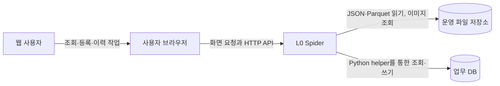
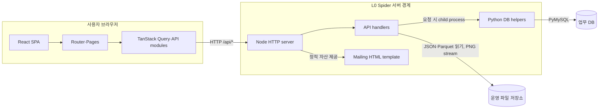

# L0 Spider 시스템 아키텍처

> 문서 목적: 현재 L0 Spider의 구성요소, 책임, 연결 관계와 신뢰 경계를 정의한다.
> 문서 상태: `Active Baseline`
> 아키텍처 범위: As-Is
> 검증 기준 branch: `main`
> 검증 기준 코드 commit: `99c4361164d4109a71f0153a5c963fa4f5d52cb4`
> 최신 하네스 감사: [reports/audit/harness-final-review.md](../../reports/audit/harness-final-review.md)
> 주요 근거: `AGENTS.md`, `reports/audit/system-inventory.md`, `docs/system/overview.md`
> 상세 환경·데이터 흐름·기능·운영 문서와 Core 계약·검증 진입점은 현재 tree에 존재한다.

## 1. 문서 목적과 범위

이 문서는 현재 checkout된 코드와 설정으로 확인되는 L0 Spider의 As-Is 아키텍처를 설명한다.
구성요소별 책임, 호출 관계, 외부 저장소와 신뢰 경계를 정의하되 전체 API·환경변수·데이터 경로 목록은 다루지 않는다.
현재 구현 사실, 저장소 소유자가 확정한 프로젝트 운영 정책과 Core Harness 산출물 상태를 구분한다.
`mock-agent`는 운영 런타임 구성요소가 아니며 세부 환경·데이터·배포·보안·기능 계약은 16절의 기준 문서가 담당한다.

## 2. 아키텍처 요약

L0 Spider는 브라우저에서 실행되는 React SPA와 이를 제공하는 Node HTTP 서버를 중심으로 구성된다.
SPA는 React Router로 페이지를 전환하고 기능별 API 모듈과 TanStack React Query로 `/api/*`를 호출한다.
Node 서버는 API route, 요청 검증, Parquet 집계, JSON 조회, 이미지 stream과 SPA 정적 제공을 담당한다.
운영 분석 파일은 Node handler가 직접 읽고 사용자·등록·이력 DB는 Python helper를 통해 접근한다.
대시보드 서버 영역은 화면과 메일이 참조할 요약 데이터를 생산하고 브라우저 대시보드는 이를 소비한다.
Self Equipment 딥링크의 `step=ALL`과 `eqpCh` 소비는 확인되지만 개별 STEP HMAC 생성·검증은 확인되지 않았다.
Mailing 요약·등록 API·HTML template은 존재하지만 renderer·scheduler·sender는 `Unknown`이며, 실행 형태는 하나의 Node HTTP 서버와 요청 시 생성되는 Python 자식 프로세스다.

## 3. 시스템 컨텍스트

| 구분 | 대상 | 역할 | L0 Spider와의 관계 | 상태 | 근거 |
|---|---|---|---|---|---|
| 행위자 | 웹 사용자 | 이상 결과 조회, 조건 등록과 이력 작업 | 브라우저를 통해 화면과 API 사용 | Confirmed | `docs/user-manual/USER_MANUAL.md` |
| 클라이언트 | 사용자 브라우저 | React SPA 실행과 HTTP 요청 | Node 서버가 제공한 UI에서 `/api/*` 호출 | Confirmed | `src/main.jsx`, `src/features/fdc-trend/api/` |
| 저장소 | 운영 파일 저장소 | mapping JSON, Parquet와 분석 이미지 보관 | Node handler가 읽기·검증·집계·stream | Confirmed | `src/config/spiderDataPaths.mjs`, `server/*Data.mjs` |
| 저장소 | 업무 DB | 사용자, 등록 조건과 이력 보관 | Python helper가 PyMySQL로 읽기·쓰기 | Confirmed | `scripts/*.py`, `scripts/requirements.txt` |
| 외부 처리 | 데이터 생성 주체 | 운영 Parquet·이미지 생성 후보 | 생성 주체·주기·전달 계약 미확인 | Unknown | `reports/audit/system-inventory.md` |
| 외부 처리 | 메일 전송 시스템 | template rendering과 실제 발송 후보 | 구현 위치와 연동 방식 미확인 | Unknown | `public/mailing-report.html`, `web_structure.md` |
| 운영 | 배포·proxy·monitoring | 실행, TLS, 접근과 관찰성 관리 후보 | 저장소 내 구체 설정 미확인 | Unknown | `reports/audit/system-inventory.md` |

### 시스템 컨텍스트 다이어그램

## 4. 논리 구성요소

| 구성요소 | 주요 책임 | 대표 경로 또는 식별자 | 입력 | 출력 | 의존 대상 | 상태 |
|---|---|---|---|---|---|---|
| SPA bootstrap | Provider와 router 마운트 | `src/main.jsx`, `AppProviders` | HTML root | React 애플리케이션 | React, Router, Query | Confirmed |
| 화면·라우팅 | Dashboard, Self Equipment, 등록·분석 화면 전환 | `src/features/fdc-trend/routes.jsx` | URL·사용자 입력 | page UI | 브라우저 API 계층 | Confirmed |
| 브라우저 API 계층 | query 구성, fetch와 일부 응답 검증 | `src/features/fdc-trend/api/` | 화면 조회 조건 | JSON·오류 | Node `/api/*` | Confirmed |
| Node HTTP 서버 | API dispatch, Vite middleware 또는 `dist` 제공 | `server.mjs` | HTTP 요청 | API·정적 응답 | handler, Vite | Confirmed |
| 데이터 handler | 검증, 필터·집계, 파일·이미지 제공 | `server/*Data.mjs` | URL 조건 | filter·chart·image payload | 운영 파일 | Confirmed |
| DB 경계 | helper 실행, timeout과 JSON 중계 | `server/*History.mjs`, `server/*Registration.mjs` | 검증된 payload | DB 처리 결과 | Python helper | Confirmed |
| Python DB helper | credential 로딩과 SQL 실행 | `scripts/*.py` | stdin JSON·환경변수 | stdout JSON | 업무 DB | Confirmed |
| 대시보드 생산자 | 날짜·Line·Grade 집계와 Mailing 요약 생성 | `server/dashboardData.mjs` | detail·stats·mapping | `lineDashboard` | 운영 파일 | Confirmed |
| STEP URL 처리 | 쿼리 생성·정규화와 화면 초기값 적용 | `dashboardLinks.mjs`, `selfEquipmentUrlFilters.mjs` | URL 조건 | 초기 필터 | Self Equipment 화면 | Confirmed |
| HMAC 처리 | 개별 STEP 토큰 생성·검증 후보 | 현재 구현 위치 미확인 | 후보 토큰 | 검증·매핑 결과 | 비밀키 후보 | Unknown |
| 메일 template | KPI·표·딥링크의 HTML 구조 정의 | `public/mailing-report.html` | template 변수 | HTML 후보 | 외부 renderer 후보 | Confirmed |
| 메일 전달 | 렌더링, scheduling, 수신자 결정과 전송 | 현재 구현 위치 미확인 | 요약·등록 조건 | 실제 메일 | 외부 메일 시스템 후보 | Unknown |
| 공통 관찰성 | console·stderr 기반 오류 기록 | `server.mjs`, `server/*.mjs` | 실행·helper 오류 | process log | 실행 환경 | Confirmed |

## 5. 프론트엔드 아키텍처

| 책임 | 대표 경로 | 주요 기술 또는 식별자 | 상태 | 근거 |
|---|---|---|---|---|
| 시작과 전역 상태 | `src/main.jsx`, `AppProviders.jsx` | React 19, `RouterProvider`, `QueryClientProvider` | Confirmed | manifest와 import |
| 라우팅 | `src/routes/router.jsx`, feature `routes.jsx` | React Router, 기본·`/fdc_trend` prefix | Confirmed | route 선언 |
| 페이지 구성 | `src/features/fdc-trend/pages/` | Dashboard, Self Equipment, 등록, 동일성·공통부 | Confirmed | page import와 route |
| 서버 상태 | `src/lib/queryClient.js`, page `useQuery` | TanStack React Query, 기본 cache·retry 정책 | Confirmed | manifest와 import |
| API 호출 | `src/features/fdc-trend/api/` | Fetch API, `URLSearchParams`, 오류 정규화 | Confirmed | API 모듈 |
| UI·스타일 | `src/components/ui/`, `src/styles/` | Radix UI, Tailwind CSS, shadcn 설정 | Confirmed | manifest, import와 설정 |
| 시각화 | Dashboard·chart 컴포넌트 | Recharts, Plotly 관련 컴포넌트 | Confirmed | manifest와 실제 import |
| 정적 문서 | `UserManualPage.jsx` | Markdown raw import와 image glob | Confirmed | 사용자 메뉴얼 page |

URL query는 page 또는 utility에서 정규화하며 화면은 loading·빈 결과·오류 UI를, API 계층은 일부 응답 shape 검사를 제공한다.
정적 자산은 `public/`, 메뉴얼 원본과 이미지는 `docs/user-manual/`에 있다.

## 6. 서버 및 API 아키텍처

| 책임 | 대표 경로 또는 식별자 | 호출 대상 | 상태 | 근거 |
|---|---|---|---|---|
| 실행·route dispatch | `server.mjs` — `createServer` | 각 `handle*Request` | Confirmed | route 분기 |
| Dashboard 응답 | `handleDashboardDataRequest` | `getDashboardSummary` | Confirmed | `server/dashboardData.mjs` |
| Self Equipment | `handleSelfEquipmentDataRequest`, scatter·file handler | Parquet, 이미지, 이력 DB | Confirmed | `server/selfEquipmentData.mjs` |
| 동일성·공통부 | `handleCommonality*`, `handleCommonAnomaly*` | 디렉터리, Parquet와 PNG | Confirmed | 대응 data 모듈 |
| 사용자·등록·이력 | current user, registration, history handler | Python helper | Confirmed | 대응 Node·Python 파일 |
| 정적 제공 | Vite middleware 또는 `dist` fallback | SPA asset | Confirmed | `server.mjs` |
| 오류 처리 | handler별 status와 JSON, 최상위 catch | 브라우저 | Confirmed | `sendJson`, route catch |

Node는 파일에 직접 접근하고 DB는 `python3 -B` helper를 실행하며, helper는 stdin/stdout JSON과 서버 측 `DB_INFO_PATH`를 경계로 사용한다.
요청 method·필수 query·body 크기·일부 값 범위를 handler가 검증하지만 전체 API의 공통 schema 계층은 확인되지 않았다.

## 7. 데이터 접근 아키텍처

| 데이터 유형 | 접근 주체 | 접근 방식 | 대표 코드 | 생성 책임 | 상태 |
|---|---|---|---|---|---|
| mapping JSON | Node | 파일 읽기와 mapping 변환 | `mappingConfig.mjs`, `dashboardData.mjs` | Unknown | Confirmed |
| Dashboard detail·stats | Node | hyparquet 집계와 metadata cache | `dashboardData.mjs` | Unknown | Confirmed |
| Self Equipment Parquet | Node | 허용 경로 변환, hyparquet와 LRU | `selfEquipmentData.mjs` | Unknown | Confirmed |
| 동일성·공통부 데이터 | Node | 디렉터리 index, Parquet 조회와 PNG stream | `commonalityData.mjs`, `commonAnomalyData.mjs` | Unknown | Confirmed |
| 사용자·기준정보 | Python helper | SELECT | `current_user.py`, `my_eqp_reference.py` | DB 관리 주체 Unknown | Confirmed |
| 등록·이력 | Python helper | SELECT·INSERT·UPDATE·DELETE, 일부 runtime DDL | registration·history helper | L0 Spider 쓰기 | Confirmed |
| 사용자 메뉴얼 | Vite·브라우저 | build resource import | `UserManualPage.jsx` | 저장소 문서 | Confirmed |

Node handler는 파일 존재와 허용 root를 검사하고 일부 cache를 `mtimeMs`와 size 변경으로 갱신한다.
파일 없음·조건 누락·읽기 오류는 handler별 빈 payload 또는 4xx·5xx로 구분되며 통합 계약은 아직 없다.
실제 `/appdata`를 조사하지 않았으며 화면별 전체 추적은 [data-flow.md](data-flow.md)와 기능 문서에서 관리한다.

## 8. 주요 런타임 구성과 연결

`server.mjs`는 Vite middleware mode에서 SPA와 API를 함께 제공하고 정적 mode에서는 `dist`를 제공한다.
Python helper는 요청 시 생성되는 자식 프로세스이며 미확인 STEP HMAC과 메일 renderer·sender는 다이어그램에서 제외했다.

## 9. 네 가지 필수 영역의 아키텍처 위치

### 9.1 데이터 경로와 화면 연결

대표 책임 흐름은 `화면 → route/page → API module → Node handler → 파일 또는 Python helper → DB`다.
파일 기반 화면은 Node가 경로를 검증·집계하고, 등록·이력은 Python helper가 DB 연산을 수행한다.
화면별 파라미터 출처, 경로 pattern과 데이터 없음 처리는 `docs/system/data-flow.md`에서 후속 정의한다.

### 9.2 대시보드 API 계약 경계

계약 생산자는 `server/dashboardData.mjs`의 `handleDashboardDataRequest`와 payload builder다.
소비자는 `dashboardApi.js`와 `LineAnomalyDashboard.jsx`이며 응답 배열과 대표 summary 필드를 사용한다.
`GET /api/dashboard-data`의 응답 구조·nullable·오류 body가 계약 검증 대상이고 변경 시 Dashboard, Mailing template 계약과 후속 JSON Schema를 함께 검토한다.
현재 산출물은 [dashboard.md](../features/dashboard.md), `harness/contracts/dashboard-api.schema.json`, Dashboard fixture와 `tests/contract/dashboard-api.contract.test.mjs`다. 오류 응답과 root producer 직접 계약은 `Partial`이다.

### 9.3 STEP 딥링크와 HMAC 경계

확인된 생성자는 `dashboardLinks.mjs`와 Mailing template이며 `/self-equipment` query를 만든다.
브라우저의 `selfEquipmentUrlFilters.mjs`와 `FdcTrendPage.jsx`가 `line`, `sdwt`, `grade`, `step`, `eqpCh`를 소비한다.
`step=ALL`과 `eqpCh`는 `Confirmed`지만 개별 STEP HMAC 생성·서버 검증·비밀키 신뢰 경계·변조·만료 처리는 `Unknown`이다.
상세 계약은 `docs/features/step-deeplink.md`, `docs/features/self-equipment.md`, `docs/system/security.md`, 관련 ADR에서 정의한다.

### 9.4 메일 생성 및 발송 경계

대시보드 서버는 `lineDashboard.mailingSummary`와 KPI를 만들고 등록 API는 DB의 수신 조건을 관리한다.
`public/mailing-report.html`은 수신인별 rows, KPI와 Self Equipment 링크를 요구하는 Jinja 호환 template이다.
실제 데이터 결합, 수신자 최종 결정, auto-escape 적용, rendering, scheduling, 전송, 성공·실패·재시도·발송 log는 `Unknown`이다.
현재 Core 산출물은 [mailing.md](../features/mailing.md), `harness/contracts/mailing-summary.schema.json`, Mailing fixture와 `tests/contract/mailing-summary.contract.test.mjs`다. renderer·sender와 render test는 `Blocked`이며 mock 의존 integration은 `mock-agent` 범위다.

## 10. 신뢰 경계와 보안상 책임

| 경계 또는 자원 | 신뢰 수준 | 주요 위험 | 현재 보호 방식 | 상태 | 후속 문서 |
|---|---|---|---|---|---|
| 브라우저 입력 | 신뢰하지 않음 | 잘못된 query·body, 과대 요청 | handler validation, 일부 body·개수 제한 | Confirmed | `security.md` |
| 사용자 식별 | 조건부 신뢰 | proxy header 위조와 오식별 | forwarded IP→DB 승인 사용자 조회 | Risk | `security.md`, 환경 정의 |
| 파일 시스템 | 서버 신뢰 경계 | path traversal, 운영 파일 노출 | 허용 root·확장자·파일 존재 검사 | Confirmed | `security.md` |
| DB credential | 고신뢰 비밀 | 노출·과도한 DB 권한 | 서버 측 파일과 `DB_INFO_PATH` 사용 | Confirmed | `security.md` |
| HMAC 비밀키 | 정의되지 않음 | 키 노출, 검증 부재 | 구현·키 이름 미확인 | Unknown | `security.md`, STEP ADR |
| DB 쓰기 | 운영 자원 | 오등록·DDL 영향 | Node validation과 Python transaction | Risk | 운영·배포 문서 |
| 메일 수신자·인증 | 개인정보·비밀 | 오발송·수신자 혼합 | template 요구사항만 확인 | Documented | `mailing.md`, `security.md` |
| log·오류 응답 | 운영 정보 | 성공 path·외부 log 노출 | CORE-03A 실패 응답은 safe code/request ID, 성공 legacy path는 유지 | Partial | `security.md` |

확인되지 않은 보호 방식을 구현 사실로 확장하지 않으며 상세 위협·비밀·오류 정보 정책은 향후 `docs/system/security.md`에서 정의한다.

## 11. 실행 및 배포 관점의 아키텍처

- `package.json`의 `start`와 `preview`는 `server.mjs`를 실행하며 `dev`는 Vite 단독 서버를 실행한다. (`Confirmed`)
- `server.mjs`는 환경에 따라 Vite middleware 또는 build된 `dist` 정적 자산을 제공한다. (`Confirmed`)
- 확인된 상시 애플리케이션 진입점은 Node HTTP 서버 하나이며 DB helper는 요청별 자식 프로세스다. (`Confirmed`)
- host·port·mode·데이터 root·DB credential 위치는 `process.env` 참조로 조정된다. (`Confirmed`)
- log는 console과 Python stderr로 전달되지만 수집·rotation·보존 정책은 `Unknown`이다.
- Node.js·Python 버전, OS, systemd, Docker, reverse proxy, TLS, health check와 monitoring 구성은 `Unknown`이다.
- Vite 단독 서버와 통합 서버의 API 범위가 다르므로 실행 mode에 따른 기능 차이가 있다. (`Mismatch`)

구체적인 값과 절차는 `docs/system/environment-definition.md`, `docs/system/deployment.md`, `docs/operations/runbook.md`, `docs/operations/systemd.md`에서 후속 정의한다.

## 12. Core Harness와 mock-agent 경계

이 절은 런타임 구현이 아니라 저장소 소유자가 확정한 프로젝트 운영 정책이다.
`main`은 실제 L0 Spider와 Core Harness의 기준이며 시스템 문서, API·데이터 계약과 운영 자원 비의존 검증을 관리한다.
mock 서버·API·DB·데이터·실행 script, mock 의존 integration·E2E와 Browser QA는 `mock-agent`에서만 관리한다.
`main`의 런타임·빌드·검증은 `mock-agent`에 의존하지 않고 기본 동기화 방향은 `main → mock-agent`다.
mock 구현은 `main`으로 병합하지 않으며 `mock-agent`가 `main`의 계약과 기능 정의를 따라야 한다.
이번 작업에서는 `mock-agent`를 checkout하거나 조사하지 않았다.

## 13. 아키텍처 제약과 보존 원칙

- 기존 사용자 route, query와 API 호환성을 임의로 깨지 않는다.
- 운영 DB와 `/appdata` 자원을 테스트 대상으로 쓰거나 변경하지 않는다.
- 실제 메일 발송과 수신자 결정 변경은 데이터·개인정보·운영 영향을 먼저 검토한다.
- HMAC 비밀키와 검증 책임은 서버 측 신뢰 경계를 벗어나 브라우저로 이동시키지 않는다.
- 데이터 경로 변경 시 화면, API, 문서와 Core 계약 검증 영향을 함께 확인한다.
- Node→Python→DB 경계 변경은 timeout, 오류 변환, transaction과 권한 영향을 검토한다.
- mock 구현을 이유로 `main` 런타임에 mock 의존성을 추가하지 않는다.

## 14. 확인된 Mismatch

| 항목 | 코드 또는 설정 | 기존 문서·후보 | 영향 | 후속 조치 |
|---|---|---|---|---|
| API route 범위 | `server.mjs`가 Vite middleware보다 더 많은 API 제공 | 두 실행 방식이 같은 앱으로 안내됨 | 개발 mode별 기능 가용성이 다름 | 환경·배포 문서에서 기준 실행 방식 정의 |
| Mailing summary 위치 | `lineDashboard.mailingSummary` | `lineDashboard.summary.mailingSummary` 후보 | schema·sender 소비 위치 오류 가능 | Dashboard 계약으로 실제 위치 고정 |
| 개별 STEP HMAC | 생성·검증·key 설정과 비-`ALL` 적용 근거 없음 | HMAC token 딥링크 후보 | 무결성·오류·호환 정책 확정 불가 | STEP 문서·보안·ADR에서 재확인 |

## 15. Unknown 및 후속 확인 필요 사항

| 항목 | 현재 상태 | 확인이 필요한 이유 | 후속 문서 또는 단계 |
|---|---|---|---|
| 운영 데이터 생산 주체·주기 | 저장소에서 미확인 | 신선도·장애·복구 경계 결정 | `data-flow.md`, 운영 환경 확인 |
| 실제 DB 제품·버전·권한 | 코드에는 PyMySQL 접근만 확인 | migration·runtime DDL·최소 권한 평가 | 환경·배포·보안 문서 |
| 개별 STEP HMAC 계약 | 구현·키·검증 미확인 | 딥링크 신뢰 경계 확정 | STEP 문서와 ADR |
| 실제 메일 전달 흐름 | renderer·scheduler·sender 미확인 | 수신자 분리, 실패·재시도·감사 확인 | `mailing.md`, 운영 환경 확인 |
| 배포 topology | process manager·proxy·TLS 미확인 | 실행·접근·복구 책임 확정 | 환경·배포 문서 |
| log·monitoring·health check | 저장소 설정 미확인 | 장애 감지와 정보 노출 정책 확인 | 운영·보안 문서 |
| API 전체 계약 | schema·호환·payload 한계 미정 | 생산자·소비자 변경 안전성 확보 | 기능 문서와 contract 단계 |

## 16. 연계 문서와 책임 분리

| 문서 | 담당 범위 | 상태 |
|---|---|---|
| `docs/system/overview.md` | 시스템 목적·기능·Core 범위 요약 | 작성됨 |
| `docs/system/architecture.md` | As-Is 구성요소·책임·연결·신뢰 경계 | 현재 문서 |
| [environment-definition.md](environment-definition.md) | runtime, 환경변수 이름과 환경 차이 | 작성됨; 운영값 `Unknown` 유지 |
| [data-flow.md](data-flow.md) | 화면→API→서비스→데이터 전체 추적 | 작성됨; 일부 Flow `Partial` |
| [deployment.md](deployment.md) | build·배포 topology와 절차 | 작성됨; 실제 topology `Unknown` |
| [security.md](security.md) | 신뢰 경계, 비밀·입력·로그 정책 | 작성됨; 운영 통제 일부 `Blocked` |
| [dashboard.md](../features/dashboard.md) | Dashboard 화면·API·데이터 계약 | 작성됨; success Schema·fixture·contract test 존재 |
| [self-equipment.md](../features/self-equipment.md) | Self Equipment·MY EQP 기능 흐름 | 작성됨 |
| [step-deeplink.md](../features/step-deeplink.md) | query와 HMAC 계약 | 작성됨; 실제 HMAC `Blocked` |
| [mailing.md](../features/mailing.md) | 집계·template·수신자·발송 경계 | 작성됨; renderer·sender `Blocked` |
| [abnormal-data.md](../features/abnormal-data.md) | 동일성·공통부 데이터와 화면 | 작성됨 |
| `harness/contracts/`, `harness/fixtures/` | Dashboard·Mailing summary 실행 계약과 최소 synthetic sample | 작성됨 |
| `tests/{unit,integration,contract}/` | ALL·딥링크·Dashboard·Mailing summary 검증 | 작성됨; HMAC·mail render는 `Blocked` |
| `scripts/verify-{env,contracts,all}.sh` | 안전한 Core 검증 진입점 | 작성됨 |

## 17. 근거 자료

| 자료 | 사용 목적 | 상태 |
|---|---|---|
| `AGENTS.md` | 안전, 판정과 Core/mock 정책 | Confirmed |
| `reports/audit/system-inventory.md` | 코드·문서 근거 인덱스와 Mismatch | Confirmed |
| `docs/system/overview.md` | 시스템 목적과 상위 경계 | Confirmed |
| `web_structure.md` | 기존 구성도와 화면·API·저장소 연결 | Confirmed |
| `docs/user-manual/USER_MANUAL.md` | 사용자·기능·화면 용어 | Confirmed |
| `src/main.jsx`, route·API 모듈 | 프론트엔드 진입·호출 구조 | Confirmed |
| `server.mjs`, `server/*.mjs` | HTTP·API·파일·DB helper 경계 | Confirmed |
| `src/config/spiderDataPaths.mjs`, `scripts/*.py` | 파일 경로와 DB 접근 책임 | Confirmed |
| `public/mailing-report.html`, `package.json`, `vite.config.mjs` | Mailing 계약과 실행·기술 근거 | Confirmed |

이 문서는 검증 기준 코드 commit `99c4361`의 As-Is 아키텍처와 현재 Core Harness 위치를 설명한다.
코드 또는 시스템 구조가 바뀌면 관련 아키텍처, 기능 문서와 실행 계약을 함께 검토한다.
