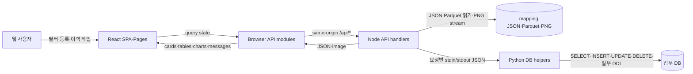

# L0 Spider 데이터 흐름 및 화면-데이터 추적성

> 문서 목적: 사용자 화면에서 실제 데이터 원천과 출력까지 이어지는 As-Is 연결을 정의한다.
> 문서 상태: `Active Baseline`
> 데이터 흐름 범위: `As-Is`
> 검증 기준 branch: `main`
> 검증 기준 코드 commit: `2d5535366fc56ecff7a322139ddfe6f09cd4df25` + 현재 working tree 변경
> 최신 하네스 감사: [reports/audit/harness-final-review.md](../../reports/audit/harness-final-review.md)
> 주요 근거: `AGENTS.md`, `reports/audit/system-inventory.md`, `docs/system/overview.md`, `docs/system/architecture.md`, `docs/system/environment-definition.md`
> 조사 제한: 실제 운영 데이터, DB, `.env`, 비밀키와 메일 전송 시스템은 열거나 실행하지 않았다.
> 브랜치 범위: `mock-agent`의 mock 서버·데이터·E2E 흐름은 `Out of Scope`이다.

## 1. 문서 목적과 범위

- 이 문서는 주요 사용자 기능을 `화면 → 라우트 → 프론트엔드 조회 → API → 서버 처리 → 데이터 원천 → 응답 → 화면·메일`로 연결한다.
- 현재 `main` 코드에서 확인되는 흐름만 As-Is 기준선으로 기록한다.
- 실제 `/appdata` 파일 내용과 실제 DB 행은 조사하지 않고 코드의 경로 pattern, table과 접근 방식만 확인했다.
- API의 field·nullable·호환 계약과 기능별 business rule은 현재 기능 문서와 JSON Schema가 담당한다. 오류 응답과 일부 운영 계약은 `Partial` 또는 `Blocked`다.
- 신뢰 경계의 상세 위협·비밀 관리 규칙은 [security.md](security.md)가 담당한다.
- `mock-agent`의 mock 흐름은 현재 시스템 데이터 원천이 아니며 이 문서에 포함하지 않는다.

## 2. 추적 방법과 판정 기준

기본 추적 방향은 다음과 같다.

`사용자 → 화면 → 프론트엔드 조회 → API → 서버 처리 → 데이터 원천 → 응답 → 화면·메일`

역방향으로는 `데이터 접근 코드 → 호출 함수 → API route → 프론트엔드 소비 → 사용자 화면`을 확인했다.
문자열만 발견되거나 한 방향만 연결된 경우 `Complete`로 판정하지 않았다.

| 상태 | 의미 |
|---|---|
| `Confirmed` | 코드, 설정 또는 명확한 호출 관계로 확인 |
| `Documented` | 기존 문서 또는 template 주석에만 기록 |
| `Inferred` | 코드 구조에 근거한 제한적 추정 |
| `Unknown` | 현재 자료와 허용된 조사로 확인 불가 |
| `Mismatch` | 코드·설정·문서 사이의 명확한 차이 |

| 추적 완성도 | 의미 |
|---|---|
| `Complete` | 사용자 진입, API, 데이터 원천, 응답과 최종 출력이 모두 연결됨 |
| `Partial` | 확인된 사실은 있으나 하나 이상의 중간 단계가 끊김 |
| `Unresolved` | 시작점 또는 원천만 확인되고 실행 연결을 확인하지 못함 |

근거는 `상대경로 — 식별자` 형식으로 표기하며 줄 번호는 직접 확인된 경우에만 사용한다.

## 3. 데이터 흐름 전체 요약

| Flow ID | 사용자 기능 | 시작점 | 주요 처리 | 데이터 원천 | 최종 출력 | 완성도 | 상태 |
|---|---|---|---|---|---|---|---|
| `DF-DASH-01` | Line Dashboard | `/`, `/fdc_trend` | 날짜 선택·고유조합 집계 | detail·stats Parquet, mapping JSON | KPI·막대·추이·상세표 | `Complete` | `Confirmed` |
| `DF-SELF-01` | Self Equipment 필터 | `/self-equipment` | mapping·path row·SKIP 제외·종속 필터 | team `df_path.parquet`, `pass_history` | STEP·EQP·sensor·ch_step·chart row | `Complete` | `Confirmed` |
| `DF-SELF-02` | Scatter·동일성 차트 | Self Equipment chart card | image path 검증·data path 변환·point 집계 | ERD `data.parquet`, history Parquet | scatter·3일 동일성·변경이력 | `Complete` | `Confirmed` |
| `DF-SELF-03` | MY EQP 조회 | `sdwt=MY_EQP` | 사용자·등록 조건·mapping·path row 결합 | `myeqp_regist`, mapping JSON, team Parquet | 등록 EQP 필터와 chart row | `Complete` | `Confirmed` |
| `DF-ABN-01` | 동일성 이상감지 | `/matching-anomaly` | 최신 directory index와 종속 필터 | `erd_commonality` directory·PNG | 분석 이미지 카드 | `Complete` | `Confirmed` |
| `DF-ABN-02` | 공통부 이상감지 | `/common-anomaly` | path row·SKIP 제외·data/image 변환 | `path_common` Parquet, common Parquet·PNG, DB | 이미지·scatter·동일성 chart | `Complete` | `Confirmed` |
| `DF-ABN-03` | 공통부 동일성 이상감지 | `/common-commonality-anomaly` | 최신 directory index와 EQP_MODEL 종속 필터 | `path_common_commonality` directory·PNG | 분석 이미지 카드 | `Complete` | `Confirmed` |
| `DF-COMMON-01` | 조회 카테고리 이력 | 네 이상감지 화면의 최종 필터 | drawing path→category 변환·사용자 결합 | `clicked_category_history` | 저장 성공·실패 toast | `Complete` | `Confirmed` |
| `DF-COMMON-02` | 결과 이력 저장 | 네 이상감지 화면의 결과 카드 | App별 image path 검증·사용자 결합 | `hit_history` | 카드별 저장 성공·실패 toast | `Complete` | `Confirmed` |
| `DF-MAIL-01` | Mailing·MY EQP 조건 등록 | `/registration` | 입력 정규화·Python helper·transaction | `email`, `myeqp_regist`, `erdtsum_info` | 등록 목록·저장/삭제 결과 | `Complete` | `Confirmed` |
| `DF-MAIL-02` | Mailing Report | HTML template | Dashboard summary와 등록 조건 결합 후보 | Dashboard 응답, DB 조건, template | HTML·메일 후보 | `Partial` | 일부 `Confirmed`, 전달은 `Unknown` |
| `DF-STEP-01` | STEP·MY EQP 딥링크 | Dashboard 또는 메일 LINK | URL query 생성·정규화·초기 필터 적용 | URL query, MY EQP·파일 데이터 | Self Equipment 진입 | `Partial` | `step=ALL`은 `Confirmed`, HMAC은 `Mismatch` |

## 4. 상위 데이터 흐름 다이어그램

- `Browser`는 5절의 route·page이며 운영 파일이나 DB에 직접 접근하지 않는다.
- `ApiLayer`는 `src/features/fdc-trend/api/`, `Node`는 `server.mjs`와 `server/*.mjs`다.
- `Files`는 6절의 운영 파일 원천이며 현재 scoped flow에서는 Node의 읽기만 확인됐다.
- `PyHelper`와 `Db`는 사용자·등록·이력 흐름의 읽기·쓰기 경계다.
- 개별 STEP HMAC과 실제 mail renderer·sender는 실행 연결 근거가 없어 다이어그램에서 제외했다.

## 5. 사용자 진입점과 화면 목록

기본 child route는 `/`와 `/fdc_trend` prefix 아래에 함께 등록된다.

| 화면 | 브라우저 라우트 | 주요 query | 페이지·컴포넌트 | 사용자 자료 | 상태 | 근거 |
|---|---|---|---|---|---|---|
| 메인·Dashboard | `/`, `/fdc_trend` | Dashboard API의 `startDate`, `endDate`, 반복 `line` | `L0SpiderHomePage`, `LineAnomalyDashboard` | 메뉴얼 2장 | `Confirmed` | `routes.jsx` — `fdcTrendRoutes`; `LineAnomalyDashboard` |
| Self Equipment | `/self-equipment`, `/fdc_trend/self-equipment` | `line`, 반복 `sdwt`, 반복 `grade`, `step`, `eqpCh`/`eqp_ch` | `FdcTrendPage` | 메뉴얼 4장 | `Confirmed` | `FdcTrendPage` — `useSearchParams`; `readSelfEquipmentUrlFilters` |
| 등록 Hub | `/registration`; alias `/my-eqp`, `/recipients` | 화면 내부 사용자·Line 조건 | `RegistrationHubPage`, `MailingRegistrationPage`, `MyEqpRegistrationPage` | 메뉴얼 5장 | `Confirmed` | `routes.jsx`; `RegistrationHubPage` |
| 동일성 | `/matching-anomaly` | 화면 상태로 Line·SDWT·STEP·sensor·ch_step | `CommonalityAnomalyPage` | 메뉴얼 6.1 | `Confirmed` | `CommonalityAnomalyPage` |
| 공통부 | `/common-anomaly` | 화면 상태로 Line·SDWT·prc_group·eqp·sensor | `CommonAnomalyPage` | 메뉴얼 6.2 | `Confirmed` | `CommonAnomalyPage` |
| 공통부 동일성 | `/common-commonality-anomaly` | 화면 상태로 Line·SDWT·EQP_MODEL·sensor·ch_step | `CommonalityAnomalyPage` variant | 메뉴얼 6.3 | `Confirmed` | `routes.jsx`; `CommonalityAnomalyPage` |
| Mailing LINK | `/self-equipment?...` | 전체설비: Line·SDWT·Grade; MY EQP: 추가 `step=ALL`, `eqpCh` | `FdcTrendPage` | 메뉴얼 7장 | 링크 형식 `Confirmed` | `public/mailing-report.html`; URL filter utility |

## 6. 데이터 원천 카탈로그

| Data Source ID | 유형 | 경로·table·자원 pattern | 접근 주체 | 읽기·쓰기 | 생성 책임 | 사용 Flow | 상태 | 근거 |
|---|---|---|---|---|---|---|---|---|
| `DS-MAP-01` | JSON | `MAPPING_CONFIG_PATH` 또는 mapping template | Node | 읽기 | `Unknown` | Dashboard·Self·이상·등록 | `Confirmed` | `mappingConfig.mjs` — `readLineMapping` |
| `DS-EXCLUDE-01` | JSON | 기본 `config/sensor-exclusions.json`, 선택적 `SENSOR_EXCLUSION_CONFIG_PATH` override | Node | 읽기 | 개발자·배포 담당자 | 네 이상감지 App·Mailing 후보 요약 | `Confirmed` | `sensorExclusionConfig.mjs` — `readSensorExclusionConfig` |
| `DS-DASH-01` | Parquet | `path/{latest_date}` | Node | 읽기 | `Unknown` | `DF-DASH-01`, `DF-MAIL-02` | `Confirmed` | `dashboardData.mjs` — `listDashboardDateFiles` |
| `DS-DASH-02` | Parquet | `stats/{latest_date}_spider_step_stats.parquets` | Node | 읽기 | `Unknown` | `DF-DASH-01`, `DF-MAIL-02` | `Confirmed` | `buildDashboardStatsPath` |
| `DS-SELF-01` | Parquet | `path/{line}/{sdwt}/df_path.parquet` | Node | 읽기 | `Unknown` | `DF-SELF-01`, `DF-SELF-03` | `Confirmed` | `selfEquipmentData.mjs` — `readTeamErdRows` |
| `DS-SELF-02` | Parquet·PNG | `erd/{latest_date}/.../{sensor}/{ch_step}/data.parquet`, sibling image·history | Node | 읽기·stream | `Unknown` | `DF-SELF-02` | `Confirmed` | `resolveErdDataFilePath`, `handleErdFileRequest` |
| `DS-ABN-01` | directory·PNG | `erd_commonality/{latest_date}/.../{sensor}_{ch_step}/img.png` | Node | directory 읽기·stream | `Unknown` | `DF-ABN-01` | `Confirmed` | `commonalityData.mjs` — `collectCommonalityRows` |
| `DS-ABN-02` | Parquet·PNG | `path_common/{line}/{sdwt}/df_path.parquet` → `common/.../data.parquet`, PNG | Node | 읽기·stream | `Unknown` | `DF-ABN-02` | `Confirmed` | `commonAnomalyData.mjs` |
| `DS-ABN-03` | directory·PNG | `path_common_commonality/{latest_date}/{sdwt}/{eqp_model}/{grade}/{sensor}@{ch_step}/img.png` | Node | directory 읽기·stream | `Unknown` | `DF-ABN-03` | `Confirmed` | `commonCommonalityData.mjs` |
| `DS-DB-USER` | DB | `v_ipms_ip_info`, `user_info` | Python | 읽기 | DB 관리 주체 `Unknown` | Self·등록·이력 | `Confirmed` | `scripts/current_user.py` |
| `DS-DB-REF` | DB | `erdtsum_info` | Python | 읽기 | DB 관리 주체 `Unknown` | `DF-MAIL-01` MY EQP 기준 | `Confirmed` | `scripts/my_eqp_reference.py` |
| `DS-DB-REG` | DB | `myeqp_regist`, `email` | Python | 읽기·쓰기; 일부 DDL | L0 Spider 쓰기, schema 책임 `Unknown` | `DF-SELF-03`, `DF-MAIL-01/02` | `Confirmed` | registration helper |
| `DS-DB-HIST` | DB | `pass_history`, `hit_history`, `clicked_category_history` | Python | 읽기·쓰기 | L0 Spider 쓰기 | `DF-SELF-01/02`, `DF-ABN-01~03`, `DF-COMMON-01/02` | `Confirmed` | history helper |
| `DS-MAIL-01` | HTML | `public/mailing-report.html` | 외부 renderer 후보 | template 소비 | 저장소가 template 관리 | `DF-MAIL-02`, `DF-STEP-01` | template `Confirmed` | Jinja 호환 변수·loop |

- 파일 원천은 현재 흐름에서 L0 Spider가 읽는 외부 결과이며 생성 주체와 주기는 `Unknown`이다.
- DB 쓰기는 등록·삭제·이력 기능에서 확인됐지만 실제 DB 권한과 migration 책임은 확인되지 않았다.

## 7. 핵심 화면-데이터 추적 매트릭스

### 프론트엔드 및 API 추적

| Flow ID | 화면·라우트 | 컴포넌트·query | 요청 | 응답 소비·출력 | 상태 | 근거 |
|---|---|---|---|---|---|---|
| `DF-DASH-01` | Dashboard `/` | `LineAnomalyDashboard` — `spider-line-dashboard*` | `fetchDashboardSummary` → `GET /api/dashboard-data` | `summary`, `lineSummary`, `dailyTrend`, `options` → KPI·chart·table | `Confirmed` | `dashboardApi.js`; Dashboard component |
| `DF-SELF-01` | `/self-equipment` | `FdcTrendPage` — `self-equipment-data` | `GET /api/self-equipment-data` | `steps`, `eqpChannels`, `sensors`, `chSteps`, `rows` | `Confirmed` | `selfEquipmentApi.js`; `FdcTrendPage` |
| `DF-SELF-02` | chart card | `ErdScatterCard`, `ThreeDayIdentityChartCard` | `GET /api/erd-scatter-data`; `GET /api/erd-file` | point group·history·image → chart/card | `Confirmed` | `fetchErdScatterData`, `fetchErdIdentityData` |
| `DF-SELF-03` | MY EQP | `FdcTrendPage` — `my-eqp-equipment-data` | `GET /api/my-eqp-equipment-data` | 등록·매칭 count, filter option, rows | `Confirmed` | `fetchMyEqpEquipmentData` |
| `DF-ABN-01` | `/matching-anomaly` | `CommonalityAnomalyPage` — `commonality-data` | `GET /api/commonality-data`, image | filter option·rows → paged PNG card | `Confirmed` | `commonalityApi.js`; page |
| `DF-ABN-02` | `/common-anomaly` | `CommonAnomalyPage` — common query keys | data·scatter·image API | path rows·point groups·PNG → cards/charts | `Confirmed` | `commonAnomalyApi.js`; page |
| `DF-ABN-03` | `/common-commonality-anomaly` | `CommonalityAnomalyPage` — `common-commonality-data` | data·image API | EQP_MODEL option·rows → paged PNG card | `Confirmed` | `commonCommonalityApi.js`; page |
| `DF-COMMON-01` | 최종 필터 click | 각 page mutation성 호출 | `POST /api/clicked-category-history` | `affectedRows` → 실패 toast | `Confirmed` | `clickedCategoryHistoryApi.js` |
| `DF-COMMON-02` | 결과 image/chart card | 각 card의 `createHitHistory` mutation | `POST /api/hit-history` | `affectedRows` → 성공·실패 toast | `Confirmed` | `hitHistoryApi.js`; 세 page |
| `DF-MAIL-01` | `/registration` | registration query·mutation | registration·reference·current user API | 등록 목록·toast·삭제 결과 | `Confirmed` | 두 registration page |
| `DF-MAIL-02` | 발송 메일 후보 | renderer 미확인 | 현재 저장소의 HTTP 호출 없음 | template KPI·표·LINK | `Partial` | `public/mailing-report.html` |
| `DF-STEP-01` | `/self-equipment?...` | URL filter utility, `FdcTrendPage` | 초기 query가 이후 Self API filter로 변환 | Line·SDWT·Grade·ALL STEP·EQP 초기 선택 | `Partial` | `selfEquipmentUrlFilters.mjs` |

### 서버 및 데이터 추적

| Flow ID | API·진입점 | handler·서비스 | 데이터 원천 | 변환·집계 | 상태 | 근거 |
|---|---|---|---|---|---|---|
| `DF-DASH-01` | `GET /api/dashboard-data` | `getDashboardSummary` | `DS-DASH-01/02`, `DS-MAP-01` | 날짜별 최신·D-1 선택, 5-key 고유집계 | `Confirmed` | `dashboardData.mjs` |
| `DF-SELF-01` | `GET /api/self-equipment-data` | `readTeamErdRows`, `buildSelfEquipmentPayload` | `DS-SELF-01`, `pass_history` | 최근 SKIP 제외, 종속 option·row 생성 | `Confirmed` | `selfEquipmentData.mjs` |
| `DF-SELF-02` | scatter·file API | `resolveErdDataFilePath`, payload builder | `DS-SELF-02` | axis column, point grouping·sampling·history | `Confirmed` | `selfEquipmentData.mjs` |
| `DF-SELF-03` | `GET /api/my-eqp-equipment-data` | 사용자·등록 조회 후 `filterMyEqpRows` | DB·mapping·복수 `DS-SELF-01` | active registration과 EQP 정규화 매칭 | `Confirmed` | `handleMyEqpEquipmentDataRequest` |
| `DF-ABN-01` | commonality data/image API | latest path·directory index·filter payload | `DS-ABN-01` | folder segment를 image row로 변환 | `Confirmed` | commonality modules |
| `DF-ABN-02` | common anomaly APIs | path·scatter·image handler | `DS-ABN-02`, `pass_history` | path→data/image, EQP match, point group | `Confirmed` | `commonAnomalyData.mjs` |
| `DF-ABN-03` | common-commonality APIs | latest path·directory index·filter payload | `DS-ABN-03` | folder segment를 image row로 변환 | `Confirmed` | common-commonality modules |
| `DF-COMMON-01` | clicked history POST | `buildClickedCategoryHistoryRecord`, Python helper | drawing path, 사용자 DB, `clicked_category_history` | category 문자열·sensor `ALL` 정규화 | `Confirmed` | clicked history Node/Python |
| `DF-COMMON-02` | hit history POST | `buildHitHistoryRecord`, Python helper | App별 image path, 사용자 DB, `hit_history` | 날짜·SDWT 추출, slash→`#`, 6-column INSERT | `Confirmed` | `hitHistory.mjs`; `hit_history.py` |
| `DF-MAIL-01` | registration APIs | Node validation→Python action | `DS-DB-REF`, `DS-DB-REG` | group·list serialize·transaction | `Confirmed` | registration Node/Python |
| `DF-MAIL-02` | 실행 진입점 없음 | Dashboard producer와 template만 확인 | `lineDashboard`, 등록 DB 후보 | 최종 결합·render·send 미확인 | `Partial` | Dashboard module·template |

## 8. 조회 조건과 경로 파라미터 전파

| 파라미터 | 최초 출처 | 프론트엔드 처리·API 전달 | 서버·경로 반영 | 기본값·누락 | 상태 | 근거 |
|---|---|---|---|---|---|---|
| `line` | 사용자 선택 또는 URL | Dashboard 반복 `line`; 상세은 단일 `line` | mapping 검증, team/path 및 DB 조건 | 유효 mapping의 첫 Line; mapping 실패 시 종속 조회 중단 | `Confirmed` / CORE-04 | Dashboard/Self API |
| `sdwt` | mapping display 또는 URL 반복값 | display SDWT로 전달; `MY_EQP`는 virtual 값 | row filter·DB 등록 또는 MY EQP 분기 | 일반 상세 endpoint에서 필수 | `Confirmed` | URL utility; handlers |
| `pathSdwt` | mapping JSON key | 화면의 team key | `path/{line}/{pathSdwt}`, `path_common` 조립 | 일반 상세에서 필수 | `Confirmed` | `readTeamErdRows`, `readCommonPathRows` |
| `grade` / `priority` | 사용자·URL | `A/B`를 `A`,`B`로 확장하여 반복 `priority` | Parquet `priority`, mailing group | URL Grade가 없으면 화면 기본 `A/B` | `Confirmed` | `expandPriorities`; URL utility |
| `step` / `desc` | 사용자 또는 URL | URL `step`은 `stepToken`; API에는 `desc` | Parquet `desc` filter | URL은 `ALL`만 초기 선택에 사용 | `Confirmed` / 비-ALL `Mismatch` | `FdcTrendPage` |
| `eqpCh` | 사용자 또는 URL | `eqpCh`; legacy `eqp_ch`도 읽음 | row `eqp` filter, MY EQP 정규화 | 없으면 미선택 | `Confirmed` | API·URL utility |
| `sensor` | 사용자 선택 | `sensor` query; `ALL` 허용 | row·axis filter; click history는 선택 `ALL`을 그대로 저장 | 없으면 후속 row 없음 | `Confirmed` | Self/commonality handlers |
| `chStep` / `ch_step` | 사용자 선택 | API query는 `chStep` | row `step`, axis `${sensor}_${chStep}` | sensor `ALL`이면 `ALL`만 정상 분기 | `Confirmed` | Self/Commonality payload |
| `latest_date` | 서버의 filename/directory 선택 | 브라우저가 직접 전달하지 않음 | dashboard 날짜 file, 최신 commonality directory, ERD path segment | 유효 날짜 없으면 404 또는 오류 | `Confirmed` | dashboard/latest modules |
| `step_desc` | Parquet row·directory | UI label·`stepDesc` query | detail row filter·directory segment | 선택 전 결과 row 없음 | `Confirmed` | data handlers |
| `step_seq` | commonality directory | 브라우저 선택값 아님 | image row metadata·path segment | directory에 의존 | `Confirmed` | `collectCommonalityRows` |
| `ppid` | file path·Parquet row | chart grouping·표시 | ERD/commonality path와 grouping | 원천 값에 의존 | `Confirmed` | path config·pages |
| `recipe_id` | dashboard detail row | 직접 query로 전달하지 않음 | 5-key 고유 이상건 집계 | 빈 문자열도 정규화 key에 참여 | `Confirmed` | `LINE_ANOMALY_ID_COLUMNS` |
| `eqp` | row·등록 DB·사용자 선택 | `eqp` query 또는 `eqpCh` | file row filter, chart group, My EQP match | endpoint별 조건부 필수 | `Confirmed` | Self/Common modules |
| `ver` | path row | 화면 row metadata | ERD 경로·common SKIP 구분 | 원천 값에 의존 | `Confirmed` | path config·history code |

## 9. 대시보드 데이터 흐름

1. 사용자는 `/`의 `LineAnomalyDashboard`에서 Line과 추이 기간을 선택한다.
2. `fetchDashboardSummary`가 `startDate`, `endDate`, 반복 `line`으로 `GET /api/dashboard-data`를 호출한다.
3. `server.mjs`가 `handleDashboardDataRequest`로 dispatch한다.
4. `getDashboardSummary`가 detail root의 날짜·시각 file을 나열하고 기간별 일일 최신 file과 D-1 동일 시각 file을 선택한다.
5. 최신 시각의 stats Parquet, 선택된 detail Parquet들과 mapping JSON을 읽는다.
6. `desc`, `recipe_id`, `priority`, `sensor`, `eqp` 고유조합을 Line·Grade·SDWT 기준으로 집계한다.
7. 응답의 `lineDashboard`를 브라우저가 shape 검사 후 KPI, chart, trend와 상세 table로 렌더링한다.
8. 상세 LINK는 `buildSelfEquipmentDetailUrl`로 Line·SDWT·Grade를 Self Equipment query에 전달한다.

| 응답 field | 서버 생성 | 원천·계산 | 프론트엔드 소비 | 빈값 처리 | 상태 |
|---|---|---|---|---|---|
| `summary.monitoringSensorTotal` | `buildDashboardSummaryFromDetailSummary` | 최신 stats의 TL `total` 합 | KPI·최신 sensor 합 | 숫자 정규화, 없으면 0 | `Confirmed` |
| `summary.changeFromPreviousDay` | line payload builder | 최신 detail와 D-1 동일 시각 고유건 차 | 전일 대비 KPI | 비교 file 없으면 `null` | `Confirmed` |
| `summary.previousDateTime` | line payload builder | 선택된 비교 file 시각 | KPI 설명 | 비교 없으면 `null` | `Confirmed` |
| `lineSummary` | line payload builder | 기간·Line별 count·ratio·Grade | 막대·상세 table·LINK | row 없으면 빈 상태 | `Confirmed` |
| `dailyTrend` | line payload builder | 날짜×Line count, 없는 날짜 0 | 기간 trend chart | 빈 array 가능 | `Confirmed` |
| `mailingSummary` | line payload builder | Line·SDWT·Grade별 동일 5-key count에서 Mailing sensor 규칙 제외 | browser는 shape만 검사; sender 후보 | 빈 array 가능 | `Confirmed` |

- `lineDashboard.summary.mailingSummary`는 없고 실제 위치는 `lineDashboard.mailingSummary`다.
- root·schema 오류는 `500`, 유효 최신 file 없음은 `404`, 잘못된 filter는 `400`으로 변환된다.
- 상세 계약은 [dashboard.md](../features/dashboard.md), `harness/contracts/dashboard-api.schema.json`, Dashboard success·empty fixture와 `tests/contract/dashboard-api.contract.test.mjs`에 존재한다. CORE-03A 보호 대상 오류는 `harness/contracts/safe-api-error.schema.json`과 해당 contract test가 담당하며 root producer 직접 검증은 `Partial`이다.

## 10. Self Equipment 및 이상 데이터 흐름

### Flow ID: `DF-SELF-01` — 일반 Self Equipment

| 단계 | 구성요소 | 입력 | 처리 | 출력 | 상태 | 근거 |
|---|---|---|---|---|---|---|
| 1 | `FdcTrendPage` | mapping, 사용자 선택 | Line→SDWT→Grade→STEP→EQP→sensor→ch_step 상태 구성 | API query | `Confirmed` | page query state |
| 2 | `fetchSelfEquipmentData` | filter state | 반복 priority와 선택 query 직렬화 | `GET /api/self-equipment-data` | `Confirmed` | API module |
| 3 | Self handler | `line`, `pathSdwt`, `sdwt` 등 | 필수값·path segment 검증 | 조회 조건 | `Confirmed` | `readFilters` |
| 4 | `readTeamErdRows` | Line·path SDWT | team path Parquet 읽기·정규화 | path rows | `Confirmed` | `DS-SELF-01` |
| 5 | 설정·history 결합 | path rows·sensor 제외 JSON·`pass_history` | App 규칙 일치 sensor와 최근 72시간 활성 SKIP row 제외 | visible rows | `Confirmed` | `excludeSensorRows`; `excludeRecentlySkippedRows` |
| 6 | payload builder | visible rows·filter | 제외 후 종속 option과 최종 chart rows 생성 | JSON | `Confirmed` | `buildSelfEquipmentPayload` |
| 7 | page | JSON rows | EQP grouping·pagination | 최대 20 실제 chart/page | `Confirmed` | `paginateChartGroups` |

### Flow ID: `DF-SELF-02` — ERD chart와 파일

chart row의 `file_path`가 `GET /api/erd-scatter-data`의 `path`가 된다.
서버는 허용 ERD 또는 backup root인지 검사하고 sibling `data.parquet`와 선택 axis column을 읽는다.
scatter mode는 선택 EQP point와 sibling history Parquet 결과를 반환하며 history 읽기 실패는 `historyError`로 분리한다.
identity mode는 요청 `days` 범위의 EQP group을 만들고 point 수를 제한한다.
`GET /api/erd-file`은 허용 root·확장자·존재를 검증한 뒤 이미지를 stream한다.

### Flow ID: `DF-SELF-03` — MY EQP

`sdwt=MY_EQP`는 화면에서 virtual team `__MY_EQP__`로 해석되고 `GET /api/my-eqp-equipment-data`를 사용한다.
서버는 요청 주소로 현재 사용자를 확인하고 active `myeqp_regist`와 mapping을 조회한다.
등록 SDWT를 path key로 변환해 여러 team Parquet를 읽고 정규화된 EQP를 등록 조건과 매칭한다.
`selfEquipment` sensor 규칙과 SKIP을 제외한 결과는 일반 payload builder에 `allowAllSteps`를 적용하여 STEP `ALL`을 제공한다. `availablePriorities`도 sensor 제외 후 row에서 계산한다.
등록은 있으나 path row가 매칭되지 않으면 count를 근거로 별도 빈 결과 안내를 표시한다.

### Flow ID: `DF-ABN-01` — 동일성 이미지

`CommonalityAnomalyPage`가 mapping으로 Line·SDWT를 만들고 `GET /api/commonality-data`를 반복 호출한다.
서버는 최신 날짜 directory를 고르고 `grade/stepSeq/stepDesc/ppid/ppid/sensor_chStep` 구조를 index한다.
선택 STEP·sensor·ch_step으로 image row를 반환하고 화면은 한 페이지 최대 18개만 `GET /api/commonality-image`로 표시한다.
sensor `ALL`이면 모든 sensor row와 `chStep=ALL`만 허용하는 종속 조건이 서버와 UI에 함께 적용된다.

### Flow ID: `DF-ABN-02` — 공통부 이미지와 chart

`CommonAnomalyPage`는 `path_common` Parquet에서 PRC Group·EQP·sensor option과 row를 받는다.
서버는 `pass_history`의 공통부 record를 제외하고 row의 path를 common `data.parquet`와 `{eqp}.png`로 변환한다.
PNG endpoint는 허용 common root를 검사해 stream하고 scatter endpoint는 sensor·ch_step axis로 point group을 만든다.
화면은 이미지 카드, SKIP 작업, scatter와 identity chart로 결과를 소비한다.

### Flow ID: `DF-ABN-03` — 공통부 동일성 이미지

`CommonalityAnomalyPage`의 `commonCommonality` variant가 mapping으로 Line·SDWT를 만들고 `GET /api/common-commonality-data`를 호출한다.
서버는 `COMMON_COMMONALITY_ROOT_PATH`를 우선 사용하고, 없으면 기존 commonality/dashboard root와 같은 mount의 형제
`path_common_commonality`를 선택해 최신 `YYYY-MM-DD` 날짜 directory의 `sdwt/eqp_model/grade/sensor@ch_step/img.png` 구조를 index한다.
선택 EQP_MODEL·sensor·ch_step으로 image row를 반환하고 화면은 한 페이지 최대 18개만 `GET /api/common-commonality-image`로 표시한다.
sensor `ALL`이면 선택 EQP_MODEL의 모든 sensor row와 `chStep=ALL`만 허용하며, 클릭이력은 기존 동일성 category 구조를 사용한다.

## 11. STEP 딥링크와 HMAC 데이터 흐름

| 단계 | 입력 | 처리 주체 | 처리 방식 | 출력 | 신뢰 경계 | 상태 | 근거 |
|---|---|---|---|---|---|---|---|
| LINK 생성 | Dashboard line row | `buildSelfEquipmentDetailUrl` | `URLSearchParams`로 Line·SDWT·Grade 조립 | `/self-equipment?...` | browser route | `Confirmed` | `dashboardLinks.mjs` |
| 전체설비 메일 LINK | template row | `public/mailing-report.html` | `urlencode` filter 사용 | Line·SDWT·Grade URL | renderer 미확인 | template `Confirmed` | template anchor |
| MY EQP 메일 LINK | template row | 같은 template | `sdwt=MY_EQP`, `step=ALL`, `eqpCh` | MY EQP URL | renderer 미확인 | template `Confirmed` | template anchor |
| query 소비 | URL query | `readSelfEquipmentUrlFilters` | NFKC·trim·dedupe, Grade A/B 정규화 | requested filter | browser 입력 | `Confirmed` | URL utility |
| 화면 초기화 | requested filter | `FdcTrendPage` | Line·team·Grade·`ALL` STEP·EQP state 적용 | Self API 조건 | browser→API | `Confirmed` | page initialization |
| HMAC 생성 | 개별 STEP 후보 원문 | 구현 위치 미확인 | 알고리즘·key·정규화 미확인 | token 후보 | server secret 후보 | `Unknown` | 제한 검색 |
| HMAC 검증·매핑 | 비-`ALL` `step` | 구현 위치 미확인 | 화면은 비-`ALL` 값을 STEP 선택에 사용하지 않음 | 검증 결과 없음 | browser→server | `Mismatch` | URL utility·page |
| 변조·만료 | token 후보 | 처리 위치 미확인 | 오류·만료 정책 미확인 | `Unknown` | 신뢰 경계 미정 | `Unknown` | 구현 부재 |

- `sdwt=MY_EQP`이면 `step` 누락 또는 다른 값도 `ALL`로 정규화되며 이는 별도 정상 분기다.
- 현재 코드에서 HMAC을 암호문이나 복호화 가능한 값으로 표현할 근거가 없다.
- `eqpCh`는 `eqp_ch` alias와 함께 읽혀 MY EQP의 초기 EQP channel과 서버 row filter까지 전달된다.
- 실제 renderer가 template LINK를 메일로 전달하는 단계가 없어 `DF-STEP-01` 전체는 `Partial`이다.

## 12. 메일 생성 및 발송 데이터 흐름

| 단계 | 구현 위치 | 입력 | 처리 | 출력·다음 단계 | 상태 | 근거 |
|---|---|---|---|---|---|---|
| 조건 등록 | `/registration` pages | Line·SDWT·수신 식별자·MY EQP | API payload 정규화 | registration API | `Confirmed` | registration pages |
| Mailing DB | Node→`mailing_registration.py` | SDWT·고정 Grade·식별자 | 기존 list와 merge·직렬화·transaction | `email` | `Confirmed` | helper |
| MY EQP DB | Node→`my_eqp_registration.py` | SDWT·PRC Group·EQP·기간 | 수신인×EQP row insert | `myeqp_regist` | `Confirmed` | helper |
| Dashboard 집계 | `dashboardData.mjs` | detail·stats rows·Mailing sensor 규칙 | Dashboard 5-key 집계는 유지하고 `mailingSummary`만 규칙 적용 | KPI·`mailingSummary` | `Confirmed` | `DF-DASH-01` |
| 수신자·데이터 결합 | template 주석 | Dashboard·`email`·active `myeqp_regist` 후보 | 수신자별 `rows`, `my_eqp_rows` 요구 | template context | `Documented` | template comment |
| 색상 결정 | template 주석 | numeric change | 증감·동일·비교 없음 색상 요구 | `dashboard_change_color` | `Documented` | template comment |
| HTML render | Jinja 호환 template | context 변수 | loop·format·URL encode·빈 table fallback | HTML 후보 | template `Confirmed`, 실행 `Unknown` | template |
| 이미지 | template | logo·본문 | inline 분석 이미지·첨부 구현 없음 | 정적 메일 본문 | `Confirmed` | template 검색 |
| 발송·성공·실패 | 진입점 미확인 | rendered HTML·수신자 후보 | sender·retry·log 미확인 | 실제 메일 | `Unknown` | sender 부재 |

- 후보 KPI 변수 4개는 template에 존재한다.
- `dashboard_monitoring_sensor_total`, `dashboard_change_from_previous_day`, `dashboard_previous_date_time`은 같은 무필터 Dashboard 응답에서 복사하라는 규칙이 template에 `Documented`되어 있다.
- template은 `lineDashboard.mailingSummary.abnormalCount`를 요구하지만 이를 DB 조건과 결합하는 실행 코드는 확인되지 않았다.
- 전체설비와 MY EQP table은 각각 ``로 빈 상태를 렌더링한다.

## 13. 데이터 변환 및 집계 경계

| Flow ID | 변환 전 | 변환 주체 | 규칙 | 변환 후 | 상태 | 근거 |
|---|---|---|---|---|---|---|
| `DF-DASH-01` | detail rows | `aggregateDashboardLineRows` | 5개 식별 field 고유조합과 SDWT→Line mapping; Mailing map만 sensor 규칙 적용 | Dashboard Line·Grade count와 Mailing count | `Confirmed` | dashboard module |
| `DF-DASH-01` | stats rows | summary builder | TL row의 `total` 합·고유 Grade count | KPI metrics | `Confirmed` | dashboard module |
| `DF-SELF-01` | team path rows | normalizer·payload builder | text 정규화, priority·종속 filter, SKIP 제외 | filter option·chart row | `Confirmed` | self module |
| `DF-SELF-02` | Parquet rows | scatter/identity builder | 날짜·숫자 정규화, EQP group·sampling | chart point model | `Confirmed` | self module |
| `DF-SELF-03` | DB registration+path rows | My EQP handler | SDWT mapping, EQP 표기 정규화, active filter | 등록 대상 chart rows | `Confirmed` | My EQP handler |
| `DF-ABN-01` | directory tree | `collectCommonalityRows` | path segment와 `sensor_chStep` 분해 | image row | `Confirmed` | commonality module |
| `DF-ABN-02` | path row | common payload builder | selected filter, path→data·image 변환 | image/chart row | `Confirmed` | common module |
| `DF-ABN-03` | directory tree | `collectCommonCommonalityRows` | path segment와 `sensor@chStep` 분해 | image row | `Confirmed` | common-commonality module |
| `DF-COMMON-01` | drawing paths | history record builder | path에서 SDWT·Grade·sensor 추출; sensor `ALL` 보존 | DB record | `Confirmed` | clicked history module |
| `DF-MAIL-01` | form state | Node·Python | list dedupe·serialize, row fan-out | DB rows | `Confirmed` | registration modules |
| `DF-MAIL-02` | summary·등록 조건 | 외부 sender 후보 | 수신자별 결합 rule만 문서화 | template context | `Unknown` | 실행 코드 없음 |

## 14. 빈 데이터, 오류 및 fallback 흐름

| 상황 | 감지 위치 | 서버 결과 | 화면·메일 동작 | 상태 | 근거 |
|---|---|---|---|---|---|
| Dashboard 날짜 file 없음 | dashboard handler | `404` | API 오류 message | `Confirmed` | dashboard handler |
| Dashboard 비교 file 없음 | summary builder | `previousDateTime`, change `null` | 비교 데이터 없음 표시 | `Confirmed` | Dashboard component |
| 잘못된 Dashboard filter | validation | `400` | 조회 오류 | `Confirmed` | dashboard handler |
| mapping 없음·형식 오류 | mapping handler/API·runtime contract | 보호 오류 또는 client contract 오류 | production fallback 없이 종속 조회·등록 read/write 중단, 다시 조회 | `Confirmed` / CORE-04 | mapping module·pages·registration handlers |
| Self 필수 query 누락 | Self handler | `400` | API 오류 panel | `Confirmed` | self module |
| Self row 없음 | payload/page | 빈 option·rows | 선택지 없음 또는 빈 chart 안내 | `Confirmed` | page |
| ERD path·file 오류 | scatter/file handler | `400`, `403`, `404` 또는 `500` | chart/image 오류 | `Confirmed` | self module |
| ERD history 읽기 실패 | scatter handler | main payload `200`+`historyError` | 변경이력 오류만 분리 | `Confirmed` | scatter handler |
| 동일성 날짜·SDWT 없음 | commonality handler | `404` | 화면 query 오류 | `Confirmed` | commonality modules |
| 동일성·공통부 image 없음 | image handler | `404`; 잘못된 root `403` | image card 오류 | `Confirmed` | image handlers |
| DB 사용자 없음 | current user handler | `404`; 기타 `500` | 사용자·등록 기능 오류 | `Confirmed` | current user module |
| 등록·이력 DB 실패 | 각 handler | 주로 `500` | toast 또는 오류 panel | `Confirmed` | API/page |
| HMAC key·token 오류 | 구현 위치 없음 | 처리 미확인 | 화면 정책 미확인 | `Unknown` | 구현 부재 |
| 메일 대상 없음 | template | 실행 결과 미확인 | template은 빈 table row 정의 | `Partial` | template |
| 메일 전송 실패 | sender 없음 | 미확인 | retry·log 미확인 | `Unknown` | sender 부재 |

## 15. 읽기·쓰기 및 데이터 소유권 경계

| 데이터·자원 | L0 Spider 역할 | 읽기 | 쓰기 | 외부 생성 주체 | 상태 |
|---|---|---|---|---|---|
| mapping·Dashboard·path·ERD Parquet | 조회·집계·변환 | 예 | scoped flow에서 미확인 | `Unknown` | `Confirmed` |
| 동일성·공통부 PNG | 경로 검증·stream | 예 | scoped flow에서 미확인 | `Unknown` | `Confirmed` |
| 사용자·reference DB | 식별·기준 조회 | 예 | 해당 flow에서 미확인 | DB 관리 주체 `Unknown` | `Confirmed` |
| `pass_history` | SKIP 조회·등록·해제 | 예 | INSERT/UPDATE/DELETE | L0 Spider 작업 | `Confirmed` |
| `hit_history` | 네 App의 카드별 결과 이력 저장 | 해당 흐름에서 미확인 | INSERT | L0 Spider 작업 | `Confirmed` |
| `clicked_category_history` | 최종 filter 조회 이력 | 해당 흐름에서 미확인 | INSERT | L0 Spider 작업 | `Confirmed` |
| `myeqp_regist` | MY EQP 조회·등록·삭제 | 예 | INSERT/DELETE, 조건부 DDL | L0 Spider 작업·schema 책임 `Unknown` | `Confirmed` / `Risk` |
| `email` | Mailing 조건 조회·merge·삭제 | 예 | INSERT/UPDATE/DELETE | L0 Spider 작업 | `Confirmed` |
| Mailing HTML | template 관리 | renderer 소비 `Unknown` | 저장소 변경으로 관리 | 저장소 | `Partial` |
| 실제 메일 | 전송 책임 미확인 | 미확인 | 미확인 | `Unknown` | `Unknown` |

## 16. 날짜, 최신 데이터 및 캐시 흐름

| 항목 | 결정 주체 | 기준 | 사용 Flow | 상태 | 근거 |
|---|---|---|---|---|---|
| Dashboard 최신 | server | 유효 날짜·시각 file 중 기간별 최신 | `DF-DASH-01` | `Confirmed` | dashboard module |
| Dashboard D-1 | server | 최신 시각의 전일 동일 `hh:mm` | `DF-DASH-01/MAIL-02` | `Confirmed` | `selectPreviousDashboardFileAtSameTime` |
| 동일성 최신 | server | 유효 directory 이름 내림차순 첫 값 | `DF-ABN-01` | `Confirmed` | latest commonality module |
| 공통부 동일성 최신 | server | 유효 `YYYY-MM-DD` directory 이름 내림차순 첫 값 | `DF-ABN-03` | `Confirmed` | latest common-commonality module |
| active SKIP | Node/Python | `exec_date` 기준 72시간 | Self·공통부 | `Confirmed` | pass history modules |
| active MY EQP | DB query | `exec_date`+`periode`와 DB `NOW()` | `DF-SELF-03` | `Confirmed`, timezone `Unknown` | registration helper |
| React Query 기본 | browser | stale 60초, retry 1, focus refetch off | 공통 | `Confirmed` | `queryClient.js` |
| Dashboard query | browser | main 60초, trend 5분 | `DF-DASH-01` | `Confirmed` | Dashboard component |
| registration query | browser | stale 15초, 30초 polling | `DF-SELF-03/MAIL-01` | `Confirmed` | registration pages |
| file cache | Node | 대체로 `mtimeMs`·size; bounded entry | file flows | `Confirmed` | data modules |
| commonality index | Node | 5분 TTL | `DF-ABN-01` | `Confirmed` | commonality module |
| common-commonality index | Node | 5분 TTL | `DF-ABN-03` | `Confirmed` | common-commonality module |
| current user | Node | 주소별 5분 TTL | DB flows | `Confirmed` | current user module |

- 날짜 filename 검증에는 UTC 계산이 쓰이지만 DB와 운영 timezone 일치 정책은 `Unknown`이다.
- 브라우저의 `staleTime: Infinity` chart query는 page session에서 동일 key 재조회 빈도를 줄인다.

## 17. 데이터 흐름의 신뢰 경계와 민감정보

| 경계 | 통과 데이터 | 검증·보호 | 노출 대상 | 위험 | 상태 | 후속 문서 |
|---|---|---|---|---|---|---|
| URL→브라우저 | Line·SDWT·Grade·STEP·EQP | NFKC·trim·option match | 사용자·browser | query 변조, HMAC 부재 | `Risk` | STEP·security |
| browser→API | query·JSON body | handler method·필수값·body 제한 | Node | 계약·과대 입력 공통화 미완료 | `Confirmed` / `Risk` | security |
| API→file | file path·segment | 허용 root·segment·확장자 검사 | 운영 filesystem | 일부 오류 path 노출 | `Confirmed` / `Risk` | security |
| proxy→사용자 식별 | forwarded 주소 | 주소 정규화 후 DB 조회 | Node·Python | trusted proxy 범위 미확인 | `Risk` | environment·security |
| Node→Python→DB | 사용자·등록·이력 payload | Node validation·parameterized SQL | DB | runtime DDL·오류 detail | `Risk` | security·operations |
| HMAC key | 위치·값 미확인 | 구현 미확인 | 미확인 | 무결성 정책 정의 불가 | `Unknown` | STEP ADR·security |
| mail context | 수신 식별자·조회 조건 | template의 수신자 filter 요구 | renderer 후보 | 구현 미확인·오발송 | `Risk` | mailing·security |
| 오류·log | path·DB 오류 후보 | 일부 사용자 message 변환 | browser·process log | 내부 정보 노출 | `Risk` | security |

## 18. 변경 영향 규칙

- 브라우저 route 변경 시 사용자 메뉴얼, Dashboard 상세 LINK와 mail LINK를 함께 검토한다.
- query parameter 변경 시 URL utility, page 초기 state, API module, server handler와 mail template을 함께 검토한다.
- API 경로나 응답 field 변경 시 handler, browser 소비자와 향후 JSON Schema·contract test를 함께 검토한다.
- path pattern 변경 시 `spiderDataPaths.mjs`, path resolver, 허용 root, history parser와 관련 화면을 함께 검토한다.
- Dashboard 고유조합·DB column·집계 기준 변경 시 Dashboard, `mailingSummary`와 mail template 요구사항을 함께 검토한다.
- sensor `ALL` 변경 시 UI 종속 filter, server payload와 `clicked_category_history.sensor` 저장값을 함께 검토한다.
- HMAC 변경 시 생성·검증·정규화·기존 LINK·key rotation·보안 문서와 ADR을 함께 검토한다.
- mail context 변경 시 producer, template, 수신자 분리와 실제 발송 없는 render 검증을 함께 검토한다.
- 현재 존재하는 계약·fixture·test·검증 script와 `Blocked` 자산을 구분한다. HMAC 생성·검증과 mail renderer처럼 존재하지 않는 구현은 완료 기준에 사용하지 않는다.
- mock 구현을 이유로 `main` 데이터 흐름에 mock 의존성을 추가하지 않는다.

## 19. Core Harness와 mock-agent 경계

- 이 문서는 `main`의 실제 코드와 Core Harness 데이터 흐름을 기준으로 한다.
- `mock-agent`의 mock API·DB·Parquet·PNG와 mock 의존 E2E는 `Out of Scope`이다.
- mock 자산은 운영 데이터 원천이 아니며 `main`의 흐름은 mock 구현에 의존하지 않는다.
- `mock-agent`는 `main`의 API 계약·시스템 문서·기능 정의를 따라야 한다.
- 기본 동기화 방향은 `main → mock-agent`이며 mock 구현 자체는 `main` 병합 대상이 아니다.
- 현재 `main`의 mock 자산 부재는 데이터 흐름 `Mismatch`가 아니다.

## 20. Mismatch

| ID | 코드 흐름 | 문서·후보 | 영향 | 후속 조치 |
|---|---|---|---|---|
| `DF-M01` | 실제 Mailing summary는 `lineDashboard.mailingSummary` | 후보는 `lineDashboard.summary.mailingSummary` | sender·Schema가 잘못된 field를 소비할 수 있음 | Dashboard 계약에서 실제 위치 고정 |
| `DF-M02` | 개별 STEP HMAC 생성·검증·key가 없고 비-`ALL` token은 초기 STEP에 적용되지 않음 | 개별 HMAC STEP LINK 후보 | 무결성·오류·호환 흐름을 완성할 수 없음 | STEP 기능·보안·ADR에서 재확인 |
| `DF-M03` | 통합 Node 서버에만 일부 등록·MY EQP·click API가 있음 | Vite 단독과 통합 실행이 같은 기능으로 안내됨 | 실행 mode별 화면-데이터 연결이 달라짐 | 환경·배포 기준 mode 명시 |

- 사용자 메뉴얼의 sensor `ALL` 이력 저장값은 현재 `buildClickedCategoryHistoryRecord`와 일치한다.

## 21. Unknown 및 추적 중단 지점

| Flow ID·항목 | 마지막 확인 지점 | 미확인 연결 | 영향 | 다음 확인 단계 |
|---|---|---|---|---|
| 모든 file flow | Node의 path read·stream | upstream 생성 주체·주기·완료 신호 | freshness·복구 기준 불명 | 운영 데이터 생산 계약 확인 |
| `DF-STEP-01` | template/query parsing | HMAC 생성·검증·key·만료·변조 처리 | 개별 STEP LINK 불완전 | STEP 문서·ADR·운영자 확인 |
| `DF-MAIL-02` | Dashboard summary·DB 등록·template | 데이터 결합·renderer·scheduler·sender | 실제 수신자·발송 결과 불명 | mail component 위치 확인 |
| `DF-MAIL-02` | template rule | MY EQP별 이상건 재집계 구현 | Report count 생산자 불명 | sender 코드 또는 외부 계약 확인 |
| DB 흐름 | Python SQL·transaction | DB 권한·schema migration·backup | runtime DDL·복구 책임 불명 | 운영·보안 문서 |
| 날짜 흐름 | UTC filename·DB `NOW()` | 운영·DB·메일 timezone | 경계 시각 결과 차이 | 환경·메일 계약 |
| 모든 API | handler별 오류 | 공통 error/schema·payload 한계 | 소비자 호환성 불명 | 기능 계약·JSON Schema |
| UI 문서 | 메뉴얼과 현재 정적 코드 | 현재 commit 화면 이미지 재검증 | 시각적 차이 가능 | 별도 Browser QA |

## 22. 연계 문서·산출물과 책임 분리

| 문서·산출물 | 담당 범위 | 상태 |
|---|---|---|
| `docs/system/overview.md` | 시스템 목적·상위 경계 | 작성됨 |
| `docs/system/architecture.md` | 구성요소·책임·신뢰 경계 | 작성됨 |
| `docs/system/environment-definition.md` | runtime·설정·외부 의존 | 작성됨 |
| `docs/system/data-flow.md` | 화면부터 데이터 원천까지의 Flow ID | 현재 문서 |
| [security.md](security.md) | 입력·비밀·권한·오류 노출 상세 | 작성됨; 일부 운영 통제 `Blocked` |
| [dashboard.md](../features/dashboard.md) | Dashboard field·빈값·오류 계약 | 작성됨 |
| [self-equipment.md](../features/self-equipment.md) | filter·chart·SKIP·MY EQP 규칙 | 작성됨 |
| [step-deeplink.md](../features/step-deeplink.md) | query·HMAC·호환·오류 정책 | 작성됨; 실제 HMAC `Blocked` |
| [mailing.md](../features/mailing.md) | 집계·수신자·render·발송 경계 | 작성됨; renderer·sender `Blocked` |
| [abnormal-data.md](../features/abnormal-data.md) | 동일성·공통부 path·image·chart | 작성됨 |
| `harness/contracts/dashboard-api.schema.json` | Dashboard success 실행 가능 계약 | 작성됨; success·empty fixture와 contract test 존재 |
| `harness/contracts/mailing-summary.schema.json` | `lineDashboard.mailingSummary` fragment 계약 | 작성됨; success·empty fixture와 contract test 존재 |
| `tests/unit/step-hmac.test.mjs` | MY EQP `ALL`·`eqpCh` URL 회귀 | 작성됨; 실제 HMAC test는 `Blocked` |
| `tests/integration/step-deeplink.test.mjs` | 운영 자원 비의존 딥링크→payload 연결 | 작성됨 |
| `scripts/verify-env.sh`, `verify-contracts.sh`, `verify-all.sh` | Core 정적·계약·전체 안전 검증 | 작성됨 |

## 23. 근거 자료

| 자료 | 사용 목적 | 상태 |
|---|---|---|
| `AGENTS.md` | 판정·안전·Core/mock 정책 | `Confirmed` |
| `reports/audit/system-inventory.md` | 화면·API·데이터 근거 인덱스 | `Confirmed` |
| `docs/system/overview.md` | 기능·시스템 경계 | `Confirmed` |
| `docs/system/architecture.md` | 구성요소·호출·신뢰 경계 | `Confirmed` |
| `docs/system/environment-definition.md` | 실행 mode·환경·경로 override | `Confirmed` |
| `docs/user-manual/USER_MANUAL.md` | 사용자 진입·filter·출력·변경 작업 | `Confirmed` |
| `src/features/fdc-trend/routes.jsx`, page·API·URL utility | route·query·응답 소비 | `Confirmed` |
| `server.mjs`, `server/*Data.mjs` | route·파일 조회·변환·오류 | `Confirmed` |
| `src/config/spiderDataPaths.mjs` | 데이터 path pattern | `Confirmed` |
| registration·history Node/Python helper | DB 읽기·쓰기 경계 | `Confirmed` |
| `public/mailing-report.html` | template context·빈 상태·LINK | template `Confirmed` |

이 문서는 검증 기준 코드 commit `99c4361`의 As-Is 흐름과 현재 Core 계약 위치를 설명한다.
실제 운영 데이터 내용은 조사하지 않았으며 코드, API, path 또는 화면 변경 시 관련 Flow ID와 추적표를 함께 갱신해야 한다.
상세 API 계약과 기능별 규칙은 현재 연계 문서에서 관리하며 `Partial`·`Blocked` 항목은 후속 결정과 검증으로 보완한다.
