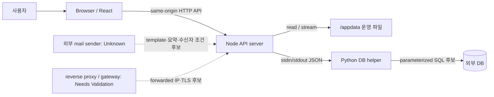

# L0 Spider 시스템 보안 기준

## 1. 문서 목적과 범위

| 항목 | 기준 |
|---|---|
| 목적 | 기준 commit의 L0 Spider As-Is 보안 경계, 구현 통제, 외부 통제 후보와 보안 공백을 정의한다. |
| 문서 상태 | `Active Baseline` |
| 검증 기준 branch | `main` |
| 검증 기준 코드 commit | `2d5535366fc56ecff7a322139ddfe6f09cd4df25` + 현재 working tree 변경 |
| 최신 하네스 감사 | [reports/audit/harness-final-review.md](../../reports/audit/harness-final-review.md) |
| 포함 | 브라우저, 프론트엔드, Node API, Python DB helper, DB, `/appdata`, STEP/HMAC, 메일 template, 설정·로그·배포 경계 |
| 제외 | 실제 운영 인프라, secret, 운영 데이터, 침투 테스트, 취약점 조회, 실행 검증 |
| 상태 표현 | 증거 상태와 통제 상태를 분리하고 개선 정책을 현재 구현처럼 표현하지 않는다. |
| branch 경계 | `mock-agent`의 mock 서버·데이터·token·browser QA는 범위 밖이며 현재 통제 근거로 사용하지 않는다. |

이 문서는 보안 코드나 인증·인가 정책을 구현하지 않는다.
실제 secret, token, 이메일 주소, 내부 host·IP와 운영 데이터 행을 포함하지 않는다.

## 2. 보안 목표

| 보안 목표 | 보호 대상 | 현재 통제 | 통제 상태 | 근거 |
|---|---|---|---|---|
| 운영 데이터 기밀성 | Parquet, 이미지, DB 조회 결과 | browser는 API를 통하고 일부 파일 endpoint는 허용 root·확장자를 검사 | `Implemented` / 운영 접근 `Needs Validation` | `server/selfEquipmentData.mjs:449-465,803-833` |
| 조회 결과 무결성 | Dashboard·Self Equipment payload | 서버가 파일·DB를 읽어 집계하고 contract가 구조를 검증 | `Implemented` / 원천 무결성 `Needs Validation` | `server/dashboardData.mjs:730-783`; `tests/contract/dashboard-api.contract.test.mjs` |
| STEP link 무결성 | 개별 STEP 선택 후보 | HMAC 생성·검증은 확인되지 않음 | `Not Implemented` 또는 구현 위치 `Unknown` | `docs/features/step-deeplink.md:112-177` |
| 운영 자원 무단 변경 방지 | DB, `/appdata` | 파일 흐름은 읽기 중심이고 DB write는 helper에 한정 | `Implemented` / 계정 권한 `Needs Validation` | `server/*.mjs`; `scripts/*.py` |
| 메일 수신자 보호 | 등록 조건, 수신자별 report | template에 수신자별 filter 요구가 있음 | `Policy` / sender `Needs Validation` | `public/mailing-report.html:39-46,180,229` |
| secret 서버 측 보관 | DB credential, HMAC·메일 credential 후보 | DB credential은 서버 측 파일에서 로드하고 Git 제외 | DB `Implemented`; 나머지 `Unknown` | `.gitignore:8-14`; `scripts/current_user.py:21-31` |
| 정보 노출 최소화 | 오류, 로그, URL | client 오류의 파일 경로 마스킹은 구현됨 | 일부 `Implemented` | `src/features/fdc-trend/api/errorMessage.js:1-20` |
| 서비스 가용성 | API·파일·DB 기능 | 일부 body 제한, helper timeout, bounded cache | 일부 `Implemented` | `server/*History.mjs`; `server/boundedCache.mjs` |

## 3. 보호 자산

민감도는 조직의 공식 데이터 분류가 아니라 이 문서의 보안 검토 우선순위다.

| 자산 | 설명 | 민감도 | 저장·처리 위치 | 주요 위험 | 상태 |
|---|---|---|---|---|---|
| DB 접속정보 | host·port·database·user·password key | 높음 | `DB_INFO_PATH`의 server-side pickle | 노출, 과도한 권한, pickle 신뢰 | `Confirmed` |
| HMAC 비밀키 | 개별 STEP token 후보의 서명 key | 미정 | 구현·환경변수 미확인 | 키 부재·노출·rotation 불가 | `Unknown` |
| 메일 인증정보 | SMTP 또는 발송 API credential 후보 | 미정 | sender 구현 미확인 | 유출·오발송 | `Unknown` |
| 운영 파일 | Parquet, PNG, mapping JSON | 높음 후보 | `/appdata` 경로 패턴 | 무단 읽기·변경, 경로 노출 | 위치 `Confirmed`, 분류 `Unknown` |
| DB 업무 데이터 | 사용자, 등록 조건, 이력 | 높음 후보 | 외부 DB table | 권한 없는 조회·변경, 개인정보 노출 | 사용 `Confirmed` |
| STEP token | 개별 STEP opaque token 후보 | 미정 | URL 후보 | 기록·referrer·log 노출, 변조 | `Documented` / 구현 `Unknown` |
| Dashboard payload | 집계, Line·SDWT·Grade 정보와 source path | 중간 이상 후보 | browser·Node memory | 과도한 반환, 운영 경로 노출 | `Confirmed` |
| Self Equipment payload | 장비·sensor·chart·history 정보 | 중간 이상 후보 | browser·Node memory | 직접 URL 조회, 파일 경로 노출 | `Confirmed` |
| 메일 수신자 조건 | `email`, `myeqp_regist`의 사용자 식별자 | 높음 후보 | DB·메일 renderer 입력 | 다른 수신자 조건 혼합 | `Confirmed` / sender `Unknown` |
| 로그 | stderr, console, 외부 access log 후보 | 높음 후보 | process output·외부 logging | DB detail·path·token·주소 노출 | application `Confirmed`, 운영 `Unknown` |

## 4. 행위자와 신뢰 가정

| 행위자 또는 시스템 | 역할 | 신뢰 수준 | 인증·검증 경계 | 상태 | 근거 |
|---|---|---|---|---|---|
| 일반 사용자 | 화면 조회와 등록·이력 작업 | 신뢰하지 않는 입력 주체 | browser와 API 입력에서 검증 필요 | `Confirmed` | route·API 코드 |
| 사용자 브라우저 | React 실행, query·body 전송 | 신뢰하지 않음 | 서버 검증을 대체하지 않음 | `Confirmed` | `src/features/fdc-trend/api/*.js` |
| React frontend | UX 검증·오류 표시 | 부분 신뢰 | 민감한 권한 판정 위치로 사용하지 않음 | `Confirmed` | `src/routes/router.jsx`; feature API |
| Node API server | route, 파일 집계, helper orchestration | server trust boundary | 입력 검증·root 제한·오류 변환 | `Confirmed` | `server.mjs`; `server/*.mjs` |
| Python DB helper | DB query와 transaction | server 내부 고신뢰 code | stdin JSON과 credential 파일 경계 | `Confirmed` | `scripts/*.py` |
| DB | 사용자·등록·이력 저장 | 외부 고신뢰 자원 | 계정·TLS·권한은 운영 확인 필요 | 접속 `Confirmed`, 통제 `Unknown` | PyMySQL helper |
| 운영 파일 저장소 | Parquet·이미지·mapping 제공 | 외부 고신뢰 자원 | filesystem owner·mode·mount 미확인 | 참조 `Confirmed`, 통제 `Unknown` | data path code |
| reverse proxy 또는 gateway | TLS·접근·forwarded header 후보 | 조건부 신뢰 | 신뢰 proxy와 header 덮어쓰기 필요 | `Documented` / `Needs Validation` | `README.md:73` |
| 메일 전송 시스템 | rendering·schedule·전송 후보 | 외부 경계 | 구현·인증·수신자 최종 결정 미확인 | `Unknown` | `public/mailing-report.html`; `web_structure.md:604-610` |
| 운영 관리자 | 배포·secret·권한 관리 | 고신뢰 역할 후보 | 실제 역할·승인 절차 미확인 | `Unknown` | 저장소 밖 |
| 데이터 생성 프로세스 | `/appdata` 결과 생성 후보 | 외부 경계 | 생산 주체·완료 신호·권한 미확인 | `Unknown` | data-flow 문서 |

## 5. 시스템 신뢰 경계

Browser는 DB나 `/appdata`에 직접 접근하지 않는다.
HMAC secret과 실제 mail sender는 구현 근거가 없어 확인된 runtime 구성요소로 표시하지 않았다.
Proxy가 존재해도 신뢰 header 정책과 Node 직접 접근 차단이 확인되기 전에는 외부 통제로 확정하지 않는다.

## 6. 보안 진입점과 공격 표면

| 진입점 | 입력 또는 데이터 | 처리 주체 | 현재 검증 | 잠재 위험 | 상태 | 근거 |
|---|---|---|---|---|---|---|
| browser route | route path | React Router | 공개 route 정의, guard 없음 | 외부 인증 부재 시 직접 진입 | `Confirmed` / 경계 `Unknown` | `src/features/fdc-trend/routes.jsx:11-68` |
| Self query | `line`, `sdwt`, `grade`, `step`, `eqpCh` | browser·Node | 정규화·option matching·segment 검사 일부 | 변조·과대 query·의도와 다른 filter | 일부 `Implemented` | URL filter·Self handler |
| API query | date, Line, path, filter | Node handlers | 필수값, date, range, allowlist 일부 | 무제한 반복 query, path 정보 | 일부 `Implemented` | `server/dashboardData.mjs:786-826` |
| API body | 등록·history JSON | Node handlers | JSON parse, 64 KiB~2 MiB 제한, 개수·형식 일부 | 권한 없는 write, 자원 소진 | 일부 `Implemented` | registration·history handlers |
| file endpoint | 절대 path query | Node file handler | root, extension, 존재·file 검사 | symlink, path disclosure | 일부 `Implemented` | image handlers |
| 정적 파일 | URL pathname | `server.mjs` | decode·normalize·dist root 검사 | 보안 header 부재, decode error | 일부 `Implemented` | `server.mjs:89-128` |
| forwarded IP | request headers·socket | current user resolver | 첫 주소 정규화 | header spoofing·오식별 | `Needs Validation` | `server/currentUser.mjs:17-28` |
| DB helper stdin | server-generated JSON | Python helper | application별 normalization | 과도한 DB 권한·원문 오류 | 일부 `Implemented` | `server/*.mjs`; `scripts/*.py` |
| 환경변수·설정 파일 | path·host·runtime flag | process | 이름별 parsing | 잘못된 경로, secret 유출 | 일부 `Implemented` | server·Vite·Python |
| 메일 link | Dashboard·Self URL | 외부 renderer 후보 | template `urlencode`; 실제 renderer 미확인 | 수신자 혼합·URL 노출 | `Policy` / `Needs Validation` | mail template |

## 7. 인증과 권한 경계

| 영역 | 현재 구현 | 통제 위치 | 실패 처리 | 상태 | 근거 |
|---|---|---|---|---|---|
| 로그인·로그아웃 | repository route와 API에 전용 구현 없음 | 해당 없음 | 해당 없음 | `Not Implemented` in repository | code search |
| session·인증 cookie | 인증 session 없음; sidebar 상태 cookie만 있음 | browser UI | 인증에 사용하지 않음 | `Confirmed` | `src/components/ui/sidebar.jsx:27-70` |
| route guard | 사용자 route에 guard component 없음 | React Router | 직접 route rendering | `Not Implemented` | `src/features/fdc-trend/routes.jsx:11-68` |
| API auth middleware | global middleware·Bearer/JWT 확인 안 됨 | `server.mjs` direct dispatch | handler별 처리 | `Not Implemented` in application | `server.mjs:131-273` |
| current user | forwarded/socket IP를 DB 승인 사용자와 매핑 | `getRemoteIp`, `resolveCurrentUser` | 400·403·500 또는 일부 fallback | 일부 `Implemented` | `server/currentUser.mjs:17-119` |
| history write identity | body `knoxId` 대신 server 조회 결과 사용 | hit·click·pass handlers | 사용자 조회 실패 시 write 실패 | `Implemented` | `hitHistory.mjs:215-236`; `passHistory.mjs:505-530` |
| My EQP 조회 | current user ID와 `is_public=1` 조건 | Node·Python helper | 조회 오류 500 | 일부 `Implemented` | `myEqpRegistration.mjs:258-271`; Python query |
| My EQP 등록 | current user 조회 실패 시 remote IP fallback; 복수 `knoxIds` 허용 | Node handler | helper 오류 500 | `Needs Validation` | `myEqpRegistration.mjs:179-185,290-300` |
| Mailing 등록 | caller가 `knoxId`·`knoxIds`를 지정 | Node handler | 형식 오류도 catch에서 500 | `Needs Validation` | `mailingRegistration.mjs:53-75,160-217` |
| 역할·관리자 권한 | role·permission check 미확인 | 해당 없음 | 미확인 | `Unknown` | code search |
| 외부 gateway·SSO | repository에 연동 설정 없음 | 저장소 밖 후보 | 미확인 | `Unknown` / `Needs Validation` | architecture·environment docs |

저장소에 인증 코드가 없다는 사실만으로 운영 서비스가 인터넷에 익명 노출되었다고 단정하지 않는다.
다만 application 자체의 write API 권한 경계는 외부 proxy가 제공하는 접근 제한과 별개로 명시적 검증이 부족하다.

## 8. 브라우저와 프론트엔드 보안

| 항목 | 현재 처리 | 위험 | 통제 상태 | 근거 |
|---|---|---|---|---|
| URL parameter | NFKC·trim·중복 제거 후 초기 filter 후보로 사용 | URL 변조·기록·referrer 노출 | 일부 `Implemented` | `selfEquipmentUrlFilters.mjs:1-32` |
| server 재검증 | browser filter를 server가 다시 필터·segment 검증 | UI 검증 우회 | 일부 `Implemented` | Self·commonality handlers |
| manual HTML | Markdown을 HTML로 변환 후 `DOMPurify.sanitize` | XSS | `Implemented` | `UserManualPage.jsx:38-52,100` |
| 일반 React 출력 | JSX text binding 사용 | source별 HTML injection | React escape `Implemented`; 전수 검토 아님 | page code |
| 새 창 link | 확인된 link에 `rel="noreferrer"` 또는 `noopener noreferrer` | opener·referrer | 일부 `Implemented` | mail template; page anchors |
| localStorage | theme와 color 값만 allowlist로 보관 | client storage 변조 | `Implemented` / 민감값 미사용 | `themeProvider.jsx:6-47,89-113` |
| cookie | sidebar open boolean을 7일 저장 | `Secure`, `SameSite`, `HttpOnly` 없음 | `Low`; 인증 cookie 아님 | `sidebar.jsx:27-70` |
| sessionStorage | 사용 위치 확인 안 됨 | 민감값 저장 여부 | `Unknown`이나 source 검색상 미사용 | code search |
| browser 설정 | `VITE_SITE_URL`이 Vite config에 사용됨 | `VITE_*` secret은 bundle 노출 가능 | `Policy` | `vite.config.mjs:29-33` |
| API base URL | feature client는 상대 `/api` 사용 | origin 경계 변경 | same-origin `Implemented` | `src/features/fdc-trend/api/*.js` |
| 오류 표시 | API `error`의 경로 마스킹과 안전한 `requestId` 문의 코드 표시 | 보호 대상 외 legacy 오류의 비경로 정보 | 일부 `Implemented` | `errorMessage.js`; `safeApiError.mjs` |
| query cache | React Query memory cache, 기본 retry 1 | 브라우저 memory에 업무 payload 잔류 | `Needs Validation` | `src/lib/queryClient.js:8-17` |
| source map | Vite build에서 명시 설정 미확인 | production source 노출 여부 | `Unknown` | `vite.config.mjs` |

## 9. API 입력 검증과 오류 응답

| API 또는 영역 | 입력 | 검증 위치 | 실패 결과 | 정보 노출 위험 | 상태 | 근거 |
|---|---|---|---|---|---|---|
| Dashboard | `startDate`, `endDate`, repeated `line` | strict date·range parsing | 보호 오류 `code`·`requestId` | 성공 `sourcePaths` | `Implemented` / `Risk` | `dashboardData.mjs`; `safeApiError.mjs` |
| Self Equipment | `line`, `pathSdwt`, `sdwt`, filters | 필수값·path segment·option matching | 400·500 | 성공 `sourcePath` | 일부 `Implemented` | `selfEquipmentData.mjs:62-65,321-353` |
| ERD scatter | `path`, `eqp`, `sensor`, `chStep`, `days` | root·segment·0~30 integer | 400·보호 오류 500 | 성공 `sourcePath` | 일부 `Implemented` / `Risk` | `selfEquipmentData.mjs`; `safeApiError.mjs` |
| image | absolute `path` | root·extension·file 존재 | 403·보호 오류 404/500 | 성공 요청 계약에 path 사용 | 일부 `Implemented` | file handlers |
| registration | JSON, user IDs, 목록 | 1 MiB, count·length·pattern, mapping 가용성·Line/SDWT 범위 | mapping 400/503 또는 보호 오류 500 | debug row·DB detail 제거 | 일부 `Implemented` / CORE-04 | registration handlers |
| history | JSON, file path, batch | 64 KiB~2 MiB, root parse, batch 500 | 보호 오류 500 | 성공 payload 호환 유지 | 일부 `Implemented` | history handlers |
| method | endpoint별 GET/HEAD/POST/DELETE | handler allowlist | 405 | 낮음 | `Implemented` | server handlers |
| content type | POST JSON | body를 JSON parse하나 request `Content-Type` 강제 확인 없음 | parse error | content confusion | `Not Implemented` | `readJsonBody` functions |
| global query/body limit | 공통 middleware 없음 | endpoint별 구현 | endpoint별 상이 | 누락 route·대형 URL | `Not Implemented` globally | `server.mjs` |
| rate limit | 구현 확인 안 됨 | 해당 없음 | 없음 | 반복 file·DB 요청 | `Not Implemented` in application | code search |
| stack trace | response에 stack·원문 exception을 넣지 않음 | 보호 대상 catch body | 고정 message·code·requestId | legacy 단순 오류는 별도 | 일부 `Implemented` | `safeApiError.mjs`; server catches |

입력 형식 오류가 여러 handler에서 500으로 반환되므로 client error와 server fault가 명확히 분리되지 않는다.
성공 response의 `sourcePath(s)`는 browser network 응답에 남아 있어 CORE-03B 호환 전환이 필요하다. CORE-03A 보호 대상 실패 response는 raw `error.message`, DB detail, debug row와 실패 경로를 반환하지 않는다.

## 10. 데이터 경로와 파일 시스템 보안

| 데이터 흐름 | 사용자 영향값 | 경로 조립 위치 | 현재 검증 | 접근 형태 | 위험 | 상태 | 근거 |
|---|---|---|---|---|---|---|---|
| team index | `line`, `pathSdwt` | `buildTeamErdPath` | slash·backslash·`..` 거부 | Parquet read | symlink·mount 권한 | `Implemented` / `Unknown` | `selfEquipmentData.mjs:62-65,137-162` |
| common index | `line`, `pathSdwt` | `buildCommonAnomalyPath` | 같은 segment 검사 | Parquet read | symlink·path 노출 | `Implemented` / `Unknown` | `commonAnomalyData.mjs:223-245` |
| ERD data | browser가 받은 image path | `resolveErdDataFilePath` | `resolve` 후 ERD·backup root prefix | Parquet read | lexical prefix와 symlink 영향 | `Implemented` / `Needs Validation` | `selfEquipmentData.mjs:449-465` |
| common data | image 또는 data path | `resolveCommonAnomalyDataPath` | suffix 변환, common root prefix | Parquet read | symlink·경로 노출 | `Implemented` / `Needs Validation` | `commonAnomalyData.mjs:261-276` |
| ERD image | absolute path query | `handleErdFileRequest` | ERD root·image extension·regular file | stream read | 직접 file 존재 oracle | `Implemented` / `Risk` | `selfEquipmentData.mjs:803-833` |
| commonality image | absolute path query | commonality handler | 최신 root·`img.png`·regular file | stream read | 404·500 path 노출 | `Implemented` / `Risk` | `commonalityData.mjs:256-289` |
| common-commonality image | absolute path query | common-commonality handler | 공통부 동일성 최신 root·`img.png`·regular file | stream read | 404·500 path 노출 | `Implemented` / `Risk` | `commonCommonalityData.mjs` |
| static dist | browser pathname | `resolveStaticPath` | normalize·dist prefix | stream read | symlink·security header | 일부 `Implemented` | `server.mjs:89-128` |
| mapping | env 또는 fixed path | `readLineMapping` | JSON parse·공통 runtime 계약·빈 Line 거부 | file read | 성공 `source_path`는 CORE-03B 잔여 | `Implemented` / CORE-04 | mapping contract·`server/mappingConfig.mjs` |
| DB history path | body `filePath` | pass·hit path parser | 절대 경로, dot segment 거부, ERD/common/commonality/common-commonality root·날짜·segment·결과 파일명 | DB write | 원본 경로가 DB·log에 남을 가능성 | 일부 `Implemented` | `passHistory.mjs:316-364,435-458`; `hitHistory.mjs` |

확인된 core runtime은 `/appdata` 파일을 읽거나 stream하며 해당 경로에 파일을 쓰는 코드는 확인하지 못했다.
실제 `/appdata`의 mount, owner, mode, ACL, symlink 구성, read-only 여부와 데이터 생성 주체는 `Unknown`이다.
root prefix 검사는 구현되었지만 `realpath` 기반 symlink 탈출 방지 여부는 실행 환경 확인이 필요하다.

## 11. 대시보드 API 보안 경계

| 항목 | 현재 처리 | 보호 대상 | 위험 | 상태 | 근거 |
|---|---|---|---|---|---|
| endpoint | `GET/HEAD /api/dashboard-data` | 집계 데이터 | application auth 없음 | `Confirmed` / 외부 경계 `Unknown` | `server.mjs:134-139` |
| filter | strict date와 범위, repeated Line | resource selection | Line 개수·URL 길이 제한 없음 | 일부 `Implemented` | `dashboardData.mjs` |
| response | 집계·Line·trend·mail summary·source paths | 업무·운영 정보 | browser가 쓰지 않는 path까지 반환 | `Risk` | `dashboardData.mjs:765-783` |
| 오류 | 400·404·500, `{ok:false,error}` | 내부 구현 정보 | exception message 결합 | `Risk` | `dashboardData.mjs:813-825` |
| cache | JSON `no-store`; HEAD도 `no-store` | 조회 payload | proxy 정책 미확인 | application `Implemented` | `dashboardData.mjs:32-37,807-819` |
| frontend | 상대 URL 호출, shape 일부 검사, 오류 마스킹 | consumer integrity | runtime schema 전체 검증 아님 | 일부 `Implemented` | `dashboardApi.js:3-31` |
| JSON Schema | 성공 body 구조와 field type 검증 | contract compatibility | 인증·권한·기밀성은 검증하지 않음 | `Implemented` | `harness/contracts/dashboard-api.schema.json` |
| mail 공유 | `lineDashboard.summary`, `mailingSummary`가 template 입력 후보 | 수신자별 정보 | sender 결합·filter 미확인 | producer `Confirmed`, sender `Unknown` | dashboard·template |

`lineDashboard.mailingSummary`는 `lineDashboard.summary`의 sibling이며, 과거 후보인 `summary.mailingSummary`는 현재 계약과 다르다.
Contract test의 green 결과를 접근 통제나 운영 데이터 보호 증거로 사용하지 않는다.

## 12. Self Equipment 보안 경계

| 입력 또는 경계 | 현재 처리 | 데이터 영향 | 위험 | 상태 | 근거 |
|---|---|---|---|---|---|
| `/self-equipment` | route guard 없이 직접 진입 | 화면 노출 | 외부 인증 경계 의존 | `Confirmed` / `Unknown` | routes |
| `line` | NFKC·trim 후 API query, server 필수·segment 검사 | root 아래 team file | 허용 Line membership 별도 검사 없음 | 일부 `Implemented` | URL filter·handler |
| `sdwt`·`grade` | 중복 제거·option matching | team·grade filter | 유효하지 않으면 미선택·빈 결과 | `Implemented` | URL filter·payload builder |
| `step` | MY EQP는 `ALL`; 일반은 비-`ALL` token을 선택에 사용하지 않음 | STEP filter | HMAC 후보와 Mismatch | `Mismatch` | STEP doc |
| `eqpCh` | alias parsing, row EQP와 matching | 장비 범위 | HMAC 서명 포함 여부 미확인 | 처리 `Confirmed`, 보호 `Unknown` | URL filter·Self server |
| MY EQP | IP 기반 user ID로 active registration 조회 | 개인·public 등록 범위 | user lookup fallback·proxy trust | `Risk` | `selfEquipmentData.mjs:356-445` |
| chart path | API payload의 absolute path를 다음 API에 전달 | Parquet·history | URL·response path 노출 | `Risk` | Self API·server |
| image | 허용 root image stream endpoint | 운영 image | page 소비 위치와 접근 분류 미확인 | endpoint `Confirmed` | `handleErdFileRequest` |
| 데이터 없음 | 빈 filter 또는 file error | 화면 empty/error | file 존재·path detail 구분 | 일부 `Implemented` | Self docs·handlers |

## 13. STEP 딥링크와 HMAC

| 보안 속성 | 현재 구현 | 보호되는 범위 | 보호되지 않는 범위 | 상태 | 근거 |
|---|---|---|---|---|---|
| HMAC 목적 | 개별 STEP link 무결성 후보로 문서화 | 요구가 확정되면 서명 대상 | 현재 runtime | `Documented` | `AGENTS.md:65-71` |
| 생성 위치 | source 검색에서 확인 안 됨 | 없음 확인 | token 발급 | `Unknown` | STEP doc |
| 검증·매핑 | source 검색에서 확인 안 됨 | 없음 확인 | 변조·unknown token 처리 | `Unknown` | STEP doc |
| canonicalization | 형식·field 순서·구분자 미확인 | 없음 확인 | 동등 입력 정규화 | `Unknown` | STEP doc |
| algorithm·digest | 확인 안 됨 | 없음 확인 | 강도·encoding | `Unknown` | STEP doc |
| secret | 환경변수 이름·저장 위치 미확인 | 없음 확인 | key 보호·누락 처리 | `Unknown` | environment doc |
| `step=ALL` | MY EQP에서 literal 예약값으로 강제 | 모든 STEP 선택 동작 | 개별 token 무결성 | `Implemented` | URL filter·template |
| `eqpCh` | 별도 query로 server filter에 사용 | option matching | 서명 포함 여부와 변조 방지 | `Implemented` / `Unknown` | Self code |
| 만료·replay | token 구현·시간 field 미확인 | 없음 확인 | 재사용 제한 | `Unknown` | STEP doc |
| key rotation | key 자체 미확인 | 없음 확인 | 구·신 key 호환 | `Unknown` | STEP doc |
| 기존 link | MY EQP `ALL` link만 구현 확인 | 현재 MY EQP 호환 | 개별 STEP token link | `Confirmed` / `Mismatch` | template·URL utility |

HMAC은 서명 대상의 무결성과 진위 확인을 위한 방식이며 STEP 내용을 암호화하거나 숨기지 않는다.
일반 원칙상 token이 URL에 있으면 browser history, referrer, proxy·access log에 남을 수 있다.
또한 서명 대상에 포함되지 않은 `eqpCh` 같은 parameter는 HMAC만으로 무결성이 보호되지 않는다.
이 일반 원칙은 현재 HMAC 구현 확인 결과가 아니며 실제 서명 원문·algorithm·비교 방식은 모두 `Unknown`이다.

## 14. Secret 및 환경변수 관리

| secret 또는 설정 | 환경변수 | 사용 주체 | 브라우저 노출 | 기본값 | 누락 처리 | Git 보호 | 상태 | 근거 |
|---|---|---|---|---|---|---|---|---|
| DB credential 파일 | `DB_INFO_PATH` | Python helper | 아니오 | server path 존재 | default path 사용 후 open 실패 | `.gitignore`에 파일명 | `Implemented` | Python helpers; `.gitignore:14` |
| DB credential key | `DB_HOST`, `DB_PORT`, `DB_NAME`, `DB_USER`, `DB_PASSWORD` | helper가 pickle에서 읽음 | 아니오 | 없음 | key/file error | 실제 파일 제외 | `Implemented` / 운영 권한 `Unknown` | helper loaders |
| HMAC secret | 이름 미확인 | 생성·검증 주체 미확인 | 미확인 | 미확인 | 미확인 | 정책만 있음 | `Unknown` | STEP·environment docs |
| mail credential | 이름 미확인 | sender 미확인 | 미확인 | 미확인 | 미확인 | 미확인 | `Unknown` | sender 부재 |
| site host | `VITE_SITE_URL` | Vite config | browser build 영향 가능 | hard-coded host 후보 | 빈 문자열 | 비밀로 사용 금지 정책 | `Confirmed` | `vite.config.mjs:27-34` |
| file roots | `SPIDER_DASHBOARD_PATH_ROOT`, `COMMONALITY_ROOT_PATH`, `COMMON_COMMONALITY_ROOT_PATH`, `MAPPING_CONFIG_PATH` | Node | response·error에 간접 노출 가능 | code path | fallback path | secret 아님 | `Confirmed` | server modules |
| process bind | `HOST`, `PORT` | Node | service endpoint로 관찰 가능 | code default | fallback | secret 아님 | `Confirmed` | `server.mjs:37-38` |
| runtime mode | `BUILD_ON_START`, `LIVE_RELOAD` | Node | 동작에 간접 영향 | enabled unless `0` | default enabled | secret 아님 | `Confirmed` | `server.mjs:39-40` |

`.env.example`과 `.env.mock.example`은 현재 `main`에서 확인되지 않았다.
`VITE_` 변수는 client-visible 영역으로 간주하여 secret, token, DB·mail credential과 HMAC key를 두지 않는 것이 `Policy`다.
Hard-coded 내부 host 후보는 위치와 유형만 `Risk`로 기록하며 실제 값은 `<redacted>`로 취급한다.

## 15. DB 보안 경계

| 항목 | 현재 구현 | 위험 | 상태 | 근거 |
|---|---|---|---|---|
| driver | `PyMySQL>=1.1,<2` | dependency 취약점 미조회 | `Confirmed` | `scripts/requirements.txt` |
| credential 주입 | server-side pickle을 helper가 로드 | pickle 변조·file permission | `Implemented` / `Needs Validation` | helper loaders |
| query parameterization | 대표 SELECT·INSERT·UPDATE·DELETE에 `%s` parameter 사용 | 동적 identifier 조립의 안전성 전수 검토 필요 | 대체로 `Implemented` | `scripts/*.py` |
| dynamic SQL | 고정 column 목록·placeholder 수로 query 조립 | future input-derived identifier 금지 | 일부 `Implemented` | pass·My EQP helper |
| read·write | user lookup·reference read, registration·history write·commit | 권한 범위 넓음 | `Confirmed` | Python helpers |
| runtime DDL | `myeqp_regist.is_public` 부재 시 `ALTER TABLE` | application 계정 DDL 권한·동시성 | `Risk` | `my_eqp_registration.py:50-67` |
| transaction | write 후 명시적 `commit()` | partial recipient batch는 Node loop 단위 | 일부 `Implemented` | helper write functions |
| rollback | context manager 동작 외 명시 정책 미확인 | 실패 시 transaction 결과 | `Unknown` | Python code |
| connection pool | 요청마다 child process와 connection | load·connection exhaustion | `Not Implemented` | Node spawn·helper connect |
| timeout | Node child timeout은 일부 존재; DB connect/read/write timeout 없음 | blocked DB call 후 child 종료 동작 | 일부 `Implemented` / `Unknown` | server helpers; connect args |
| TLS | PyMySQL `ssl` option 미확인 | network 기밀성 | `Unknown` | connect calls |
| 최소 권한 | 실제 DB account grants 미확인 | read/write/DDL 과권한 | `Unknown` / `Risk` | 운영 확인 필요 |
| 오류 | 보호 대상 helper stderr 차단, API는 safe error 계약 사용 | 직접 helper 실행·외부 DB log는 별도 경계 | 일부 `Implemented` | Node helper orchestration·`safeApiError.mjs` |

실제 DB에 접속하거나 계정 권한·TLS·transaction 결과를 검증하지 않았다.
Parameterized value query는 SQL injection 위험을 줄이지만 인증·권한과 최소 권한을 대신하지 않는다.

## 16. 메일 생성 및 발송 보안

| 단계 | 민감 데이터 | 현재 처리 | 위험 | 상태 | 근거 |
|---|---|---|---|---|---|
| trigger·schedule | 실행 시각·job identity | 구현 위치 미확인 | 중복·누락·무단 발송 | `Unknown` | code search |
| 수신 조건 등록 | 사용자 ID, SDWT, priority | DB `email` table에 저장·병합 | caller 지정 ID에 대한 권한 | `Implemented` / `Risk` | mailing registration code |
| My EQP 수신 조건 | 사용자 ID, 장비 조건 | active registration 후보 | 수신자 혼합 | producer `Confirmed` | My EQP DB code |
| 최종 수신자 결정 | 두 조건의 union 요구 | template comment에 요구만 존재 | 오발송·다른 사용자 조건 포함 | `Policy` / `Needs Validation` | `mailing-report.html:39-46` |
| HTML template | KPI, report rows, links | Jinja-compatible placeholder | escaping이 sender 설정에 의존 | template `Confirmed` | `public/mailing-report.html` |
| escaping | 업무 문자열 | auto-escape enabled 요구와 `urlencode` 사용 | 실제 renderer가 요구를 지키는지 미확인 | `Policy` / `Needs Validation` | template comment |
| link | Dashboard·Self Equipment query | URL encode, new tab rel 보호 | 업무 값·향후 token의 URL 노출 | 일부 `Implemented` | template anchors |
| image·attachment | 현재 inline CSS·정적 link 중심 | 첨부 구현 미확인 | 외부 tracking·민감 첨부 | `Unknown` | template·sender 부재 |
| sender credential | mail account·API key | 구현·환경변수 미확인 | credential 유출 | `Unknown` | code search |
| 실패·재시도 | 오류·수신자 | 구현 미확인 | 중복 전송·주소 logging | `Unknown` | sender 부재 |
| empty data | empty table message template 존재 | section별 빈 상태 표시 | sender의 empty send 정책 미확인 | template `Implemented` | template loops |

이 저장소에서 확인된 것은 등록 API, Dashboard 요약 producer와 template 자산이다.
실제 renderer·sender·SMTP/API·수신자 최종 검증·발송 차단·audit log는 `Unknown`이며 상세 상태는 [mailing.md](../features/mailing.md)에서 `Blocked`로 관리한다.

## 17. 로그와 오류 정보 노출

| 로그 지점 | 포함 가능 정보 | 현재 마스킹 | 노출 대상 | 위험 | 상태 | 근거 |
|---|---|---|---|---|---|---|
| Node stderr | 보호 오류 `scope`, `code`, `requestId` | 원문 exception 미기록 | process log | request correlation | `Implemented` | `safeApiError.mjs` |
| Python stderr | helper가 출력할 수 있으나 보호 대상 Node child에서 `ignore` | Node process log로 전달하지 않음 | child 내부 | 직접 실행 시 원문 가능 | 일부 `Implemented` | helper orchestration; `scripts/*.py` |
| API error body | 고정 `error`, 안정적 `code`, `requestId` | 공통 보호 오류 builder | network client | 내부 detail 제거 | `Implemented` for CORE-03A scope | `safeApiError.mjs`; handler catches |
| API debug body | 없음 | debug row·DB detail field 제거 | network client·UI | 해당 없음 | `Implemented` | registration handlers·pages |
| success payload | `sourcePath`, `sourcePaths` | 없음 | network client | 운영 file topology | `Risk` | Dashboard·Self handlers |
| browser display | server error·request ID | file path regex 마스킹, 문의 코드 표시 | 사용자 UI | 보호 대상은 고정 문구 | 일부 `Implemented` | `errorMessage.js` |
| server startup log | bind host·port | 없음 | process log | network topology | `Low` | `server.mjs:301-304` |
| query string log | access log 구현 없음 | 해당 없음 | 외부 proxy 후보 | STEP token·filter 노출 | `Unknown` | 저장소 밖 |
| request body log | application에서 전체 body log 미확인 | 해당 없음 | process log | 개인정보 | source상 미확인 |
| systemd journal | 설정 없음 | 미확인 | 운영자 | 보존·권한 | `Unknown` | unit file 부재 |

보호 대상 오류의 network response 원문 노출은 CORE-03A에서 제거했다. 성공 payload의 legacy path와 보호 대상 밖 단순 오류는 별도 계약 범위다.
Log·오류 정책은 token, 실제 path, 수신자·사용자 정보, DB detail을 기본적으로 기록하지 않는 `Policy`를 따라야 한다.

## 18. 네트워크와 host 경계

| 연결 | 현재 설정 | 신뢰 경계 | 보호 방식 | 상태 | 근거 |
|---|---|---|---|---|---|
| browser → Node | 상대 `/api`, Node `HOST`·`PORT` bind | same-origin application | application CORS header 없음 | runtime `Confirmed`, 운영 경계 `Unknown` | API clients; `server.mjs` |
| Vite dev client | `host: true`, fixed port, `allowedHosts` | 개발 server | host allowlist | `Implemented` for Vite | `vite.config.mjs:126-145` |
| full Node host | default all-interface bind | 운영 listener 후보 | host allowlist 없음 | `Confirmed` / `Risk` | `server.mjs:37-38,301` |
| reverse proxy → Node | forwarded headers 소비 | proxy trust | trusted proxy allowlist·hop count 없음 | `Needs Validation` | `currentUser.mjs:22-28` |
| TLS | repository cert·proxy 설정 없음 | network boundary | 외부 종료 후보 | `Unknown` | config search |
| CORS | header 설정 없음 | browser origin | same-origin client만 확인 | application `Not Implemented` | code search |
| security headers | CSP·HSTS·frame·nosniff 등 설정 없음 | browser response | 외부 proxy 후보 | application `Not Implemented` | code search |
| Node → DB | PyMySQL host·port | server outbound | credential auth; TLS 미확인 | 접속 `Confirmed`, 보호 `Unknown` | helper connect |
| sender → mail system | 구현 없음 | external outbound | 미확인 | `Unknown` | sender 부재 |
| external font·link | CSS·home links 후보 | browser outbound | 운영 allowlist 미확인 | `Needs Validation` | environment docs |

Node가 직접 외부에 노출되는지, proxy가 모든 forwarded header를 덮어쓰는지, TLS·firewall·network ACL이 적용되는지는 저장소만으로 확인할 수 없다.

## 19. 실행 사용자와 파일 권한

| 프로세스 또는 자원 | 필요한 권한 | 현재 확인 결과 | 위험 | 상태 | 근거 |
|---|---|---|---|---|---|
| Node server | source·dist read, port bind, Python spawn | 실행 user·group 미확인 | root 또는 과권한 실행 | `Unknown` | systemd/Docker 설정 부재 |
| Python helper | script·credential file read, DB network | Node user 상속 후보 | credential file 과다 접근 | `Inferred` / `Needs Validation` | `spawn` env·stdio |
| `/appdata` | Parquet·image·mapping read | 실제 owner·mode·ACL 미확인 | write 가능·다른 데이터 접근 | `Unknown` | 운영 filesystem 미조사 |
| credential pickle | Node child user read only 필요 | mode·owner 미확인 | 다른 user read·변조 | `Unknown` | `DB_INFO_PATH` |
| dist·public asset | server read, build process write | ownership 미확인 | build artifact 변조 | `Unknown` | server static code |
| log destination | stdout/stderr write | rotation·retention·reader 미확인 | 민감 log 장기 보존 | `Unknown` | logging code |
| port binding | configured port bind | privileged port 사용 여부 미확인 | root 필요 여부 | `Unknown` | env-driven port |
| Docker user | container 설정 없음 | 해당 runtime 확인 불가 | root container 후보 | `Out of Scope` / `Unknown` | Dockerfile 부재 |
| systemd fields | `User`, `Group`, `WorkingDirectory`, `EnvironmentFile` | tracked unit 없음 | 실행 경계 미정 | `Unknown` | repository search |

최소 권한 원칙상 application user는 운영 파일 read, 필요한 credential read와 제한된 DB 작업만 가져야 한다.
이는 현재 구현 사실이 아니라 운영 `Policy`이며 실제 mode·grant 확인 전 `Implemented`로 표시하지 않는다.

## 20. 의존성 및 빌드 보안

| 항목 | 현재 상태 | 위험 | 확인 상태 | 근거 |
|---|---|---|---|---|
| Node lock | `package-lock.json` lockfile v3 | 설치 재현성은 높지만 provenance 별도 | `Confirmed` | lock header |
| Python dependency | `PyMySQL>=1.1,<2` 범위만 선언 | exact transitive 고정 없음 | `Confirmed` / `Risk` | requirements |
| scripts | `dev`, `build`, `preview`, `start`, `lint`, `test:contract` | 실행 mode 차이 | `Confirmed` | `package.json:5-12` |
| build-on-start | full server가 기본적으로 `npm run build` 가능 | 운영 시작 시 toolchain·supply-chain 영향 | `Confirmed` / `Risk` | `server.mjs:65-77,286-289` |
| source map | 명시 설정 없음 | 실제 production artifact 미확인 | `Unknown` | Vite config |
| static asset | `public/`이 build에 포함되는 구조 | mail template이 public URL에 노출 | `Confirmed` / 분류 `Risk` | Vite·web structure |
| external CDN/font | CSS 참조 후보 | browser outbound·CSP | `Needs Validation` | environment doc |
| vulnerability audit | 이번 단계에서 실행하지 않음 | 알려진 취약점 상태 미확인 | `Unknown` | `Not Run` |
| CI security scan | tracked CI workflow 미확인 | 자동 점검 공백 | `Not Implemented` in repository | file search |
| client env secret | `VITE_*`가 build에 포함될 수 있음 | secret bundle 노출 | 금지 `Policy` | environment doc |

## 21. 가용성과 장애 격리

| 장애 조건 | 영향 범위 | 현재 처리 | 추가 확인 | 상태 | 근거 |
|---|---|---|---|---|---|
| DB 장애 | current user·registration·history·MY EQP | helper 오류와 timeout 후 API 500 | DB timeout·circuit breaker | 일부 `Implemented` | helper orchestration |
| `/appdata` 누락 | Dashboard·Self·commonality·common-commonality | 404 또는 500·화면 오류 | mount readiness·health | 일부 `Implemented` | file handlers |
| history file 누락 | scatter history 부분 | chart payload에 `historyError`와 빈 history 가능 | 실제 UX | 부분 격리 `Implemented` | `selfEquipmentData.mjs:777-793` |
| mail sender 장애 | mail delivery | sender 미확인 | retry·dedupe·alert | `Unknown` | sender 부재 |
| HMAC secret 누락 | 개별 STEP link 후보 | 구현 없음 | fail-closed 정책 | `Unknown` | STEP doc |
| 잘못된 입력 | 해당 API | 400·403·404·500 혼재 | status normalization | 일부 `Implemented` | handlers |
| 대용량 body | write APIs | route별 64 KiB~2 MiB 제한 | URL·GET·공통 limit | 일부 `Implemented` | `readJsonBody` |
| 반복 고비용 요청 | file scan·DB process | rate limit 없음, 일부 bounded cache | proxy limit·load test | `Risk` | cache·server code |
| child process hang | DB helper | 10~15초 후 SIGTERM 일부 | DB socket 종료·orphan 확인 | 일부 `Implemented` | server helper runners |
| Node crash | 전체 service | server error 시 process exit | restart policy | `Unknown` | `server.mjs:291-299` |
| health check | 전체 service | endpoint·config 미확인 | liveness·readiness | `Not Implemented` in repository | code search |

## 22. 보안 통제 매트릭스

| 영역 | 통제 목적 | 현재 통제 | 통제 상태 | 증거 상태 | 주요 공백 |
|---|---|---|---|---|---|
| 인증 | 사용자 확인 | IP→승인 사용자 DB mapping | 일부 `Implemented` | `Confirmed` | trusted proxy·SSO·fallback |
| 권한 | 기능·row 접근 제한 | history identity 고정, My EQP owner/public query | 일부 `Implemented` | `Confirmed` | role, mailing·recipient authorization |
| API 입력 | 비정상 입력 차단 | 필수값·형식·body·개수 제한 | 일부 `Implemented` | `Confirmed` | global schema·rate limit·Content-Type |
| 파일 경로 | root 밖 접근 방지 | segment·resolve·root·extension 검사 | `Implemented` | `Confirmed` | symlink·realpath·운영 ACL |
| DB query | injection·무결성 | value parameterization·transaction | 일부 `Implemented` | `Confirmed` | runtime DDL·TLS·minimum grant |
| secret | client·Git 노출 방지 | DB file·gitignore | 일부 `Implemented` | `Confirmed` | HMAC·mail key·rotation |
| STEP/HMAC | link 무결성 | `step=ALL` 동작만 확인 | HMAC `Unknown` | `Mismatch` | 생성·검증·key·expiry |
| mail recipient | 오발송 방지 | template recipient filter 요구 | `Policy` | `Documented` | sender-side enforcement |
| 로그 마스킹 | 민감정보 노출 방지 | client path masking | 일부 `Implemented` | `Confirmed` | server response·stderr·access log |
| 네트워크 | 전송·origin 보호 | Vite `allowedHosts` | 일부 `Implemented` | `Confirmed` | TLS·proxy·firewall·Node host |
| 운영 권한 | blast radius 제한 | 정책만 정의 | `Needs Validation` | `Unknown` | service user·file mode·DB grant |
| contract test | response 호환성 | Dashboard JSON Schema test | `Implemented` | `Confirmed` | 인증·권한·security regression |

## 23. 보안 변경 보존 원칙

- secret을 frontend code, public asset 또는 `VITE_*` 변수로 이동하지 않는다.
- 운영 DB와 `/appdata`를 test data, fixture 또는 생성 결과 저장소로 사용하지 않는다.
- URL·API 입력을 검증 없이 filesystem path, SQL value 또는 동적 identifier에 결합하지 않는다.
- root 검사를 약화하지 않고 symlink·canonical path 영향을 함께 검토한다.
- STEP/HMAC 변경 시 link producer, browser consumer, server verifier, mail template와 기존 link를 함께 검토한다.
- `step=ALL` 또는 `eqpCh` 변경 시 서명 범위, 우회가 아닌 정상 분기, 기존 MY EQP 호환성을 재검토한다.
- HMAC key는 server-side trust boundary에 두고 actual key·token을 문서·fixture·log에 기록하지 않는다.
- 메일 수신자·조건·link 변경 시 다른 사용자의 row 혼합, 오발송과 URL 정보 노출을 확인한다.
- 오류 response·stdout·stderr·access log에 secret, token, 실제 path, DB detail과 개인정보를 남기지 않는다.
- application write API는 외부 gateway 존재 여부와 별개로 필요한 authorization을 명시한다.
- runtime DDL은 migration 책임과 최소 권한을 확정하기 전 확대하지 않는다.
- mock 구현을 이유로 `main`의 보안 통제와 운영 안전 규칙을 완화하지 않는다.
- 실제 보안 변경은 별도 승인 범위에서 unit·contract·integration 및 운영 설정 검증과 함께 수행한다.

## 24. Mismatch

| 항목 | 현재 코드·설정 | 기존 문서·후보 | 보안 영향 | 후속 조치 |
|---|---|---|---|---|
| 개별 STEP HMAC | 생성·검증·key·비-`ALL` 적용 확인 안 됨 | `{HMAC_TOKEN}` 개별 STEP link 후보 | link 무결성 경계를 정의할 수 없음 | 요구·서명 계약·ADR을 먼저 확정 |
| 비-`ALL` `step` | browser가 읽지만 일반 화면 초기 STEP으로 적용하지 않음 | token→STEP 선택 후보 | invalid·변조·정상 token을 구분하지 못함 | producer·consumer·error contract 결정 |
| Vite API surface | dev middleware가 full `server.mjs`의 일부 등록·MY EQP route를 포함하지 않음 | full server와 같은 application 후보 | 실행 mode별 보안·기능 검증 범위가 다름 | deployment 문서에서 기준 entrypoint 확정 |

Dashboard `lineDashboard.summary.mailingSummary` 후보와 실제 sibling `lineDashboard.mailingSummary` 차이는 보안 구현 Mismatch라기보다 API 계약 Mismatch이며 Dashboard 문서를 기준으로 유지한다.

## 25. Unknown과 Risk Register

| ID | 영역 | 상태 | 위험 설명 | 영향 | 우선순위 | 확인 방법 |
|---|---|---|---|---|---|---|
| SEC-R01 | identity | `Risk` / `Needs Validation` | client forwarded header를 신뢰할 proxy 검증 없이 우선 사용 | 다른 사용자로 오식별될 조건 | `High` | proxy 설정·직접 Node 접근 차단 확인 |
| SEC-R02 | authorization | `Risk` / `Needs Validation` | Mailing 등록이 caller 지정 수신자 ID를 받음 | 무단 등록·삭제 가능성 | `High` | 요구·gateway·row authorization review |
| SEC-R03 | My EQP | `Risk` / `Needs Validation` | user lookup 실패 시 remote IP fallback, 복수 수신자 지정 가능 | owner 경계 혼동 | `High` | 실패 정책·권한 요구 확정 |
| SEC-R04 | HMAC | `Mismatch` / `Unknown` | 개별 STEP 생성·검증·secret·expiry 부재 | link 무결성 요구 미충족 | `High` | ADR·unit·integration |
| SEC-R05 | error | `Partial` | error/debug/DB detail은 제거됐으나 성공 source path는 유지 | 운영 file topology 노출 | `High` | CORE-03B opaque resource 전환 |
| SEC-R06 | DB privilege | `Risk` / `Unknown` | runtime DDL과 read/write가 같은 credential 후보 | 과권한 blast radius | `High` | DB grant·migration 책임 확인 |
| SEC-R07 | filesystem | `Unknown` | `/appdata` ACL·read-only·symlink 구성 미확인 | 무단 read/write·root 우회 조건 | `Medium` | owner·mode·mount·realpath 점검 |
| SEC-R08 | network | `Unknown` | TLS·firewall·reverse proxy·security header 미확인 | 전송·browser 보호 공백 | `High` | 운영 proxy·TLS configuration review |
| SEC-R09 | logging | `Unknown` / `Risk` | access log에 query·token, journal에 stderr가 남을 수 있음 | 민감정보 장기 보존 | `High` | log format·mask·retention 확인 |
| SEC-R10 | mail | `Unknown` | sender·recipient enforcement·autoescape·retry 미확인 | 오발송·HTML injection·중복 | `High` | sender code·render-only test |
| SEC-R11 | dependency | `Unknown` | dependency audit·CI scan 미실행 | 알려진 취약점 미확인 | `Medium` | 승인된 offline/CI audit |
| SEC-R12 | availability | `Risk` | rate limit 없음, 요청마다 DB child process 후보 | resource exhaustion | `Medium` | load model·proxy limits·pool 정책 |
| SEC-R13 | cookie | `Risk` / `Low` | sidebar cookie에 security attribute 없음 | UI 상태 변조·불필요한 전송 | `Low` | cookie 사용 제거 또는 attribute 검토 |
| SEC-R14 | timezone | `Unknown` / `Risk` | DB `NOW()`와 zone 없는 date parsing | 기간·expiry 경계 오류 | `Medium` | runtime·DB timezone 계약 |
| SEC-R15 | host constants | `Risk` | code에 내부 host 후보가 hard-coded | source·bundle 정보 노출 | `Low` | 공개 범위·설정 분리 검토 |

위 항목은 침투 테스트로 확인한 취약점 목록이 아니다.
조건부 위험은 운영 topology와 요구사항 검증 후 우선순위와 상태를 갱신한다.

## 26. 검증 및 후속 작업

| 검증 ID | 검증 항목 | 계층 | 운영 자원 필요 여부 | 현재 준비도 | 대상 산출물 |
|---|---|---|---|---|---|
| SEC-V01 | path traversal·root 밖 path 거부 | unit | 아니오, synthetic path | `Test Ready` | file handler tests |
| SEC-V02 | symlink·canonical path 정책 | integration | 격리 temp filesystem | `Needs Design` | path security test |
| SEC-V03 | 잘못된 query·body·크기·Content-Type | contract | 아니오 | `Partial` | API contract tests |
| SEC-V04 | error body에서 path·DB detail·user data 제거 | contract | 아니오 | `Test Ready` / CORE-03A 작성 | `safe-api-error` Schema·contract test |
| SEC-V05 | HMAC 결정성·정상·변조·누락 | unit | 아니오, synthetic key | `Blocked` | STEP/HMAC unit test |
| SEC-V06 | HMAC expiry·rotation·`eqpCh` 서명 | integration | 아니오, synthetic key | `Blocked` | ADR·integration test |
| SEC-V07 | forwarded header trust | 운영 설정 review | 예 | `Blocked` | proxy·deployment doc |
| SEC-V08 | API row authorization | integration | 운영 DB 불필요한 synthetic adapter | `Needs Design` | auth tests |
| SEC-V09 | SQL parameterization regression | static review·unit | 아니오 | `Partial` | Python unit tests |
| SEC-V10 | DB TLS·grant·timeout | 운영 환경 확인 | 예, read-only 확인 | `Blocked` | runbook·security update |
| SEC-V11 | mail autoescape·recipient 분리 | unit/render test | 아니오, synthetic data | `Blocked` | mailing contract·render test |
| SEC-V12 | 실제 발송 차단·retry·dedupe | integration | 격리 sender 필요 | `Blocked` | mailing integration |
| SEC-V13 | security headers·CORS·host | contract·운영 확인 | local server 또는 config review | `Needs Design` | deployment tests |
| SEC-V14 | log masking | unit·static review | 아니오 | `Needs Design` | logging policy tests |
| SEC-V15 | browser link·URL exposure | `mock-agent` browser QA | mock-agent만 | `Out of Scope` for main runtime | external branch |
| SEC-V16 | dependency vulnerabilities | approved audit | 외부 DB 불필요 | `Not Run` | CI·release checklist |

현재 Core tree에는 Dashboard·Mailing summary Schema·fixture·contract test, MY EQP ALL·딥링크 test와 안전 검증 script가 존재한다.
실제 HMAC·mail renderer test와 운영 설정 검증은 여전히 `Blocked`이며, 본 문서 갱신에서 test·운영 자원을 실행하지 않았다.

## 27. 연계 문서·검증 상태

| 산출물 | 담당 범위 | 상태 |
|---|---|---|
| `docs/system/security.md` | As-Is trust boundary·control·risk 기준 | 현재 문서 |
| `docs/features/step-deeplink.md` | STEP URL, `ALL`, `eqpCh`, HMAC 상세 계약 | 작성됨 |
| [mailing.md](../features/mailing.md) | recipient·render·sender·failure 상세 | 작성됨; renderer·sender `Blocked` |
| [ADR-003-step-hmac-token.md](../decisions/ADR-003-step-hmac-token.md) | HMAC 목적·canonicalization·algorithm·rotation 결정 | `Proposed`; HMAC 미구현 |
| [systemd.md](../operations/systemd.md) | user·group·directory·environment·restart | 작성됨; 실제 unit 값 `Unknown` |
| [runbook.md](../operations/runbook.md) | secret·log·incident·운영 점검 | 작성됨; 운영 명령 실행 `Not Run` |
| `tests/unit/step-hmac.test.mjs` | MY EQP ALL·query round trip | 작성됨; 결정성·변조·secret test는 `Blocked` |
| `tests/integration/step-deeplink.test.mjs` | ALL link producer→parser→payload | 작성됨; HMAC verifier는 없음 |
| `tests/contract/{dashboard-api,mailing-summary}.contract.test.mjs` | success Schema·fixture·Mailing producer | 작성됨; 오류·full mail context `Partial`/`Blocked` |
| `scripts/verify-{env,contracts,all}.sh` | 운영 자원 비의존 검증 진입점 | 작성됨 |
| mail rendering test | autoescape·recipient isolation·link | renderer 부재로 `Blocked` |

## 28. 근거 자료

| 중요도 | 근거 | 사용 범위 |
|---|---|---|
| 1 | `AGENTS.md` | 운영 안전, 증거 상태, Core·mock 경계 |
| 2 | `reports/audit/system-inventory.md` | repository·security entry point 인덱스 |
| 3 | `docs/system/architecture.md` | component와 trust boundary |
| 4 | `docs/system/environment-definition.md` | environment·secret·deployment Unknown |
| 5 | `docs/system/data-flow.md` | 화면→API→파일·DB 연결 |
| 6 | `docs/features/dashboard.md` | Dashboard response·source path·mail 관계 |
| 7 | `docs/features/self-equipment.md` | Self query·file·identity 경계 |
| 8 | `docs/features/step-deeplink.md` | STEP/HMAC Confirmed·Mismatch·Unknown |
| 9 | `server.mjs`, `vite.config.mjs`, `server/*.mjs` | route·validation·file·error·network control |
| 10 | `scripts/*.py`, `scripts/requirements.txt` | DB credential·query·transaction·DDL |
| 11 | `src/features/fdc-trend/api/*`, `src/features/fdc-trend/utils/*` | browser request·URL·error masking |
| 12 | `public/mailing-report.html` | template·recipient·escaping·link policy |
| 13 | `.gitignore`, `package.json`, `package-lock.json` | secret exclusion·build·dependency baseline |

이 문서는 검증 기준 코드 commit `99c4361`의 As-Is 보안 경계를 설명한다.
실제 운영 인프라, DB, `/appdata`, mail system, `.env`, secret과 token은 조사하지 않았다.
`Unknown`과 `Risk`는 정적 근거의 한계이며 후속 검증 결과로 갱신해야 한다.
보안 코드를 변경할 때 관련 기능 문서, 계약과 test를 함께 검토한다.
