# SPIDER 웹 서비스 구조

> 현재 저장소의 실제 코드 연결을 기준으로 정리한 구조 문서입니다.  
> 기준일/브랜치: 2026-08-20 / `main`<br>
> 기준 파일: `server.mjs`, `vite.config.mjs`, `src/`, `server/`, `scripts/`, `src/config/spiderDataPaths.mjs`

## 0. 한 장 요약

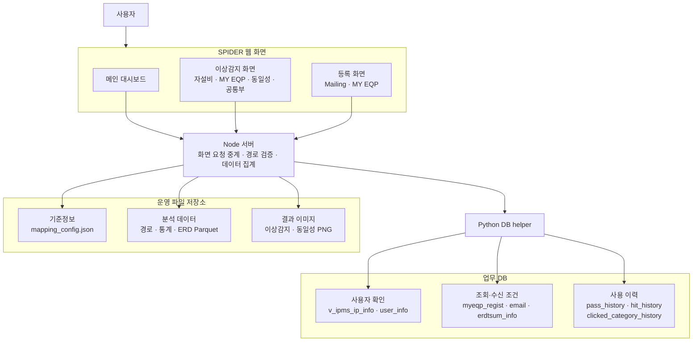

```text
사용자
  → React 웹 화면에서 조회·등록
  → Node 서버가 요청을 검증하고 데이터 조합
      ├─ 화면 조회: mapping/Parquet/이미지 파일 사용
      └─ 사용자·등록·이력: Python helper를 통해 DB 사용
  → 가공된 결과를 차트·이미지·필터·팝업으로 표시
```

| 영역 | 한 줄 설명 |
| --- | --- |
| 메인 대시보드 | 통계·상세 Parquet를 집계해 Line별 이상 현황을 표시 |
| 자설비/MY EQP | 경로 Parquet에서 대상을 찾고 ERD Parquet로 차트를 Drawing |
| 동일성/공통부 | 디렉터리·경로 Parquet를 기준으로 이미지 또는 비교 차트를 표시 |
| Mailing/My EQP 등록 | 수신 조건과 모니터링 설비를 DB에 저장·조회·삭제 |
| 이력 기능 | SKIP, HIT, 마지막 필터 선택을 각 이력 테이블에 기록 |

핵심적으로 **조회 데이터는 운영 파일**, **사용자·등록·이력 데이터는 DB**에 있으며, 두 저장소를 **Node 서버가 하나의 웹 응답으로 조합**하는 구조입니다.

## 1. 전체 구조 한눈에 보기

SPIDER는 하나의 저장소 안에서 다음 네 계층으로 구성됩니다.

1. React SPA가 화면과 필터, 차트, 등록 UI를 담당합니다.
2. 프런트 API 모듈이 브라우저 요청을 `/api/*` 형식으로 통일합니다.
3. Node 서버가 HTTP 라우팅, 파일 검증, Parquet 집계, 이미지 제공을 담당합니다.
4. DB 작업이 필요한 경우 Node 서버가 Python helper를 자식 프로세스로 실행합니다.

```mermaid
flowchart LR
    U["사용자 브라우저"]

    subgraph FE["React SPA"]
        ROUTER["React Router<br/>src/routes + feature routes"]
        PAGE["화면/컴포넌트<br/>src/features/fdc-trend"]
        QUERY["TanStack Query<br/>API 캐시·재조회"]
        API["프런트 API 모듈<br/>src/features/fdc-trend/api"]
        ROUTER --> PAGE --> QUERY --> API
    end

    subgraph NODE["Node HTTP 계층"]
        ENTRY["server.mjs<br/>전체 API + SPA 제공"]
        HANDLER["server/*.mjs<br/>검증·필터·집계·파일 제공"]
        ENTRY --> HANDLER
    end

    subgraph FILES["운영 파일 저장소"]
        MAP["mapping_config.json"]
        PATHS["경로/통계 Parquet"]
        ERD["ERD·공통부 Parquet"]
        IMG["PNG·백업 이미지"]
    end

    subgraph DBLAYER["DB 접근 계층"]
        PY["scripts/*.py<br/>stdin JSON → stdout JSON"]
        CRED["db_info.pkl"]
        MYSQL[("MySQL/MariaDB")]
        PY --> CRED
        PY --> MYSQL
    end

    U --> ROUTER
    API -->|HTTP /api/*| ENTRY
    HANDLER -->|직접 읽기| MAP
    HANDLER -->|hyparquet| PATHS
    HANDLER -->|hyparquet| ERD
    HANDLER -->|stream| IMG
    HANDLER -->|spawn python3| PY
```

핵심 경계는 다음과 같습니다.

- 브라우저는 `/appdata/...` 파일을 직접 읽지 않고 반드시 Node API를 통합니다.
- Node는 Parquet·JSON·이미지를 직접 읽지만, 업무 DB에는 직접 접속하지 않습니다.
- Python helper만 `db_info.pkl`을 읽고 PyMySQL로 DB에 접속합니다.
- `knox_id`가 필요한 이력 기능은 대부분 접속 IP를 DB 사용자 정보로 변환하여 사용합니다.

## 2. 실행 구조

### 2.1 통합 Node 서버

[`server.mjs`](server.mjs)는 권장되는 전체 기능 진입점입니다.

```text
node server.mjs
  ├─ LIVE_RELOAD != 0: Vite를 middleware mode로 붙여 HMR 제공
  └─ LIVE_RELOAD = 0: npm run build 후 dist 정적 파일 제공
```

| 환경변수 | 기본값 | 역할 |
| --- | --- | --- |
| `PORT` | `5173` | HTTP 포트 |
| `HOST` | `0.0.0.0` | 바인딩 주소 |
| `LIVE_RELOAD` | 활성 | 활성 시 Vite middleware/HMR, `0`이면 `dist` 정적 제공 |
| `BUILD_ON_START` | 활성 | 정적 모드 시작 시 클라이언트 빌드, `0`이면 기존 `dist` 사용 |
| `DB_INFO_PATH` | `/appdata/l0_spider/db_info.pkl` | Python helper의 DB 접속정보 |
| `MAPPING_CONFIG_PATH` | `/appdata/l0_spider/mapping_config.json` | Line/SDWT 매핑 파일 override |
| `COMMONALITY_ROOT_PATH` | `/appdata/abnormal_trend/pic/erd_commonality` | 동일성 데이터 루트 override |
| `COMMON_COMMONALITY_ROOT_PATH` | 기존 데이터 root의 형제 `path_common_commonality` | 공통부 동일성 데이터 루트 override |
| `SPIDER_DASHBOARD_PATH_ROOT` | `/appdata/abnormal_trend/pic/path` | 대시보드 일시별 상세파일 루트 override |

`LIVE_RELOAD=0`에서는 존재하는 정적 파일을 `dist`에서 제공하고, 그 외 브라우저 경로는 `dist/index.html`로 돌려 SPA 라우팅을 유지합니다.

### 2.2 Vite 단독 개발 서버

`npm run dev`는 [`vite.config.mjs`](vite.config.mjs)의 Vite 서버를 포트 `3000`에서 실행합니다.

주의: 현재 Vite 단독 서버에 등록된 API는 `server.mjs`보다 적습니다. 다음 API는 `server.mjs`에는 있지만 `vite.config.mjs` middleware에는 없습니다.

- `/api/clicked-category-history`
- `/api/my-eqp-reference`
- `/api/my-eqp-registration`
- `/api/mailing-registration`
- `/api/my-eqp-equipment-data`

따라서 My EQP·Mailing·클릭이력까지 포함한 전체 동작 확인은 `node server.mjs` 기준으로 해야 합니다. 이 차이는 향후 두 라우트 목록을 공통 등록 함수로 합치는 것이 안전합니다.

## 3. 저장소 디렉터리 역할

```text
l0_spider/
├─ server.mjs                 # 전체 Node HTTP 서버와 API 라우팅
├─ vite.config.mjs            # Vite 단독 개발 서버와 일부 API middleware
├─ src/
│  ├─ main.jsx                # React 시작점
│  ├─ routes/router.jsx       # 최상위 BrowserRouter
│  ├─ config/
│  │  └─ spiderDataPaths.mjs  # 운영 파일 경로 템플릿의 기준
│  ├─ components/
│  │  ├─ common/              # Query/Theme/Toast 전역 Provider
│  │  └─ ui/                  # 공통 UI primitive
│  ├─ features/fdc-trend/
│  │  ├─ routes.jsx           # SPIDER 화면 URL 매핑
│  │  ├─ pages/               # 화면 단위 컴포넌트
│  │  ├─ components/          # 대시보드·필터·Shell
│  │  ├─ api/                 # 브라우저의 /api 요청 함수
│  │  └─ utils/               # 필터·URL·차트·mock 계산
│  ├─ lib/                    # QueryClient, 테마, 공통 utility
│  └─ styles/                 # 전역 스타일과 디자인 토큰
├─ server/
│  ├─ *Data.mjs               # Parquet/이미지 조회와 payload 집계
│  ├─ *History.mjs            # 요청 검증, 경로 파싱, Python helper 호출
│  ├─ *Registration.mjs       # 등록 요청 검증과 Python helper 호출
│  └─ boundedCache.mjs        # 작은 LRU 캐시 공통 함수
├─ scripts/
│  ├─ *.py                    # 실제 DB SELECT/INSERT/UPDATE/DELETE
│  └─ requirements.txt        # PyMySQL 의존성
├─ public/
│  ├─ logo.png
│  └─ mailing-report.html     # 외부 메일 발송기가 렌더링할 Jinja 호환 템플릿
├─ docs/user-manual/          # 웹 화면에서 읽어 표시하는 사용자 매뉴얼
└─ README.md                  # 기능별 상세 규칙과 데이터 정의
```

## 4. 프런트엔드 라우트 구조

[`src/routes/router.jsx`](src/routes/router.jsx) 아래에 [`src/features/fdc-trend/routes.jsx`](src/features/fdc-trend/routes.jsx)가 연결됩니다. 같은 child route가 `/`와 `/fdc_trend` 두 prefix에 모두 열립니다.

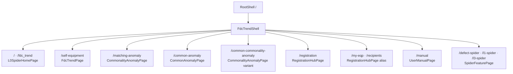

| URL | 화면 파일 | 주요 역할 | 실제 데이터 상태 |
| --- | --- | --- | --- |
| `/` | `L0SpiderHomePage.jsx` | 앱 메뉴, 최신 수행시각, 라인별 대시보드 | 운영 파일 API 사용 |
| `/self-equipment` | `FdcTrendPage.jsx` | 자설비·MY EQP·SKIP LIST 필터, Scatter/동일성 차트, SKIP/HIT/클릭이력 | 운영 파일 + DB |
| `/matching-anomaly` | `CommonalityAnomalyPage.jsx` | 동일성 디렉터리 기반 필터와 `img.png` 카드 | 운영 파일 |
| `/common-anomaly` | `CommonAnomalyPage.jsx` | 공통부 이미지, 동일성 차트, SKIP LIST | 운영 파일 + DB |
| `/common-commonality-anomaly` | `CommonalityAnomalyPage.jsx` | 공통부 동일성 EQP_MODEL 필터와 `img.png` 카드 | 운영 파일 |
| `/registration` | `RegistrationHubPage.jsx` | Mailing 등록과 My EQP 등록 통합 화면 | DB |
| `/my-eqp`, `/recipients` | `RegistrationHubPage.jsx` | `/registration`과 같은 화면의 호환 alias | DB |
| `/manual` | `UserManualPage.jsx` | `docs/user-manual/USER_MANUAL.md`를 HTML로 렌더링 | 빌드 리소스 |
| `/defect-spider`, `/l1-spider`, `/l3-spider` | `SpiderFeaturePage.jsx` | 직접 URL 접근 시 mock 기반 공통 화면 | mock/prototype |

추가 사항:

- `/fdc_trend/self-equipment`처럼 모든 내부 경로는 `/fdc_trend` prefix로도 접근할 수 있습니다.
- 메인 화면의 Defect/L1/L3 카드는 위 내부 route가 아니라 별도 외부 서비스 URL로 이동합니다.
- Hard Limit 추천 카드는 5열 기준 두 번째 줄 첫 칸에 배치되며 외부 서비스로 이동합니다.
- `SpiderFeaturePage.jsx`가 지원하는 `hardSpec`, `yieldSpec`, `recipients` 타입 중 일부는 현재 route에 직접 연결되어 있지 않은 prototype 코드입니다.

## 5. 화면 → API → 서버 → 저장소 연결

### 5.1 메인 대시보드

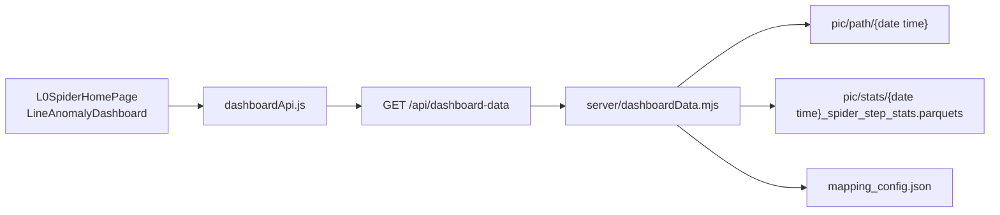

- `pic/path` 바로 아래의 `YYYY-MM-DD hh:mm:ss` 파일 목록을 조회합니다.
- 일자마다 가장 늦은 시각의 파일을 읽어 기간 추이를 계산합니다.
- 최신 상세 파일의 시각과 같은 전일 파일이 있을 때 전일 비교를 계산합니다.
- `mapping_config.json`으로 `sdwt`를 Line과 표시명에 연결합니다.
- `stats` 파일은 최신 시각의 모니터링 센서 총합 등 상단 KPI에 사용합니다.

### 5.2 자설비 이상감지

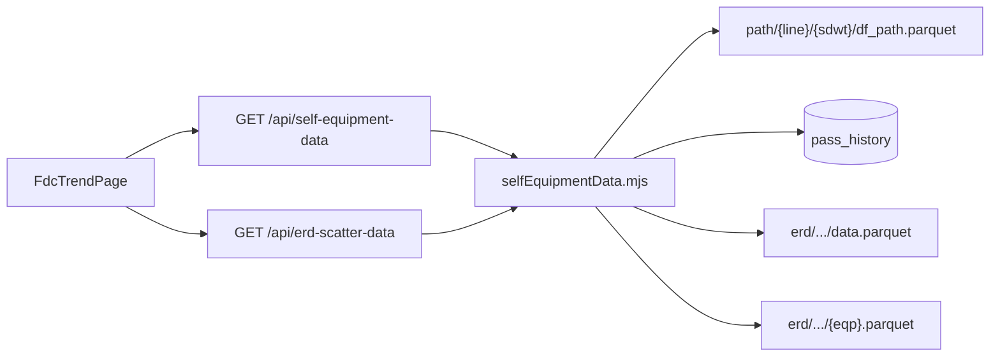

자설비 상세 흐름:

1. `mapping_config.json`으로 Line과 SDWT 선택지를 만듭니다.
2. `df_path.parquet`에서 STEP → `eqp_ch` → sensor → `ch_step` 필터와 차트 경로를 만듭니다.
3. sensor 목록이 있으면 `ALL`을 항상 제공하며, sensor가 `ALL`이면 `ch_step`은 `ALL`만 선택할 수 있습니다. 서버도 같은 규칙으로 필터 조합을 정규화합니다.
4. `pass_history`의 활성 SKIP과 같은 이상건은 72시간 동안 일반 결과에서 제외합니다.
5. 선택한 이미지 경로의 파일명을 `data.parquet`으로 바꿔 Scatter 원본을 읽습니다.
6. y축 컬럼은 `{sensor}_{ch_step}`, EQP 필터는 `eqp_cb`입니다.
7. 같은 디렉터리의 `{eqp}.parquet`를 변경점 이력으로 읽습니다.
8. EQP 그룹 순서를 유지하면서 실제 마운트되는 차트를 페이지당 최대 20개로 나눕니다.

`/api/erd-file`은 허용된 ERD 이미지 파일을 stream하는 endpoint지만 현재 주 Scatter 차트는 이미지 대신 `/api/erd-scatter-data`의 Parquet payload를 렌더링합니다.

차트 페이지네이션은 [`src/features/fdc-trend/utils/chartPagination.mjs`](src/features/fdc-trend/utils/chartPagination.mjs)의 `paginateChartGroups`가 담당합니다.

- 기본 차트 한 개는 1개로 계산합니다.
- **3일치 동일성 차트 같이 보기**가 켜진 모아보기 행은 기본 차트와 동일성 차트를 합쳐 2개로 계산합니다.
- 페이지 밖 EQP 차트 컴포넌트와 데이터 query는 렌더링하지 않습니다.
- 필터 또는 모아보기 범위가 바뀌면 첫 페이지로 돌아가고, 현재 페이지가 범위를 벗어나면 유효한 마지막 페이지로 보정합니다.

### 5.3 MY EQP 조회

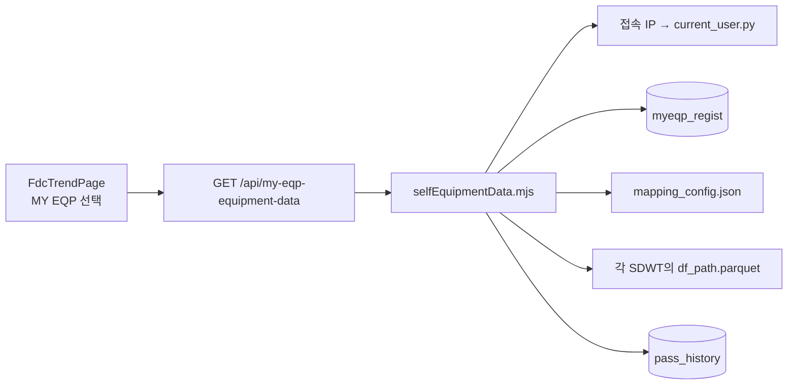

- 현재 사용자 기준의 활성 `myeqp_regist` 행과 `is_public = 1` 행을 읽습니다.
- 등록 SDWT를 `mapping_config.json`의 실제 `pathSdwt`에 연결합니다.
- 연결된 여러 `df_path.parquet`를 읽고 등록 EQP만 남깁니다.
- `pass_history`를 적용한 후 일반 자설비와 같은 필터 payload를 만듭니다.
- MY EQP의 `EQP ALL SKIP` 대상 재조회도 이 전용 API를 사용합니다.
- 현재 사용자 DB 조회가 실패하면 My EQP 등록 모듈은 예외적으로 정규화된 접속 IP를 사용자 식별값 fallback으로 사용합니다.

### 5.4 동일성 이상감지

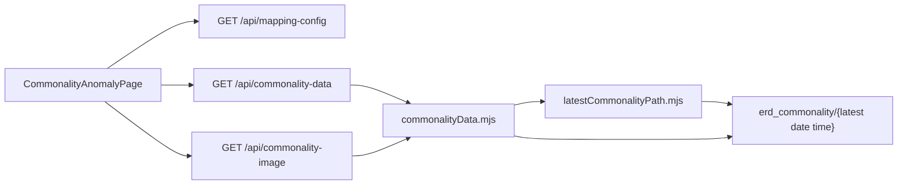

- 최신 `YYYY-MM-DD hh:mm:ss` 디렉터리를 찾습니다.
- 선택 SDWT 아래의 고정 깊이 디렉터리를 제한 병렬 탐색합니다.
- `grade/step_seq/step_desc/ppid/ppid/sensor_chStep/img.png` 구조를 index로 만듭니다.
- 두 `ppid` 디렉터리 이름이 같은 경로만 유효합니다.
- 필터 순서는 Line → SDWT → STEP → Sensor → `ch_step`입니다.
- Sensor는 `ALL`을 포함하며, Sensor가 `ALL`이면 `ch_step`은 `ALL`만 제공합니다.
- 최종 이미지는 `/api/commonality-image`가 검증 후 stream합니다.
- 결과 이미지는 페이지당 18개만 렌더링하고 숫자·말줄임표 페이지 탐색을 제공합니다.
- 마지막 필터 선택 시 `/api/clicked-category-history`로 Drawing 이력을 저장합니다.

### 5.5 공통부 동일성 이상감지

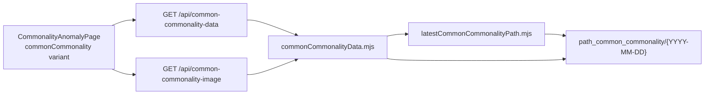

- 필터 순서는 Line → SDWT → EQP_MODEL → Sensor → `ch_step`입니다.
- 공통부 동일성의 최신 경로는 시각을 제외한 `YYYY-MM-DD` 디렉터리만 사용합니다.
- `sdwt/eqp_model/grade/sensor@ch_step/img.png` 고정 계층을 제한 병렬 탐색합니다.
- 첫 번째 `@` 앞을 Sensor로, 나머지를 `ch_step`으로 보존합니다.
- Sensor `ALL`, ch_step `ALL`, 18개 이미지 페이지네이션은 기존 동일성 화면과 같은 계약입니다.

### 5.6 공통부 이상감지

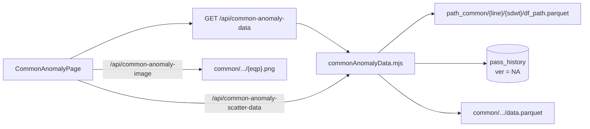

- 경로 테이블의 `file_path`에서 `pic_server2`를 `pic`으로 바꿉니다.
- 카드 이미지는 같은 디렉터리의 `{eqp}.png`를 사용합니다.
- 동일성 차트는 파일명을 `data.parquet`으로 바꿔 읽습니다.
- 공통부 SKIP도 `pass_history`를 사용하지만 `ver = NA`로 구분합니다.
- 공통부 일반 결과의 SKIP 동일성 비교는 `line_id`, `sdwt`, `desc`, `priority`, `sensor`, `step`, `eqp` 기준입니다.

### 5.7 Mailing 및 My EQP 등록

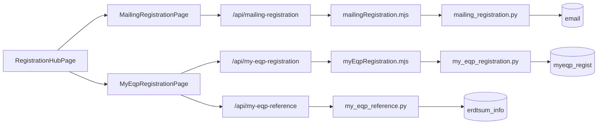

- 통합 저장 버튼은 펼쳐져 있고 입력이 완성된 두 영역의 저장 요청을 `Promise.allSettled`로 함께 처리합니다.
- Mailing은 지정된 각 `knox_id`마다 `email` 테이블 한 행을 관리합니다.
- My EQP는 `knox_id × EQP` 조합마다 `myeqp_regist` 행을 저장합니다.
- My EQP의 Line/SDWT/공정그룹/EQP 후보는 `erdtsum_info` 기준정보에서 가져옵니다.

## 6. 전체 API 목록

| Endpoint | Method | 프런트 API / 사용 화면 | Node handler | 최종 데이터 |
| --- | --- | --- | --- | --- |
| `/api/dashboard-data` | GET, HEAD | `dashboardApi.js` / 메인 대시보드 | `dashboardData.mjs` | `path/{date time}`, `stats`, mapping JSON |
| `/api/current-user` | GET | `currentUserApi.js` / 자설비·공통부·등록 | `currentUser.mjs` | `current_user.py` → `v_ipms_ip_info`, `user_info` |
| `/api/mapping-config` | GET, HEAD | `mappingConfigApi.js` / 대부분의 필터 화면 | `mappingConfig.mjs` | `mapping_config.json` |
| `/api/self-equipment-data` | GET | `selfEquipmentApi.js` / 일반 자설비 | `selfEquipmentData.mjs` | 자설비 `df_path.parquet` + `pass_history` |
| `/api/my-eqp-equipment-data` | GET | `selfEquipmentApi.js` / MY EQP | `selfEquipmentData.mjs` | `myeqp_regist` + mapping + 여러 `df_path` + `pass_history` |
| `/api/erd-scatter-data` | GET | `selfEquipmentApi.js` / 자설비 Scatter·동일성 | `selfEquipmentData.mjs` | ERD `data.parquet`, `{eqp}.parquet` |
| `/api/erd-file` | GET, HEAD | `buildErdFileUrl` 보유, 현재 주 화면 미사용 | `selfEquipmentData.mjs` | ERD 이미지 stream |
| `/api/pass-history` | GET | `passHistoryApi.js`, `commonAnomalyApi.js` | `passHistory.mjs` | `pass_history` 조회, 자설비/공통부 SKIP LIST payload |
| `/api/pass-history` | POST | SKIP, EQP ALL SKIP | `passHistory.mjs` | `pass_history` INSERT 또는 기존 동일행 UPDATE |
| `/api/pass-history` | DELETE | SKIP 해제 | `passHistory.mjs` | `pass_history` DELETE |
| `/api/hit-history` | POST | `hitHistoryApi.js` / 자설비 이력저장 | `hitHistory.mjs` | `hit_history` INSERT |
| `/api/clicked-category-history` | POST | 네 이상감지 화면 | `clickedCategoryHistory.mjs` | `clicked_category_history` INSERT |
| `/api/latest-commonality-path` | GET, HEAD | 직접 API 모듈은 있으나 화면은 서버 내부 탐색 사용 | `latestCommonalityPath.mjs` | 최신 동일성 디렉터리 |
| `/api/commonality-data` | GET | `commonalityApi.js` / 동일성 이상감지 | `commonalityData.mjs` | 동일성 디렉터리 index |
| `/api/commonality-image` | GET, HEAD | 동일성 이미지 URL builder | `commonalityData.mjs` | `img.png` stream |
| `/api/common-commonality-data` | GET | `commonCommonalityApi.js` / 공통부 동일성 | `commonCommonalityData.mjs` | 공통부 동일성 디렉터리 index |
| `/api/common-commonality-image` | GET, HEAD | 공통부 동일성 이미지 URL builder | `commonCommonalityData.mjs` | `img.png` stream |
| `/api/common-anomaly-data` | GET | `commonAnomalyApi.js` / 공통부 | `commonAnomalyData.mjs` | 공통부 `df_path.parquet` + `pass_history` |
| `/api/common-anomaly-image` | GET, HEAD | 공통부 이미지 URL builder | `commonAnomalyData.mjs` | `{eqp}.png` stream |
| `/api/common-anomaly-scatter-data` | GET | 공통부 동일성 차트 | `commonAnomalyData.mjs` | 공통부 `data.parquet` |
| `/api/my-eqp-reference` | GET, HEAD | `myEqpReferenceApi.js` / My EQP 등록 | `myEqpReference.mjs` | `erdtsum_info` SELECT DISTINCT |
| `/api/my-eqp-registration` | GET, POST, DELETE | `myEqpRegistrationApi.js` | `myEqpRegistration.mjs` | `myeqp_regist` |
| `/api/mailing-registration` | GET, POST, DELETE | `mailingRegistrationApi.js` | `mailingRegistration.mjs` | `email` |

API 경로의 최종 등록 위치는 [`server.mjs`](server.mjs), 브라우저 요청 함수는 [`src/features/fdc-trend/api`](src/features/fdc-trend/api)에 있습니다.

## 7. 운영 파일 경로와 소비 위치

경로 템플릿의 기준은 [`src/config/spiderDataPaths.mjs`](src/config/spiderDataPaths.mjs)입니다.

| 파일/경로 | 주요 컬럼·내용 | 읽는 서버 | 사용 화면 |
| --- | --- | --- | --- |
| `/appdata/l0_spider/mapping_config.json` | `line_mapping`, `sdwt_mapping` | `mappingConfig.mjs`, `dashboardData.mjs`, `selfEquipmentData.mjs` | 전체 필터, 대시보드, MY EQP |
| `/appdata/l0_spider/db_info.pkl` | DB host/port/name/user/password | 모든 DB Python helper | DB 기능 전체 |
| `pic/path/{line}/{sdwt}/df_path.parquet` | `sdwt`, `desc`, `ver`, `recipe_id`, `priority`, `sensor`, `step`, `eqp`, `file_path`, `line_rev` | `selfEquipmentData.mjs` | 자설비, MY EQP |
| `pic/path_common/{line}/{sdwt}/df_path.parquet` | `file_path`, `sdwt`, `prc_group`, `date`, `priority`, `sensor`, `step`, `eqp`, `line_rev` | `commonAnomalyData.mjs` | 공통부 |
| `pic/erd/{date}/{sdwt}/{desc}/{ver}/{ppid}/{grade}/{sensor}/{ch_step}/data.parquet` | `act_time`, `{sensor}_{ch_step}`, `eqp_cb`, hover 정보 | `selfEquipmentData.mjs` | 자설비 Scatter/동일성 |
| 위 ERD 디렉터리의 `{eqp}.parquet` | `date`, `work_type`, `ctttm_url`, `desc` | `selfEquipmentData.mjs` | 변경점 이력 |
| `pic/erd/.../{eqp}.png` | 원본 이상감지 이미지 | `selfEquipmentData.mjs` | SKIP/HIT 식별 경로, 선택적 이미지 endpoint |
| `pic/backup/#appdata#...#{eqp}.png` | 과거 백업 이미지 | `selfEquipmentData.mjs` | 백업 경로를 Scatter 원본 경로로 환산 |
| `pic/common/{date}/{sdwt}/{desc}/{grade}/{sensor}/{ch_step}/data.parquet` | 공통부 Scatter 원본 | `commonAnomalyData.mjs` | 공통부 동일성 차트 |
| 위 common 디렉터리의 `{eqp}.png` | 공통부 카드 이미지 | `commonAnomalyData.mjs` | 공통부 이미지 카드 |
| `pic/erd_commonality/{date time}/.../img.png` | 동일성 결과 이미지 | `commonalityData.mjs` | 동일성 이미지 카드 |
| `pic/path/{date time}` | 대시보드 상세 `sdwt`, `desc`, `recipe_id`, `priority`, `sensor`, `eqp` | `dashboardData.mjs` | 라인/기간/Grade 집계 |
| `pic/stats/{date time}_spider_step_stats.parquets` | `exec_date`, `recipe_id`, `priority`, `ng`, `total` | `dashboardData.mjs` | 최신 KPI |
| `pic/stats/{date time}_spider_step_stats_except_v.parquets` | V 제외 통계 템플릿 | 현재 운영 handler 직접 사용 없음 | prototype/reference |
| `docs/user-manual/USER_MANUAL.md` 및 images | 사용자 문서 원본 | Vite raw import | `/manual` |
| `public/mailing-report.html` | Jinja 호환 Mailing HTML 템플릿 | 이 저장소 런타임이 직접 렌더링하지 않음 | 외부 메일 발송기 |

## 8. DB 테이블 사용 구조

DB 연결은 모두 다음 공통 구조입니다.

```text
Node handler
  → python3 -B scripts/{helper}.py [action]
  → stdin으로 JSON payload 전달
  → helper가 DB_INFO_PATH의 pickle 로드
  → PyMySQL 실행
  → stdout JSON 결과를 Node가 응답
```

### 8.1 논리 관계도

아래 연결은 코드상 논리적 사용 관계이며, 실제 DB foreign key가 정의되어 있다는 의미는 아닙니다.

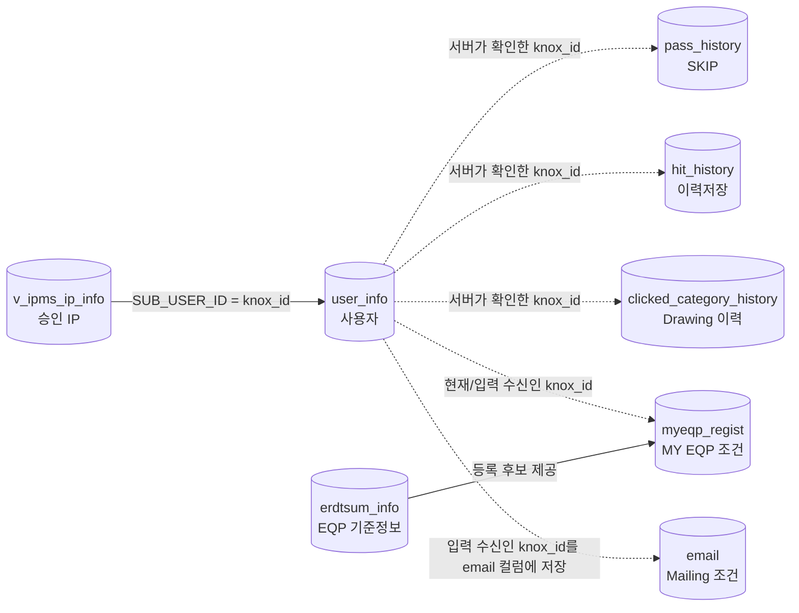

### 8.2 테이블별 사용처

| 테이블 | 읽기/쓰기 | Python helper | API | 화면 및 목적 |
| --- | --- | --- | --- | --- |
| `v_ipms_ip_info` | SELECT | `current_user.py` | `/api/current-user` 및 내부 사용자 확인 | 접속 IP가 `STATUS='승인'`인지 확인 |
| `user_info` | SELECT | `current_user.py` | 동일 | `SUB_USER_ID = knox_id` 조인 후 현재 `knox_id` 결정 |
| `erdtsum_info` | SELECT DISTINCT | `my_eqp_reference.py` | `/api/my-eqp-reference` | My EQP 등록 후보: `main`, `disp_name`, `sdwt_prod`, `prc_group` |
| `myeqp_regist` | SELECT, INSERT, DELETE, 조건부 ALTER | `my_eqp_registration.py` | `/api/my-eqp-registration`, 내부 MY EQP 조회 | 사용자별 EQP·기간·수신/열람 조건 |
| `email` | SELECT, INSERT, UPDATE, DELETE | `mailing_registration.py` | `/api/mailing-registration` | Mailing 수신인의 SDWT·Grade 조건 |
| `pass_history` | SELECT, INSERT, UPDATE, DELETE | `pass_history.py` | `/api/pass-history` | 자설비/공통부 SKIP, SKIP LIST, 72시간 제외 |
| `hit_history` | INSERT | `hit_history.py` | `/api/hit-history` | 자설비 `이력저장` 클릭 |
| `clicked_category_history` | INSERT | `clicked_category_history.py` | `/api/clicked-category-history` | 네 이상감지 App의 Drawing 시작 이력 |
| `information_schema.COLUMNS` | SELECT | `mailing_registration.py`, `my_eqp_registration.py` | 등록 API 내부 | `email` 컬럼 길이 확인, `myeqp_regist.is_public` 존재 확인 |

### 8.3 주요 저장 규칙

#### `pass_history`

- 처음 SKIP하는 동일 식별건은 INSERT합니다.
- 동일한 앞 10개 식별 컬럼의 행이 이미 있으면 `knox_id`, `exec_date`, `comment`를 UPDATE하여 재활성화합니다.
- EQP ALL SKIP은 최대 500개 record를 한 트랜잭션 흐름으로 처리합니다.
- 일반 조회에서 `exec_date` 이후 72시간만 활성 SKIP으로 봅니다. 만료 행은 자동 DELETE하지 않습니다.
- 공통부는 `ver = 'NA'`로 자설비와 구분합니다.

#### `hit_history`

- 버튼 클릭마다 새 행을 INSERT합니다.
- 원본 `/appdata/...` 경로는 `/`를 `#`으로 치환해 `file_path`에 저장합니다.

#### `clicked_category_history`

- 자설비는 Line에 suffix가 없습니다.
- 동일성은 Line에 `(g)`, 공통부는 `(c)`를 붙입니다.
- 여러 Grade/Sensor는 중복 제거 후 리스트 문자열로 저장합니다.
- 자설비 또는 동일성의 sensor 필터에서 `ALL`을 선택하면 실제 sensor 목록을 확장하지 않고 `sensor='ALL'`로 저장합니다.
- MY EQP 진입은 실제 Drawing 경로 없이 `sdwt='MY EQP'`, 전체 Grade, `sensor='ALL'`로 저장합니다.

#### `myeqp_regist`

- 컬럼: `line`, `sdwt`, `prc_group`, `eqp`, `exec_date`, `periode`, `comment`, `knox_id`, `is_public`.
- 조회 조건은 선택 Line과 `knox_id = 현재 사용자 OR is_public = 1`입니다.
- `activeOnly=true`는 `TIMESTAMPADD(DAY, periode, exec_date) > NOW()` 조건을 추가합니다.
- 현재 신규 요청은 서버가 `isPublic=false`로 고정합니다.
- helper 실행 시 `is_public` 컬럼이 없으면 자동 `ALTER TABLE ... ADD COLUMN`을 수행합니다.

#### `email`

- `email` 컬럼에는 메일 주소가 아니라 `knox_id` 문자열을 저장합니다.
- `sdwt`, `priority`는 JSON list 문자열입니다.
- 기존 수신인 행이 있으면 값을 병합하여 UPDATE합니다.
- Line 삭제는 대상 SDWT만 list에서 제거하고, 남은 SDWT가 없으면 행을 DELETE합니다.
- 현재 등록 Grade는 서버의 `A`, `B`, `D`, `N`, `M` 전체 고정값입니다.

## 9. 사용자 식별과 요청 신뢰 경계

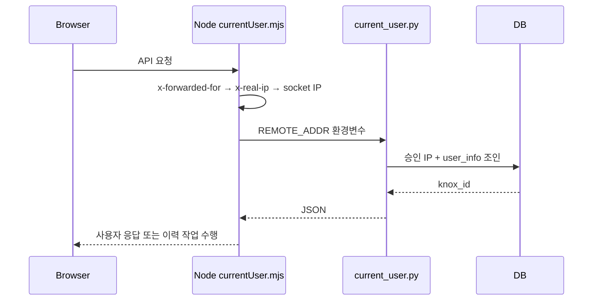

- 현재 사용자 성공 결과는 Node 메모리에 IP별 5분 캐시됩니다.
- 프록시가 `x-forwarded-for`/`x-real-ip`를 신뢰 가능한 값으로 덮어쓰는 운영 구성이 필요합니다.
- PASS, HIT, 클릭이력의 `knox_id`는 브라우저 요청값을 사용하지 않고 서버가 다시 결정합니다.
- My EQP 등록은 접속 사용자를 기본값으로 쓰지만, UI가 전달한 복수 `knoxIds`도 등록 대상으로 허용합니다.
- Mailing 등록은 요청으로 받은 `knoxId/knoxIds`를 형식 검증 후 사용합니다.
- 일반 로그인 세션이나 JWT 기반 인증 계층은 현재 코드에 없습니다.

## 10. 캐시와 갱신

| 위치 | 캐시 방식 | 만료/무효화 |
| --- | --- | --- |
| 프런트 `QueryClient` | 기본 `staleTime=60초`, window focus 재조회 비활성 | mutation 성공 시 관련 query key invalidate |
| 현재 사용자 | IP별 메모리 cache + 동시 요청 Promise 공유 | 5분 |
| My EQP 기준정보 `erdtsum_info` | 서버 메모리 | 5분 |
| 동일성 디렉터리 index | 최신경로+SDWT별 cache + 동시 탐색 공유 | 5분, 최신 폴더 변경 시 key 변경 |
| 자설비/공통부 경로 Parquet | LRU 1개 | 파일 `mtimeMs`/size가 바뀌면 재조회 |
| Scatter/변경이력 Parquet | LRU 1개 + 동시 read Promise 공유 | 파일 `mtimeMs`/size가 바뀌면 재조회 |
| 대시보드 상세 집계 | LRU 최대 32개 | 파일 metadata와 mapping object 기준 |
| 대시보드 파일 목록 | 디렉터리별 메모리 | 루트 디렉터리 `mtimeMs` 변경 시 |

## 11. Mailing Report 템플릿의 위치

[`public/mailing-report.html`](public/mailing-report.html)은 이 웹 서버가 DB를 조회해 즉시 메일을 발송하는 구현이 아닙니다.

- Jinja 호환 placeholder를 가진 HTML 템플릿입니다.
- 외부 발송기가 Dashboard 응답, `email`, 활성 `myeqp_regist`를 조합해 수신인별로 렌더링해야 합니다.
- 수신인 집합은 `email.email`과 활성 `myeqp_regist.knox_id`의 합집합을 전제로 합니다.
- 템플릿 내부 LINK는 `/self-equipment` 딥링크로 연결됩니다.
- `public` 파일이므로 빌드 결과에는 `/mailing-report.html` 정적 자산으로 복사되지만, 브라우저에서 직접 열면 Jinja 변수가 평가되지 않습니다.

## 12. 변경 시 영향 범위 체크리스트

### 새 화면 또는 URL을 추가할 때

1. `src/features/fdc-trend/routes.jsx`
2. 메인 메뉴가 필요하면 `L0SpiderHomePage.jsx`
3. 화면의 API module
4. `server.mjs` route
5. Vite 단독 개발도 지원한다면 `vite.config.mjs`

### 새 API를 추가할 때

1. `src/features/fdc-trend/api/*Api.js`
2. `server.mjs`
3. 해당 `server/*.mjs` handler
4. DB 작업이면 `scripts/*.py`와 `scripts/requirements.txt`
5. `vite.config.mjs`의 개발 middleware 누락 여부
6. 서버/프런트 단위 테스트

### 데이터 경로 또는 Parquet 스키마를 바꿀 때

1. `src/config/spiderDataPaths.mjs`
2. 해당 `server/*Data.mjs`의 허용 루트와 column 목록
3. 경로를 파싱하는 `passHistory.mjs`, `hitHistory.mjs`, `clickedCategoryHistory.mjs`
4. SKIP LIST 경로 복원 규칙
5. Dashboard/Mailing 집계의 고유건 조합
6. `README.md`, 본 문서, 사용자 매뉴얼

### 필터의 `ALL` 규칙 또는 차트 페이지네이션을 바꿀 때

1. 화면의 선택지 노출, 하위 필터 초기화와 클릭 방어
2. 서버 payload builder의 선택값 정규화와 결과 행 범위
3. `/api/clicked-category-history`에 전달하는 실제 사용자 선택값
4. 행 수가 아니라 페이지에 실제 마운트되는 차트 수
5. 필터 조합·페이지 경계 단위 테스트와 사용자 매뉴얼

### DB 테이블을 바꿀 때

1. 해당 `scripts/*.py`의 SELECT/INSERT/UPDATE/DELETE
2. Node payload builder와 validation
3. 프런트 저장/조회 화면
4. Mailing 외부 발송기의 조회 스키마
5. 기존 데이터 migration과 인덱스/NULL/default 정책

## 13. 현재 구조에서 특히 주의할 점

1. `server.mjs`와 `vite.config.mjs`가 API route를 각각 수동 등록하여 이미 기능 범위가 다릅니다.
2. DB 비밀번호가 포함된 `db_info.pkl`은 저장소에 포함하거나 웹 정적 경로 아래에 두면 안 됩니다.
3. IP 기반 사용자 확인은 프록시 헤더 신뢰 설정과 IP-사용자 일대일 매핑에 의존합니다.
4. `myeqp_regist` helper가 런타임에 `ALTER TABLE`을 수행하므로 운영 DB 계정 권한과 배포 migration 정책을 확인해야 합니다.
5. `pass_history`의 72시간 만료는 DB 정리가 아니라 조회 시 제외 규칙입니다. 테이블은 계속 증가할 수 있습니다.
6. `SpiderFeaturePage.jsx`와 `fdcTrendMockData.js`에는 현재 운영 route에서 직접 쓰지 않는 prototype/mock 기능이 남아 있습니다.
7. `public/mailing-report.html`은 템플릿일 뿐, 이 저장소에는 메일 스케줄러·렌더러·SMTP 발송기가 구현되어 있지 않습니다.

---

구조를 수정할 때는 이 문서와 [`src/config/spiderDataPaths.mjs`](src/config/spiderDataPaths.mjs), [`server.mjs`](server.mjs), DB helper SQL을 함께 갱신하는 것을 권장합니다.
